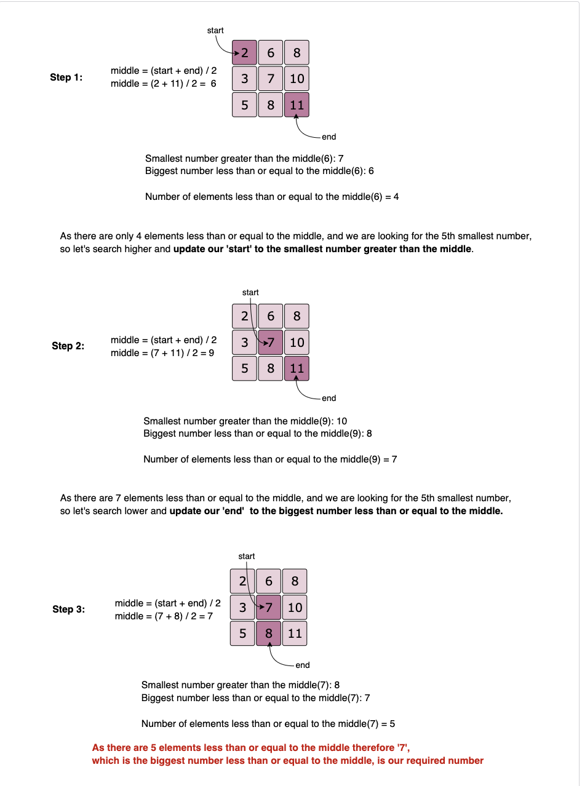

# Pattern 14: K-way merge

This pattern helps us solve problems that involve a list of sorted arrays.

Whenever we are given `K` sorted arrays, we can use a <b>Heap</b> to efficiently perform a sorted traversal of all the elements of all arrays. We can push the smallest (first) element of each sorted array in a <b>Min Heap</b> to get the overall minimum. While inserting elements to the <b>Min Heap</b> we keep track of which array the element came from. We can, then, remove the top element from the heap to get the smallest element and push the next element from the same array, to which this smallest element belonged, to the heap. We can repeat this process to make a sorted traversal of all elements.

## 👩‍🦯 🌴 Merge K Sorted Lists (medium)

https://leetcode.com/problems/merge-k-sorted-lists/

> Given an array of `K` sorted <b>LinkedLists</b>, merge them into one sorted list.

### Array Sort

```js
class ListNode {
  constructor(value, next = null) {
    this.value = value;
    this.next = next;
  }
}

function mergeLists(lists) {
  //push to list
  if (!lists || !lists.length) return null;
  let mergeArr = [];
  let resultList = new ListNode(-1);

  lists.forEach((list) => {
    let curr = list;
    while (curr) {
      mergeArr.push(curr.value);
      curr = curr.next;
    }
  });
  let curr = resultList;

  //sort list
  mergeArr
    .sort((a, b) => a - b)
    .forEach((n) => {
      let temp = new ListNode(n);
      curr.next = temp;
      curr = curr.next;
    });

  return resultList.next;
}

let l1 = new ListNode(2);
l1.next = new ListNode(6);
l1.next.next = new ListNode(8);

let l2 = new ListNode(3);
l2.next = new ListNode(6);
l2.next.next = new ListNode(7);

l1.next = new ListNode(6);

let l3 = new ListNode(1);
l3.next = new ListNode(3);
l3.next.next = new ListNode(4);

l2.next = new ListNode(6);
result = mergeLists([l1, l2, l3]);

let output = "Here are the elements form the merged list: ";
while (result != null) {
  output += result.value + " ";
  result = result.next;
}
console.log(output);
```

### Compare Each Node One by One

```js
function mergeLists(lists) {
  //compare one by one
  if (!lists || !lists.length) return null;

  function findMinNode(lists) {
    let index = -1;
    let min = Infinity;

    for (let i = 0; i < lists.length; i++) {
      if (!lists[i]) continue;
      if (lists[i].value <= min) {
        min = lists[i].value;
        index = i;
      }
    }

    let resultNode = null;

    if (index !== -1) {
      resultNode = lists[index];
      lists[index] = lists[index].next;
    }

    return resultNode;
  }

  let resultList = new ListNode(-1);
  let curr = resultList;
  let temp = findMinNode(lists);

  while (temp) {
    curr.next = temp;
    curr = curr.next;
    temp = findMinNode(lists);
  }

  return resultList.next;
}
```

## 🔍 Kth Smallest Number in M Sorted Lists (Medium)
> Given `M` sorted arrays, find the `Kth` smallest number among all the arrays.
````js
function findKthSmallest(lists, k) {
  let minHeap = new Heap();

  // put the 1st element of each list in the min heap
  for (let i = 0; i < lists.length; i++) {
    minHeap.insert(lists[i][0]);
  }
console.log(minHeap)
  // take the smallest(i.e., top) element form the min heap, if the running count is equal to k return the number
  let numberCount = 0,
    number = 0;
  while (minHeap.size > 0) {
    [number, i, list] = minHeap.remove();
    numberCount += 1;
    if (numberCount === k) {
      break;
    }
    // if the array of the top element has more elements, add the next element to the heap
    if (list.length > i + 1) {
      minHeap.insert([list[i + 1], i + 1, list]);
    }
  }
  return number;
}

console.log(
  `Kth smallest number is: ${findKthSmallest(
    [
      [2, 6, 8],
      [3, 6, 7],
      [1, 3, 4],
    ],
    5
  )}`
);
````

### Similar Problems
### 🔎 Median of Two Sorted Arrays
https://leetcode.com/problems/median-of-two-sorted-arrays/
> Given `M` sorted arrays, find the median number among all arrays.

<b>Solution:</b> This problem is similar to our parent problem with K=Median. So if there are `N` total numbers in all the arrays we need to find the `Kth` minimum number where `K=N/2`.

### 👩‍🦯 🌴 Merge K Sorted Arrays
https://leetcode.com/problems/merge-k-sorted-lists/
> Given a list of `K` sorted arrays, merge them into one sorted list.

<b>Solution:</b> This problem is similar to [Merge K Sorted Lists](#🔎-median-of-two-sorted-arrays) except that the input is a list of arrays compared to LinkedLists. To handle this, we can use a similar approach as discussed in our parent problem by keeping a track of the array and the element indices.

## 🔍 🌴 Kth Smallest Number in a Sorted Matrix (Hard)
https://leetcode.com/problems/kth-smallest-element-in-a-sorted-matrix/

> Given an `N * N` matrix where each row and column is sorted in ascending order, find the `Kth` smallest element in the matrix.

This problem follows the [K-way merge pattern](#pattern-14-k-way-merge) and can be easily converted to [Kth Smallest Number in M Sorted Lists](#🔍-kth-smallest-number-in-m-sorted-lists-medium). As each row (or column) of the given matrix can be seen as a sorted list, we essentially need to find the `Kth` smallest number in `N` sorted lists.

Since each row and column of the matrix is sorted, is it possible to use <b>Binary Search</b> to find the `Kth`smallest number?

The biggest problem to use <b>Binary Search</b>, in this case, is that we don’t have a straightforward sorted array, instead, we have a matrix. As we remember, in <b>Binary Search</b>, we calculate the middle index of the search space <i>(‘1’ to ‘N’)</i> and see if our required number is pointed out by the middle index; if not we either search in the lower half or the upper half. In a sorted matrix, we can’t really find a middle. Even if we do consider some index as middle, it is not straightforward to find the search space containing numbers bigger or smaller than the number pointed out by the middle index.

An alternative could be to apply the <b>Binary Search</b> on the <i>“number range”</i> instead of the <i>“index range”</i>. As we know that the smallest number of our matrix is at the top left corner and the biggest number is at the bottom right corner. These two numbers can represent the <i>“range”</i> i.e., the `start` and the `end` for the <b>Binary Search</b>. Here is how our algorithm will work:

1. Start the <b>Binary Search</b> with `start = matrix[0][0]` and `end = matrix[n-1][n-1]`.
2. Find `middle` of the `start` and the `end`. This middle number is NOT necessarily an element in the matrix.
3. Count all the numbers smaller than or equal to `middle` in the matrix. As the matrix is sorted, we can do this in `O(N)`.
4. While counting, we can keep track of the <i>“smallest number greater than the middle”</i> (let’s call it `n1`) and at the same time the <i>“biggest number less than or equal to the middle” </i>(let’s call it `n2`). These two numbers will be used to adjust the <i>“number range”</i> for the <b>Binary Search</b> in the next iteration.
5. If the count is equal to <b>‘K’</b>, `n2` will be our required number as it is the <i>“biggest number less than or equal to the middle”</i>, and is definitely present in the matrix.
If the count is less than <b>‘K’</b>, we can update `start = n2` to search in the higher part of the matrix and if the count is greater than <b>‘K’</b>, we can update `end = n1` to search in the lower part of the matrix in the next iteration.


````js
function findKthsmallest(matrix, k) {
  const n = matrix.length;
  let start = matrix[0][0];
  let end = matrix[n - 1][n - 1];

  while (start < end) {
    const mid = Math.floor(start + (end - start) / 2);

    const [count, smaller, larger] = countLessEqual(
      matrix,
      mid,
      matrix[0][0],
      matrix[n - 1][n - 1]
    );

    if (count === k) return smaller;
    if (count < k) {
      //search higher
      start = larger;
    } else {
      //search lower
      end = smaller;
    }
  }

  return start;
}

function countLessEqual(matrix, mid, smaller, larger) {
  let count = 0;
  let n = matrix.length;
  let row = n - 1;
  let col = 0;

  while (row >= 0 && col < n) {
    if (matrix[row][col] > mid) {
      //as matrix[row][col] is bigger than the mid,
      //keep track of the smallest number greater than the mid
      larger = Math.min(larger, matrix[row][col]);
      row--;
    } else {
      // as matrix[row][col] is <= mid
      // keep track of the biggest number <= mid
      smaller = Math.max(smaller, matrix[row][col]);
      count += row + 1;
      col++;
    }
  }
  return [count, smaller, larger];
}

console.log(
  `Kth smallest number is: ${findKthsmallest(
    [
      [1, 4],
      [2, 5],
    ],
    2
  )}`
);

console.log(`Kth smallest number is: ${findKthsmallest([[-5]], 1)}`);

console.log(
  `Kth smallest number is: ${findKthsmallest(
    [
      [2, 6, 8],
      [3, 7, 10],
      [5, 8, 11],
    ],
    5
  )}`
);

console.log(
  `Kth smallest number is: ${findKthsmallest(
    [
      [1, 5, 9],
      [10, 11, 13],
      [12, 13, 15],
    ],
    8
  )}`
);
````
- The <b>Binary Search</b> could take `O(log(max-min ))` iterations where `max` is the largest and `min` is the smallest element in the matrix and in each iteration we take `O(N)`
 for counting, therefore, the overall time complexity of the algorithm will be `O(N*log(max-min))`.
- The algorithm runs in constant space `O(1)`.


## Smallest Number Range (Hard)

https://leetcode.com/problems/smallest-range-covering-elements-from-k-lists/
Given `M` sorted arrays, find the smallest range that includes at least one number from each of the `M` lists.

## 🌟 K Pairs with Largest Sums (Hard)

https://leetcode.com/problems/find-k-pairs-with-smallest-sums/

> Given two sorted arrays in descending order, find `K` pairs with the largest sum where each pair consists of numbers from both the arrays.
