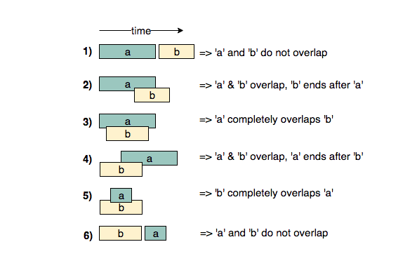

# Pattern 4 : Merge Intervals
This pattern describes an efficient technique to deal with overlapping intervals. In a lot of problems involving intervals, we either need to find overlapping intervals or merge intervals if they overlap.

Given two intervals (`a` and `b`), there will be six different ways the two intervals can relate to each other:
1. `a` and `b`do not overlap
2. `a` and `b` overlap, `b` ends after `a`
3. `a` completely overlaps `b`
4. `a` and `b` overlap, `a` ends after `b`
5. `b` completly overlaps `a`
6. `a` and `b` do not overlap

Understanding the above six cases will help us in solving all intervals related problems.


## Merge Intervals (medium)
https://leetcode.com/problems/merge-intervals/

> Given a list of intervals, <b>merge all the overlapping intervals</b> to produce a list that has only mutually exclusive intervals.

Our goal is to merge the intervals whenever they overlap. 
The diagram above clearly shows a merging approach. Our algorithm will look like this:

1. Sort the intervals on the `startTime` to ensure `a.start <= b.start`
2. If `a` overlaps `b` (i.e. `b.start <= a.end`), we need to merge them into a new interval `c` such that:
````
    c.start = a.start
    c.end = max(a.end, b.end)
````
We will keep repeating the above two steps to merge `c` with the next interval if it overlaps with `c`.

````js
class Interval {
  constructor(start, end) {
    this.start = start;
    this.end = end;
  }

  get_interval() {
    return "[" + this.start + ", " + this.end + "]";
  }
}

function merge (intervals) {
  if(intervals.length < 2) {
    return intervals
  }
  
  //sort the intervals on the startTime
  intervals.sort((a,b) => a.start - b.start)
  const mergedIntervals = []
  
  let start = intervals[0].start
  let end = intervals[0].end
  
  for(let i = 1; i < intervals.length; i++) {
    const interval = intervals[i]
    if(interval.start <= end) {
      //overlapping intervals, adjust the end
      end = Math.max(interval.end, end)    
    } else {
      //non-overlapping intercal, add the precious interval and reset
      mergedIntervals.push(new Interval(start, end))
      start = interval.start
      end = interval.end
    }
  }
  //add the last interval
  mergedIntervals.push(new Interval(start, end))
  return mergedIntervals;
};

merged_intervals = merge([new Interval(1, 4), new Interval(2, 5), new Interval(7, 9)]);
result = "";
for(i=0; i < merged_intervals.length; i++) {
  result += merged_intervals[i].get_interval() + " ";
}
console.log(`Merged intervals: ${result}`)
//Output: [[1,5], [7,9]]
//Explanation: Since the first two intervals [1,4] and [2,5] overlap, we merged them into one [1,5].


merged_intervals = merge([new Interval(6, 7), new Interval(2, 4), new Interval(5, 9)]);
result = "";
for(i=0; i < merged_intervals.length; i++) {
  result += merged_intervals[i].get_interval() + " ";
}
console.log(`Merged intervals: ${result}`)
//Output: [[2,4], [5,9]]
//Explanation: Since the intervals [6,7] and [5,9] overlap, we merged them into one [5,9].


merged_intervals = merge([new Interval(1, 4), new Interval(2, 6), new Interval(3, 5)]);
result = "";
for(i=0; i < merged_intervals.length; i++) {
  result += merged_intervals[i].get_interval() + " ";
}
console.log(`Merged intervals: ${result}`)
//Output: [[1,6]]
//Explanation: Since all the given intervals overlap, we merged them into one.
````
#### OR 
````js
function merge(intervals) {
  if(intervals.length < 2) return intervals
  
  //sort
  intervals.sort((a,b) => a[0]-b[0])
  
  for(let i = 1; i < intervals.length; i++) {
    let current = intervals[i]
    let previous = intervals[i-1]
    
    if(current[0] <= previous[1]) {
      intervals[i] = [previous[0], Math.max(previous[1], current[1])]
      intervals.splice(i-1, 1)
      i--
    }
  }
  
  return intervals
}

merge([[1,4], [2,5], [7,9]])//[[1,5], [7,9]], Since the first two intervals [1,4] and [2,5] overlap, we merged them into one [1,5].
merge([[6,7], [2,4], [5,9]])//[[2,4], [5,9]], Since the intervals [6,7] and [5,9] overlap, we merged them into one [5,9].
merge([[1,4], [2,6], [3,5]])//[[1,6]], Since all the given intervals overlap, we merged them into one.
merge([[2,5]])
````

- The time complexity of the above algorithm is `O(N * logN)`, where `N` is the total number of intervals. We are iterating the intervals only once which will take `O(N)`, in the beginning though, since we need to sort the intervals, our algorithm will take `O(N * logN)`.
- The space complexity of the above algorithm will be `O(N)` as we need to return a list containing all the merged intervals. We will also need `O(N)` space for sorting

>  Given a set of intervals, find out if any two intervals overlap.
````
Intervals: [[1,4], [2,5], [7,9]]
Output: true
Explanation: Intervals [1,4] and [2,5] overlap
````

 We can follow the same approach as discussed above to find if any two intervals overlap.
 ````
 function anyOverlap(intervals) {
  //edge cases?
  if(intervals.length < 2) return false
  
  //already sorted?
  intervals.sort((a, b) => a[0] - b[0])
  
  for(let i = 1; i < intervals.length; i++) {
    let current = intervals[i]
    let previous = intervals[i-1]
   if(current[0] <= previous[1]) return true
  }
  
  return false
}

anyOverlap([[1,4], [2,5], [7,9]])//true, Intervals [1,4] and [2,5] overlap
anyOverlap([[1,2], [3,4], [5,6]])
anyOverlap([[1,2]])
 ````
 
 ## Insert Interval (medium)
 https://leetcode.com/problems/insert-interval/
 
 > Given a list of non-overlapping intervals sorted by their `startTime`, <b>insert a given interval at the correct position</b> and merge all necessary intervals to produce a list that has only mutually exclusive intervals.

If the given list was not sorted, we could have simply appended the new interval to it and used the `merge()` function from <b>Merge Intervals</b>. But since the given list is sorted, we should try to come up with a solution better than `O(N * logN)`

When inserting a new interval in a sorted list, we need to first find the correct index where the new interval can be placed. In other words, we need to skip all the intervals which end before the start of the new interval. So we can iterate through the given sorted listed of intervals and skip all the intervals with the following condition:
`intervals[i].end < newInterval.start`
Once we have found the correct place, we can follow an approach similar to <b>Merge Intervals</b> to insert and/or merge the new interval. Let’s call the new interval `a` and the first interval with the above condition `b`. There are five possibilities:

The diagram above clearly shows the merging approach. To handle all four merging scenarios, we need to do something like this:
````
    c.start = min(a.start, b.start)
    c.end = max(a.end, b.end)
````
Our overall algorithm will look like this:

1. Skip all intervals which end before the start of the new interval, i.e., skip all `intervals` with the following condition:
````
    intervals[i].end < newInterval.start
````
2. Let’s call the last interval `b` that does not satisfy the above condition. If `b` overlaps with the new interval `a` (i.e. `b.start <= a.end`), we need to merge them into a new interval `c`:
````
    c.start = min(a.start, b.start)
    c.end = max(a.end, b.end)
````
3. We will repeat the above two steps to merge `c` with the next overlapping interval.

````js
class Interval {
  constructor(start, end) {
    this.start = start;
    this.end = end;
  }

  print_interval() {
    process.stdout.write(`[${this.start}, ${this.end}]`);
  }
}

function insert (intervals, newInterval) {
  let merged = [];
  let i = 0
  
  //skip and add to output all intervals that come before the newInterval
  while(i < intervals.length && intervals[i].end < newInterval.start) {
    merged.push(intervals[i])
    i++
  }
  
  // merge all intervals that overlap with newInterval
  while(i < intervals.length && intervals[i].start <= newInterval.end) {
    newInterval.start = Math.min(intervals[i].start, newInterval.start)
    newInterval.end = Math.max(intervals[i].end, newInterval.end)
    i++
  }
  
  //insert the newInterval
  merged.push(newInterval)
  
  //add all the remaining intervals to the output
  while(i < intervals.length) {
    merged.push(intervals[i])
    i++
  }
  return merged;
};

//Input: Intervals=[[1,3], [5,7], [8,12]], New Interval=[4,6]
// Output: [[1,3], [4,7], [8,12]]
// Explanation: After insertion, since [4,6] overlaps with [5,7], we merged them into one [4,7].
process.stdout.write('Intervals after inserting the new interval: ');
let result = insert([
  new Interval(1, 3),
  new Interval(5, 7),
  new Interval(8, 12),
], new Interval(4, 6));
for (i = 0; i < result.length; i++) {
  result[i].print_interval();
}
console.log();

// Input: Intervals=[[1,3], [5,7], [8,12]], New Interval=[4,10]
// Output: [[1,3], [4,12]]
// Explanation: After insertion, since [4,10] overlaps with [5,7] & [8,12], we merged them into [4,12].
process.stdout.write('Intervals after inserting the new interval: ');
result = insert([
  new Interval(1, 3),
  new Interval(5, 7),
  new Interval(8, 12),
], new Interval(4, 10));
for (i = 0; i < result.length; i++) {
  result[i].print_interval();
}
console.log();

// Input: Intervals=[[2,3],[5,7]], New Interval=[1,4]
// Output: [[1,4], [5,7]]
// Explanation: After insertion, since [1,4] overlaps with [2,3], we merged them into one [1,4].
process.stdout.write('Intervals after inserting the new interval: ');
result = insert([new Interval(2, 3),
  new Interval(5, 7),
], new Interval(1, 4));
for (i = 0; i < result.length; i++) {
  result[i].print_interval();
}
console.log();
````
#### OR 
````js
function insert(intervals, newInterval) {
  let merged = []
  
  let i = 0
  
  //skip and add to output all intervals that come before the newInterval
  while(i < intervals.length && intervals[i][1] < newInterval[0]) {
    merged.push(intervals[i])
    i++
  }
  
  //merge all intervals that overlap with newInterval
  while(i < intervals.length && intervals[i][0] <= newInterval[1]) {
    newInterval[0] = Math.min(intervals[i][0], newInterval[0])
    newInterval[1] = Math.max(intervals[i][1], newInterval[1])
    i++
  }
  
  //insert the newInterval
  merged.push(newInterval)
  
  //add the remaining intervals to the output
  while(i < intervals.length) {
    merged.push(intervals[i])
    i++
  }
  
  return merged
}

insert([[1,3], [5,7], [8,12]], [4,6])//[[1,3], [4,7], [8,12]], After insertion, since [4,6] overlaps with [5,7], we merged them into one [4,7].
insert([[1,3], [5,7], [8,12]], [4,10])// [[1,3], [4,12]], After insertion, since [4,10] overlaps with [5,7] & [8,12], we merged them into [4,12].
insert([[2,3],[5,7]], [1,4])//[[1,4], [5,7]], After insertion, since [1,4] overlaps with [2,3], we merged them into one [1,4].
````

- As we are iterating through all the intervals only once, the time complexity of the above algorithm is `O(N)`, where `N` is the total number of intervals.
- The space complexity of the above algorithm will be `O(N)` as we need to return a list containing all the merged intervals.

## Intervals Intersection (medium)
https://leetcode.com/problems/interval-list-intersections/

> Given two lists of intervals, find the <b>intersection of these two lists</b>. Each list consists of <b>disjoint intervals sorted on their `startTime`</b>.

This problem follows the [Merge Intervals pattern](#pattern-4--merge-intervals). As we have discussed under <b>Insert Interval</b>, there are five overlapping possibilities between two intervals`a` and `b`. A close observation will tell us that whenever the two intervals overlap, one of the interval’s `startTime` lies within the other interval. This rule can help us identify if any two intervals overlap or not.


Now, if we have found that the two intervals overlap, how can we find the overlapped part?

Again from the above diagram, the overlapping interval will be equal to:

    start = max(a.start, b.start)
    end = min(a.end, b.end) 
That is, the highest `startTime` and the lowest `endTime` will be the overlapping interval.

So our algorithm will be to iterate through both the lists together to see if any two intervals overlap. If two intervals overlap, we will insert the overlapped part into a result list and move on to the next interval which is finishing early.
````js
function findIntersection(firstIntervals, secondIntervals) {
  let result = []
  
  let i = 0
  let j = 0
  
  while(i < firstIntervals.length && j < secondIntervals.length) {
    //check if intervals overlap and firstIntervals[i] start time
    //lies within the other secondIntervals[j]
    let firstOverlapsSecond = firstIntervals[i][0] >= secondIntervals[j][0] && firstIntervals[i][0] <= secondIntervals[j][1]
    
    //check if intervals overlap and firstIntervals[j]'s start time 
    //lies within the other secondInterval[i]
    let secondOverlapsFirst = secondIntervals[j][0] >= firstIntervals[i][0] && secondIntervals[j][0] <= firstIntervals[i][1]
    
    //store the intersection part
    if(firstOverlapsSecond || secondOverlapsFirst) {
      result.push([Math.max(firstIntervals[i][0], secondIntervals[j][0]), Math.min(firstIntervals[i][1], secondIntervals[j][1])])
    }
    
    //move next from the interval which is finishing first
    if(firstIntervals[i][1] < secondIntervals[j][1]) {
      i++
    } else {
      j++
    }
  }
  
  return result
}


findIntersection([[1, 3], [5, 6], [7, 9]], [[2, 3], [5, 7]])//[2, 3], [5, 6], [7, 7], The output list contains the common intervals between the two lists.
findIntersection([[1, 3], [5, 7], [9, 12]], [[5, 10]])// [5, 7], [9, 10], The output list contains the common intervals between the two lists.
````
- As we are iterating through both the lists once, the time complexity of the above algorithm is `O(N + M)`, where `N` and `M` are the total number of intervals in the input arrays respectively.
- Ignoring the space needed for the result list, the algorithm runs in constant space `O(1)`.
## Conflicting Appointments (medium)
https://leetcode.com/problems/meeting-rooms/

> Given an array of intervals representing`N` appointments, find out if a person can <b>attend all the appointments</b>.

The problem follows the [Merge Intervals pattern](#pattern-4--merge-intervals). We can sort all the intervals by `startTime` and then check if any two intervals overlap. A person will not be able to attend all appointments if any two appointments overlap.
````js
function canAttendAllAppointments(appointmentTimes) {
  //sort intervals by start time
  appointmentTimes.sort((a,b) => a[0] -b[0])
  
  //check if any two intervals overlap
  for(let i = 1; i < appointmentTimes.length; i++) {
    if(appointmentTimes[i][0] < appointmentTimes[i-1][1]) {
      //note that in the comparison above, it is < and not <=
      //while merging we needed <= comparison, as we will be merging the two 
      //intervals have conditions appointmentTimes[i][0] === appointmentTimes[i-1][1]
      //but such intervals don't represent conflicting appointments
      //as one starts right after the other
      return false
    }
  }
  return true
}

canAttendAllAppointments([[1,4], [2,5], [7,9]])//false, Since [1,4] and [2,5] overlap, a person cannot attend both of these appointments.
canAttendAllAppointments([[6,7], [2,4], [8,12]])//true, None of the appointments overlap, therefore a person can attend all of them.
canAttendAllAppointments([[4,5], [2,3], [3,6]])//false, Since [4,5] and [3,6] overlap, a person cannot attend both of these appointments.
````
- The time complexity of the above algorithm is `O(N*logN)`, where `N` is the total number of appointments. Though we are iterating the intervals only once, our algorithm will take `O(N * logN)` since we need to sort them in the beginning.
- The space complexity of the above algorithm will be `O(N)`, which we need for sorting. 

> 🌟 Given a list of appointments, find all the conflicting appointments.
````
Appointments: [[4,5], [2,3], [3,6], [5,7], [7,8]]
Output: 
[4,5] and [3,6] conflict. 
[3,6] and [5,7] conflict.
````
### REVIEW
````js
function whatAreTheConflicts(appointmentTimes)  {
  
  // appointmentTimes.sort((a,b) => a[0]-b[0])
  
  let conflicts = []
  
  for(let i = 0; i < appointmentTimes.length -1; i++) {
    for(let j = 1; j < appointmentTimes.length; j++) {
      if((j!==i) && (appointmentTimes[i][1] > appointmentTimes[j][0])) {
        conflicts.push([appointmentTimes[j], appointmentTimes[i]])
      } 
    }
 }
 // console.log(appointmentTimes)
 return conflicts
}


 whatAreTheConflicts([[4,5], [2,3], [3,6], [5,7], [7,8]])
//[4,5] and [3,6] conflict. 
//[3,6] and [5,7] conflict.
````

## 🌟 Minimum Meeting Rooms (hard) 
https://leetcode.com/problems/meeting-rooms-ii/

> Given a list of intervals representing the start and `endTime` of`N` meetings, find the <b>minimum number of rooms</b> required to <b>hold all the meetings</b>.


#### Example :
````
Meetings: [[4,5], [2,3], [2,4], [3,5]]
Output: 2
Explanation: We will need one room for [2,3] and [3,5], and another room for [2,4] and [4,5].
````

Let’s take the example mentioned  above and try to follow our <b>Merge Intervals approach</b>:

1. Sorting these meetings on their `startTime` will give us: `[[2,3], [2,4], [3,5], [4,5]]`
2. Merging overlapping meetings:

- `[2,3]` overlaps with `[2,4]`, so after merging we’ll have => `[[2,4], [3,5], [4,5]]`
- `[2,4]` overlaps with `[3,5]`, so after merging we’ll have => `[[2,5], [4,5]]`
- `[2,5]` overlaps `[4,5]`, so after merging we’ll have => `[2,5]`

Since all the given meetings have merged into one big meeting `([2,5])`, does this mean that they all are overlapping and we need a minimum of four rooms to hold these meetings? You might have already guessed that the answer is NO! As we can clearly see, some meetings are mutually exclusive. For example, `[2,3]` and `[3,5]` do not overlap and can happen in one room. So, to correctly solve our problem, we need to keep track of the mutual exclusiveness of the overlapping meetings.

Here is what our strategy will look like:

1. We will sort the meetings based on `startTime`.
2. We will schedule the first meeting (let’s call it `m1`) in one room (let’s call it `r1`).
3. If the next meeting `m2` is not overlapping with `m1`, we can safely schedule it in the same room `r1`.
4. If the next meeting `m3` is overlapping with `m2` we can’t use `r1`, so we will schedule it in another room (let’s call it `r2`).
5. Now if the next meeting `m4` is overlapping with `m3`, we need to see if the room `r1` has become free. For this, we need to keep track of the `endTime` of the meeting happening in it. If the `endTime` of `m2` is before the `startTime` of `m4`, we can use that room `r1`, otherwise, we need to schedule `m4` in another room `r3`.

We can conclude that we need to <b>keep track of the ending time of all the meetings currently happening</b> so that when we try to schedule a new meeting, we can see what meetings have already ended. We need to put this information in a data structure that can easily give us the smallest ending time. A <i>Min-Heap</i> would fit our requirements best.

So our algorithm will look like this:

1. Sort all the meetings on their `startTime`.
2. Create a <i>min-heap</i> to store all the active meetings. This <i>min-heap</i> will also be used to find the active meeting with the smallest `endTime`.
3. Iterate through all the meetings one by one to add them in the <i>min-heap</i>. Let’s say we are trying to schedule the meeting `m1`.
4. Since the <i>min-heap</i> contains all the active meetings, so before scheduling `m1` we can remove all meetings from the heap that have ended before `m1`, i.e., remove all meetings from the heap that have an `endTime` smaller than or equal to the `startTime` of `m1`.
5. Now add `m1` to the heap.
6. The heap will always have all the overlapping meetings, so we will need rooms for all of them. Keep a counter to remember the maximum size of the heap at any time which will be the minimum number of rooms needed.

````js
function minMeetingRooms(meetings) {
  //JavaScript does not come with built in Heap, so I used an array to keep track of rooms and sorted by end time at each call
  if(meetings == null) return 0
  if(meetings.length <= 1) return meetings.length
  
  //helper that returns the meeting room with the earliest end time
  function getEarliest(room) {
    room.sort((a,b) => a[1]-b[1])
    return rooms[0]
  }
  
  //sort meetings on start time
  meetings.sort((a,b) => a[0]-b[0])
  
  let rooms = [meetings[0]]
  
  for(let i = 1; i < meetings.length; i++) {
    let earliestRoom = getEarliest(rooms)
    let currentTime = meetings[i]
    
    //if the room time ends before the currentTime interval starts
    //then use the room and update the room end time to currentTime
    if(earliestRoom[1] <= currentTime[0]) {
      earliestRoom[1] = currentTime[1]
    } else {
      //create room
      rooms.push(currentTime)
    }
  }
  return rooms.length
}

minMeetingRooms()
minMeetingRooms([[1,4]])
minMeetingRooms([[1,4], [2,5], [7,9]])//2, Since [1,4] and [2,5] overlap, we need two rooms to hold these two meetings. [7,9] can occur in any of the two rooms later.
minMeetingRooms([[6,7], [2,4], [8,12]])//1, None of the meetings overlap, therefore we only need one room to hold all meetings.
minMeetingRooms([[1,4], [2,3], [3,6]])//2, Since [1,4] overlaps with the other two meetings [2,3] and [3,6], we need two rooms to hold all the meetings.
minMeetingRooms([[4,5], [2,3], [2,4], [3,5]])//2, We will need one room for [2,3] and [3,5], and another room for [2,4] and [4,5].
````
- The time complexity of the above algorithm is `O(N*logN)`, where `N` is the total number of meetings. This is due to the sorting that we did in the beginning. Also, while iterating the meetings we might need to poll/offer meeting to the priority queue. Each of these operations can take `O(logN)`. Overall our algorithm will take `O(NlogN)`.
- The space complexity of the above algorithm will be `O(N)` which is required for sorting. Also, in the worst case scenario, we’ll have to insert all the meetings into the Min Heap (when all meetings overlap) which will also take `O(N)` space. The overall space complexity of our algorithm is `O(N)`.

### Similar Problems
> Given a list of intervals, find the point where the maximum number of intervals overlap.

> Given a list of intervals representing the arrival and departure times of trains to a train station, our goal is to find the minimum number of platforms required for the train station so that no train has to wait.

Both of these problems can be solved using the `approach` discussed above.


## 🌟 Maximum CPU Load (hard)
https://leetcode.com/problems/car-pooling/

We are given a list of `jobs`. Each job has a `startTime`, an `endTime`, and a `CPU load` when it is running. Our goal is to find the  <b>Maximum CPU Load</b> at any time if all the `jobs` are <b>running on the same machine</b>.

### Example 1:
````
Jobs: [[1,4,3], [2,5,4], [7,9,6]]
Output: 7
Explanation: Since [1,4,3] and [2,5,4] overlap, their maximum CPU load (3+4=7) will be when both the 
jobs are running at the same time i.e., during the time interval (2,4).
````
### Example 2:
````
Jobs: [[6,7,10], [2,4,11], [8,12,15]]
Output: 15
Explanation: None of the jobs overlap, therefore we will take the maximum load of any job which is 15.
````
### Example 3:
````
Jobs: [[1,4,2], [2,4,1], [3,6,5]]
Output: 8
Explanation: Maximum CPU load will be 8 as all jobs overlap during the time interval [3,4]. 
````

The problem follows the [Merge Intervals pattern](#pattern-4--merge-intervals) and can easily be converted to <b>[Minimum Meeting Rooms](#🌟-minimum-meeting-rooms-hard)</b>. Similar to [Minimum Meeting Rooms](#🌟-minimum-meeting-rooms-hard) where we were trying to find the maximum number of meetings happening at any time, for  <b>Maximum CPU Load</b> we need to find the maximum number of `jobs` running at any time. We will need to keep a running count of the maximum  <b>CPU Load</b> at any time to find the overall maximum load.

````js
function findMaxCPULoad(jobs) {
  //sort the jobs by startTime
  jobs.sort((a, b) => a[0]-b[0])
  
  let maxCPULoad = 0
  
 //consolidate jobs that overlap
  for(let i = 1; i < jobs.length; i++) {
    let current = jobs[i]
    let previous = jobs[i-1]
   
    if(current[0] < previous[1]){
      jobs[i] = [previous[0], current[1], previous[2] + current[2]]
      jobs.splice(i-1, 1)
      i--
    }
  }
  
  //set maximum load
  for(let i = 0; i < jobs.length; i++) {
    maxCPULoad = Math.max(maxCPULoad, jobs[i][2]) 
  }

  return maxCPULoad;
};

 findMaxCPULoad([[1,4,3], [2,5,4], [7,9,6]])//7, Since [1,4,3] and [2,5,4] overlap, their maximum CPU load (3+4=7) will be when both the jobs are running at the same time i.e., during the time interval (2,4). 
 findMaxCPULoad([[6,7,10], [2,4,11], [8,12,15]])//15, None of the jobs overlap, therefore we will take the maximum load of any job which is 15. 
 findMaxCPULoad([[1,4,2], [2,4,1], [3,6,5]])//8, Maximum CPU load will be 8 as all jobs overlap during the time interval [3,4]. 
 ````
 
- The time complexity of the above algorithm is `O(N*logN)`, where `N` is the total number of `jobs`. This is due to the sorting that we did in the beginning. Also, while iterating the `jobs`, we might need to poll/offer `jobs` to the priority queue. Each of these operations can take `O(logN)`. Overall our algorithm will take `O(NlogN)`.
- The space complexity of the above algorithm will be `O(N)`, which is required for sorting. Also, in the worst case, we have to insert all the `jobs` into the priority queue (when all `jobs` overlap) which will also take `O(N)` space. The overall space complexity of our algorithm is `O(N)`.
## 🌟 Employee Free Time (hard)
https://leetcode.com/problems/employee-free-time/ 
> For `K` employees, we are given a list of intervals representing the working hours of each employee. Our goal is to find out if there is a <b>free interval that is common to all employees</b>. You can assume that each list of employee working hours is sorted on the `startTime`.

This problem follows the [Merge Intervals pattern](#pattern-4--merge-intervals). Let’s take the an example:
````
Input: Employee Working Hours=[[[1,3], [9,12]], [[2,4]], [[6,8]]]
Output: [4,6], [8,9]
````
One simple solution can be to put all employees' working hours in a list and sort them on the `startTime`. Then we can iterate through the list to find the gaps. Let’s dig deeper. Sorting the intervals of the above example will give us:
````
[1,3], [2,4], [6,8], [9,12]
````
We can now iterate through these intervals, and whenever we find non-overlapping intervals (e.g., `[2,4]` and `[6,8]`), we can calculate a free interval (e.g., `[4,6]`). 
````js
function findEmployeeFreeTime (schedules) {
  let freeTime = [];
  
  //combine all schedules
  let allTime = []
  
  for(let i = 0; i < schedules.length; i++) {
    for(let j = 0; j <  schedules[i].length; j++) {
      allTime.push(schedules[i][j])
    }
  }
  allTime.sort((a,b) => a[0]-b[0])

  //merge overlap
  for(let i = 1; i < allTime.length; i++) {
    let current = allTime[i]
    let previous = allTime[i-1]
   
    if(current[0] <= previous[1]) {
      allTime[i] = [previous[0], current[1]]
      allTime.splice(i-1, 1)
      i-- 
    }
  }
  //whatever is not accounted for is free time
  for(let i = 1; i < allTime.length; i++) {
    freeTime.push([allTime[i-1][1], allTime[i][0]])
  }
    return freeTime;
};

findEmployeeFreeTime ([[[1,3], [5,6]], [[2,3], [6,8]]])//[3,5], Both the employees are free between [3,5].
findEmployeeFreeTime ([[[1,3], [9,12]], [[2,4]], [[6,8]]])//[4,6], [8,9], All employees are free between [4,6] and [8,9].
findEmployeeFreeTime ([[[1,3]], [[2,4]], [[3,5], [7,9]]])//[5,7], ll employees are free between [5,7].
````
- This algorithm will take `O(N * logN)` time, where `N` is the total number of intervals. This time is needed because we need to sort all the intervals. 
- The space complexity will be `O(N)`, which is needed for sorting. 

#### Can we find a better solution?

One fact that we are not utilizing is that each employee list is individually sorted!

How about we take the first interval of each employee and insert it in a <i>Min-Heap</i>. This <i>Min-Heap</i> can always give us the interval with the smallest `startTime`. Once we have the smallest start-time interval, we can then compare it with the next smallest start-time interval (again from the <i>Heap</i> to find the gap. This interval comparison is similar to what we suggested in the previous approach.

Whenever we take an interval out of the <i>Min-Heap</i>, we can insert the same employee’s next interval. This also means that we need to know which interval belongs to which employee.
- The above algorithm’s time complexity is `O(N*logK)`, where `N` is the total number of intervals, and `K` is the total number of employees. This is because we are iterating through the intervals only once (which will take `O(N)`), and every time we process an interval, we remove (and can insert) one interval in the <i>Min-Heap</i>, (which will take `O(logK)`. At any time, the heap will not have more than `K` elements.
- The space complexity of the above algorithm will be `O(K)` as at any time, the heap will not have more than `K` elements.

