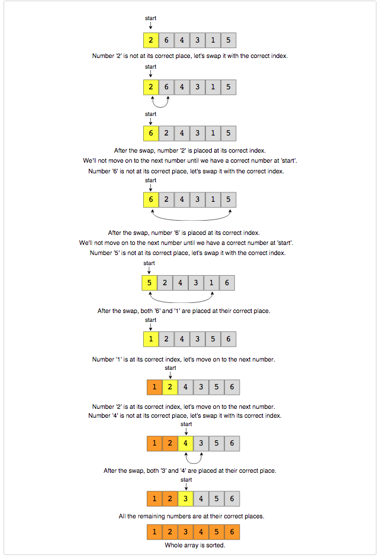

# Pattern 5: Cyclic Sort

This pattern describes an interesting approach to deal with problems involving arrays containing numbers in a given range.

### For example, take the following problem:

> You are given an unsorted array containing numbers taken from the range `1` to `n` The array can have duplicates, which means that some numbers will be missing. Find all the missing numbers.

To efficiently solve this problem, we can use the fact that the input array contains numbers in the range of `1` to `n`.
For example, to efficiently sort the array, we can try placing each number in its correct place, i.e., placing `1` at index `0`, placing `2` at index `1`, and so on. Once we are done with the sorting, we can iterate the array to find all indices that are missing the correct numbers. These will be our required numbers.

## Cyclic Sort (easy)

We are given an array containing `n` objects. Each object, when created, was assigned a unique number from `1` to `n` based on their creation sequence. This means that the object with sequence number `3` was created just before the object with sequence number `4`.

> Write a function to sort the objects <i>in-place</i> on their creation sequence number in `O(n)` and without any extra space.

For simplicity, let’s assume we are passed an integer array containing only the sequence numbers, though each number is actually an object.
As we know, the input array contains numbers in the range of `1` to `n`. We can use this fact to devise an efficient way to sort the numbers. Since all numbers are unique, we can try placing each number at its correct place, i.e., placing `1` at index `0`, placing `2` at index `1`, and so on.

To place a number (or an object in general) at its correct index, we first need to find that number. If we first find a number and then place it at its correct place, it will take us `O(N²)`, which is not acceptable.

Instead, what if we iterate the array one number at a time, and if the current number we are iterating is not at the correct index, we swap it with the number at its correct index. This way we will go through all numbers and place them in their correct indices, hence, sorting the whole array.



```js
function cyclicSort(nums) {
  let i = 0;

  while (i < nums.length) {
    const j = nums[i] - 1; //nums[i] = 3, 3-1 = 2
    if (nums[i] !== nums[j]) {
      //3 !== 2
      //swap
      // [nums[i], nums[j]] = [nums[j], nums[i]]
      let temp = nums[i];
      nums[i] = nums[j];
      nums[j] = temp;
    } else {
      i++;
    }
  }
  return nums;
}

cyclicSort([3, 1, 5, 4, 2]);
cyclicSort([2, 6, 4, 3, 1, 5]);
cyclicSort([1, 5, 6, 4, 3, 2]);
```

- The time complexity of the above algorithm is `O(n)`. Although we are not incrementing the index `i` when swapping the numbers, this will result in more than `n` iterations of the loop, but in the worst-case scenario, the while loop will swap a total of `n-1` numbers and once a number is at its correct index, we will move on to the next number by incrementing `i`. So overall, our algorithm will take `O(n) + O(n-1)` which is asymptotically equivalent to `O(n)`.
- The algorithm runs in constant space `O(1)`.

## Find the Missing Number (easy)

https://leetcode.com/problems/missing-number/

> We are given an array containing `n` distinct numbers taken from the range `0` to `n`. Since the array has only `n` numbers out of the total `n+1` numbers, find the missing number.

This problem follows the <b>[Cyclic Sort pattern](#pattern-5-cyclic-sort)</b>. Since the input array contains unique numbers from the range `0` to `n`, we can use a similar strategy as discussed in <b>[Cyclic Sort pattern](#pattern-5-cyclic-sort)</b> to place the numbers on their correct index. Once we have every number in its correct place, we can iterate the array to find the index which does not have the correct number, and that index will be our missing number.

However, there are two differences with <b>[Cyclic Sort](#pattern-5-cyclic-sort)</b>:

1. In this problem, the numbers are ranged from `0` to `n`, compared to `1` to `n` in the <b>[Cyclic Sort](#pattern-5-cyclic-sort)</b>. This will make two changes in our algorithm:
   - In this problem, each number should be equal to its index, compared to `index - 1` in the <b>[Cyclic Sort](#pattern-5-cyclic-sort)</b>. Therefore => `nums[i] == nums[nums[i]]`
   - Since the array will have `n` numbers, which means array indices will range from `0` to `n-1`. Therefore, we will ignore the number `n` as we can’t place it in the array, so => `nums[i] < nums.length`
2. Say we are at index `i`. If we swap the number at index `i` to place it at the correct index, we can still have the wrong number at index `i`. This was true in <b>[Cyclic Sort](#pattern-5-cyclic-sort)</b> too. It didn’t cause any problems in <b>[Cyclic Sort](#pattern-5-cyclic-sort)</b> as over there, we made sure to place one number at its correct place in each step, but that wouldn’t be enough in this problem as we have one extra number due to the larger range. Therefore, we will not move to the next number after the swap until we have a correct number at the index `i`.

```js
function findMissingNumber(nums) {
  let i = 0;
  const n = nums.length;

  //sort first
  while (i < n) {
    let j = nums[i];
    if (nums[i] < n && nums[i] !== nums[j]) {
      //0 < 4 && 0 !== 4
      //swap
      [nums[i], nums[j]] = [nums[j], nums[i]];
    } else {
      i++;
    }
  }

  //find the first number missing from it's index
  //that will be our required number
  for (i = 0; i < n; i++) {
    if (nums[i] !== i) {
      return i;
    }
  }
  return n;
}

findMissingNumber([4, 0, 3, 1]); //2
findMissingNumber([8, 3, 5, 2, 4, 6, 0, 1]); //7
```

- The time complexity of the above algorithm is `O(n)`. In the while loop, although we are not incrementing the index `i` when swapping the numbers, this will result in more than `n` iterations of the loop, but in the worst-case scenario, the while loop will swap a total of `n-1` numbers and once a number is at its correct index, we will move on to the next number by incrementing `i`. In the end, we iterate the input array again to find the first number missing from its index, so overall, our algorithm will take `O(n) + O(n-1) + O(n)` which is asymptotically equivalent to `O(n)`.
- The algorithm runs in constant space `O(1)`.

## Find all Missing Numbers (easy)

https://leetcode.com/problems/find-all-numbers-disappeared-in-an-array/

> We are given an unsorted array containing numbers taken from the range `1` to `n`. The array can have duplicates, which means some numbers will be missing. Find all those missing numbers.

This problem follows the <b>[Cyclic Sort pattern](#pattern-5-cyclic-sort)</b> and shares similarities with <b>[Find the Missing Number](#find-the-missing-number-easy)</b> with one difference. In this problem, there can be many duplicates whereas in <b>[Find the Missing Number](#find-the-missing-number-easy)</b> there were no duplicates and the range was greater than the length of the array.

However, we will follow a similar approach though as discussed in <b>[Find the Missing Number](#find-the-missing-number-easy)</b> to place the numbers on their correct indices. Once we are done with the <b>Cyclic Sort</b> we will iterate the array to find all indices that are missing the correct numbers.

```js
function findMissingNumbers(nums) {
  let i = 0;

  while (i < nums.length) {
    const j = nums[i] - 1;

    if (nums[i] !== nums[j]) {
      //swap
      [nums[i], nums[j]] = [nums[j], nums[i]];
    } else {
      i++;
    }
  }

  let missingNumbers = [];

  for (i = 0; i < nums.length; i++) {
    if (nums[i] !== i + 1) {
      missingNumbers.push(i + 1);
    }
  }

  return missingNumbers;
}

findMissingNumbers([2, 3, 1, 8, 2, 3, 5, 1]); //[4, 6, 7], The array should have all numbers from 1 to 8, due to duplicates 4, 6, and 7 are missing.
findMissingNumbers([2, 4, 1, 2]); //3
findMissingNumbers([2, 3, 2, 1]); //4
```

- The time complexity of the above algorithm is `O(n)`.
- Ignoring the space required for the output array, the algorithm runs in constant space `O(1)`.

## Find the Duplicate Number (easy)

https://leetcode.com/problems/find-the-duplicate-number/

> We are given an unsorted array containing `n+1` numbers taken from the range `1`to`n` The array has only one duplicate but it can be repeated multiple times. <b>Find that duplicate number without using any extra space</b>. You are, however, allowed to modify the input array.

This problem follows the <b>[Cyclic Sort pattern](#pattern-5-cyclic-sort)</b> and shares similarities with <b>[Find the Missing Number](#find-the-missing-number-easy)</b>. Following a similar approach, we will try to place each number on its correct index. Since there is only one duplicate, if while swapping the number with its index both the numbers being swapped are same, we have found our duplicate!

```js
function findDuplicate(nums) {
  let i = 0;

  while (i < nums.length) {
    if (nums[i] !== i + 1) {
      let j = nums[i] - 1;
      if (nums[i] !== nums[j]) {
        //swap
        [nums[i], nums[j]] = [nums[j], nums[i]];
      } else {
        //we have found the duplicate
        return nums[i];
      }
    } else {
      i++;
    }
  }
  return -1;
}

findDuplicate([1, 4, 4, 3, 2]); //4
findDuplicate([2, 1, 3, 3, 5, 4]); //3
findDuplicate([2, 4, 1, 4, 4]); //4
```

- The time complexity of the above algorithm is `O(n)`.
- The algorithm runs in constant space `O(1)` but modifies the input array.

> Can we solve the above problem in `O(1)` space and without modifying the input array?

While doing the <b>Cyclic Sort</b>, we realized that the array will have a cycle due to the duplicate number and that the start of the cycle will always point to the duplicate number. This means that we can use the <b>fast & the slow</b> pointer method to find the duplicate number or the start of the cycle similar to <b>[Start of LinkedList Cycle](https://github.com/Chanda-Abdul/Several-Coding-Patterns-for-Solving-Data-Structures-and-Algorithms-Problems-during-Interviews/blob/main/%E2%9C%85%20%20Pattern%2003:%20Fast%20%26%20Slow%20pointers.md#start-of-linkedlist-cycle-medium)</b>.

```js
function findDuplicate(nums) {
  //using fast & slow pointer method
  let slow = nums[0];
  let fast = nums[nums[0]];
  while (slow !== fast) {
    slow = nums[slow];
    fast = nums[nums[fast]];
  }
  //find the cycle length
  let current = nums[nums[slow]];
  let cycleLength = 1;
  while (current !== nums[slow]) {
    current = nums[current];
    cycleLength++;
  }

  return findStart(nums, cycleLength);
}

function findStart(nums, cycleLength) {
  let pointer1 = nums[0];
  let pointer2 = nums[0];
  //move pointer2 ahead by cycleLength steps
  while (cycleLength > 0) {
    pointer2 = nums[pointer2];
    cycleLength--;
  }
  //increment both pointers until they meet at the start of the cycle
  while (pointer1 !== pointer2) {
    pointer1 = nums[pointer1];
    pointer2 = nums[pointer2];
  }

  return pointer1;
}

findDuplicate([1, 4, 4, 3, 2]); //4
findDuplicate([2, 1, 3, 3, 5, 4]); //3
findDuplicate([2, 4, 1, 4, 4]); //4
```

- The time complexity of the above algorithm is `O(n)` and the space complexity is `O(1)`.

## Find all Duplicate Numbers (easy)

https://leetcode.com/problems/find-all-duplicates-in-an-array/

> We are given an unsorted array containing `n` numbers taken from the range `1` to `n`. The array has some numbers appearing twice, <b>find all these duplicate numbers without using any extra space</b>.

This problem follows the <b>[Cyclic Sort pattern](#pattern-5-cyclic-sort)</b> and shares similarities with <b>[Find the Duplicate Number](#find-all-duplicate-numbers-easy)</b>. Following a similar approach, we will place each number at its correct index. After that, we will iterate through the array to find all numbers that are not at the correct indices. All these numbers are duplicates.

```js
function findAllDuplicates(nums) {
  let i = 0;

  while (i < nums.length) {
    //??
    let j = nums[i] - 1;

    if (nums[i] !== nums[j]) {
      //swap
      [nums[i], nums[j]] = [nums[j], nums[i]];
    } else {
      i++;
    }
  }

  let duplicateNumbers = [];

  for (i = 0; i < nums.length; i++) {
    if (nums[i] !== i + 1) {
      //we have found the duplicate
      duplicateNumbers.push(nums[i]);
    }
  }

  return duplicateNumbers;
}

findAllDuplicates([3, 4, 4, 5, 5]); //[4, 5]
findAllDuplicates([5, 4, 7, 2, 3, 5, 3]); //[3, 5]
```

- The time complexity of the above algorithm is `O(n)`.
- Ignoring the space required for storing the duplicates, the algorithm runs in constant space `O(1)`.

## 🌟 Find the Corrupt Pair (easy)

> We are given an unsorted array containing `n` numbers taken from the range `1` to `n`. The array originally contained all the numbers from `1` to `n`, but due to a data error, one of the numbers got duplicated which also resulted in one number going missing. Find both these numbers.

```js
function findCorruptNumbers(nums) {
  let i = 0;

  while (i < nums.length) {
    const j = nums[i] - 1;
    if (nums[i] !== nums[j]) {
      //swap
      [nums[i], nums[j]] = [nums[j], nums[i]];
    } else {
      i++;
    }
  }

  //output => duplicate number(nums[i]) and the missing number(i+1)
  for (let i = 0; i < nums.length; i++) {
    if (nums[i] !== i + 1) {
      return [nums[i], i + 1];
    }
  }
  return [-1, -1];
}

findCorruptNumbers([3, 1, 2, 5, 2]); //[2, 4], '2' is duplicated and '4' is missing.
findCorruptNumbers([3, 1, 2, 3, 6, 4]); // [3, 5], '3' is duplicated and '5' is missing.
```

- The time complexity of the above algorithm is `O(n)`.
- The algorithm runs in constant space `O(1)`.

## 🌟 Find the Smallest Missing Positive Number (medium)

https://leetcode.com/problems/first-missing-positive/

> Given an unsorted array containing numbers, find the <b>smallest missing positive number</b> in it.

This problem follows the <b>[Cyclic Sort pattern](#pattern-5-cyclic-sort)</b> and shares similarities with <b>[Find the Missing Number](#find-the-missing-number-easy)</b> with one big difference. In this problem, the numbers are not bound by any range so we can have any number in the input array.

However, we will follow a similar approach though as discussed in <b>[Find the Missing Number](#find-the-missing-number-easy)</b> to place the numbers on their correct indices and ignore all numbers that are out of the range of the array (i.e., all negative numbers and all numbers greater than or equal to the length of the array). Once we are done with the <b>Cyclic Sort</b> we will iterate the array and the first index that does not have the correct number will be the smallest missing positive number!

```js
function findFirstSmallestMissingPositive(nums) {
  //try to sort the array
  let i = 0;
  let n = nums.length;

  while (i < n) {
    const j = nums[i] - 1;
    if (nums[i] !== nums[j] && nums[i] > 0 && nums[i] <= n) {
      [nums[i], nums[j]] = [nums[j], nums[i]];
    } else {
      i++;
    }
  }

  for (let i = 0; i < n; i++) {
    if (nums[i] !== i + 1) {
      return i + 1;
    }
  }

  return nums.length + 1;
}

findFirstSmallestMissingPositive([-3, 1, 5, 4, 2]); //3, The smallest missing positive number is '3'
findFirstSmallestMissingPositive([3, -2, 0, 1, 2]); //4
findFirstSmallestMissingPositive([3, 2, 5, 1]); //4
```

- The time complexity of the above algorithm is `O(n)`.
- The algorithm runs in constant space `O(1)`.

## 🌟 Find the First K Missing Positive Numbers (hard)

https://leetcode.com/problems/kth-missing-positive-number/

> Given an unsorted array containing numbers and a number `K`, find the first `K` missing positive numbers in the array.

This problem follows the <b>[Cyclic Sort pattern](#pattern-5-cyclic-sort)</b> and shares similarities with <b>[Find the Smallest Missing Positive Number](#🌟-find-the-smallest-missing-positive-number-medium)</b>. The only difference is that, in this problem, we need to find the first `K` missing numbers compared to only the first missing number.

We will follow a similar approach as discussed in <b>[Find the Smallest Missing Positive Number](#🌟-find-the-smallest-missing-positive-number-medium)</b> to place the numbers on their correct indices and ignore all numbers that are out of the range of the array. Once we are done with the <b>Cyclic Sort</b> we will iterate through the array to find indices that do not have the correct numbers.

If we are not able to find `K` missing numbers from the array, we need to add additional numbers to the output array. 

To find these additional numbers we will use the length of the array. For example, if the length of the array is `4`, the next missing numbers will be `4, 5, 6` and so on. 

One tricky aspect is that any of these additional numbers could be part of the array. Remember, while sorting, we ignored all numbers that are greater than or equal to the length of the array. 

So all indices that have the missing numbers could possibly have these additional numbers. 

To handle this, we must keep track of all numbers from those indices that have missing numbers.

Let’s understand this with an example:

```
nums: [2, 1, 3, 6, 5], k =2
```

After the <b>Cyclic Sort</b> our array will look like:

```
nums: [1, 2, 3, 6, 5]
```

From the sorted array we can see that the first missing number is `4` (as we have `6` on the fourth index) but to find the second missing number we need to remember that the array does contain `6`. Hence, the next missing number is `7`.

```js
function findFirstKMissingPositive(nums, k) {
  //sort? the input array
  let i = 0;
  const n = nums.length;

  while (i < n) {
    const j = nums[i] - 1;
    if (nums[i] !== nums[j] && nums[i] <= n && nums[i] > 0) {
      //swap
      [nums[i], nums[j]] = [nums[j], nums[i]];
    } else {
      i++;
    }
  }

  const missingNumbers = [];
  const extraNumbers = new Set();

  for (let i = 0; i < n; i++) {
    if (missingNumbers.length < k) {
      if (nums[i] !== i + 1) {
        missingNumbers.push(i + 1);
        extraNumbers.add(nums[i]);
      }
    }
  }

  //add the remaining missing numbers
  let j = 1;

  while (missingNumbers.length < k) {
    const currentNumber = j + n;
    //ignore if the array contains the current number
    if (!extraNumbers.has(currentNumber)) {
      missingNumbers.push(currentNumber);
    }
    j++;
  }

  return missingNumbers;
}

findFirstKMissingPositive([3, -1, 4, 5, 5], 3); //[1, 2, 6], The smallest missing positive numbers are 1, 2 and 6.)
findFirstKMissingPositive([2, 3, 4], 3); //[1, 5, 6], The smallest missing positive numbers are 1, 5 and 6.
findFirstKMissingPositive([-2, -3, 4], 2); //[1, 2], The smallest missing positive numbers are 1 and 2.
findFirstKMissingPositive([2, 1, 3, 6, 5], 2); //[4, 7]
```

- The time complexity of the above algorithm is `O(n + k)`, as the last two for loops will run for `O(n)` and `O(k)` times respectively.
- The algorithm needs `O(k)` space to store the `extraNumbers`.
