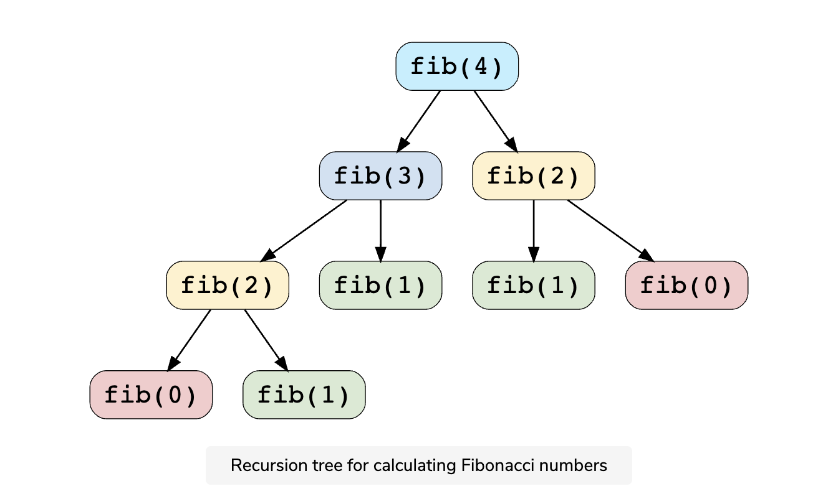
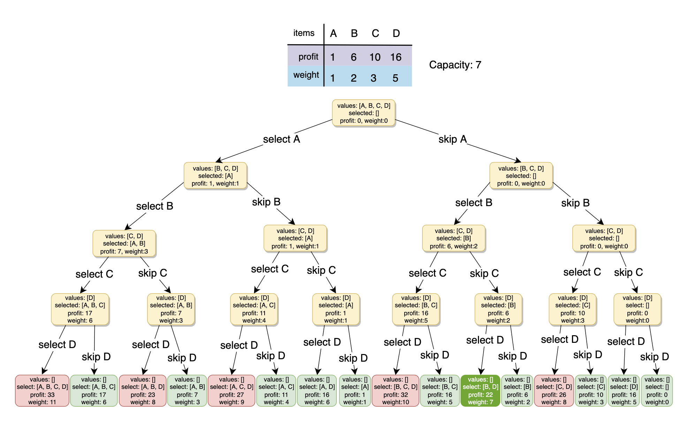
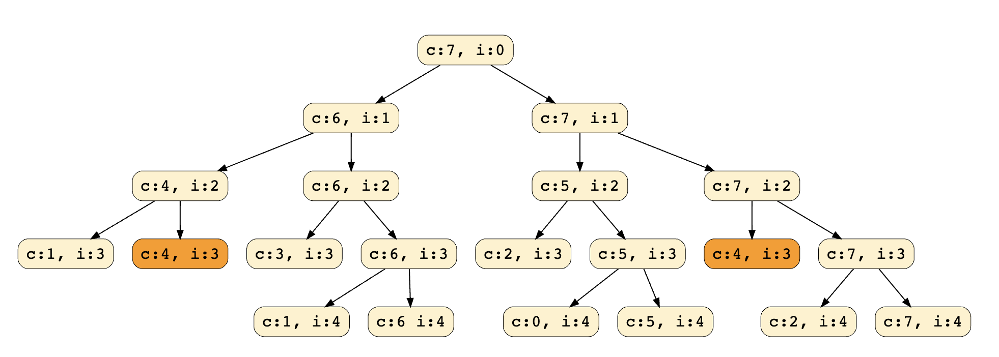
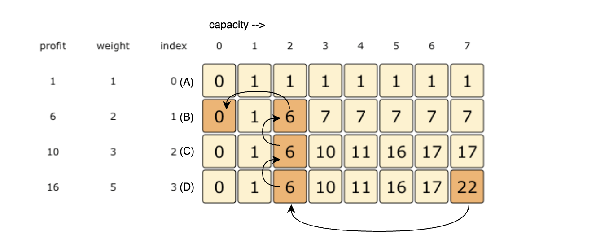
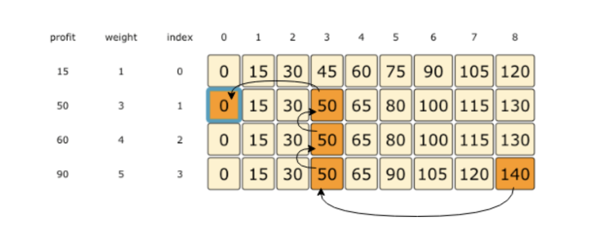
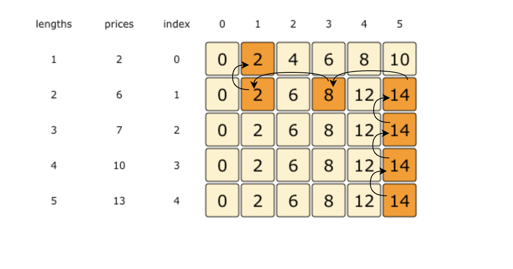
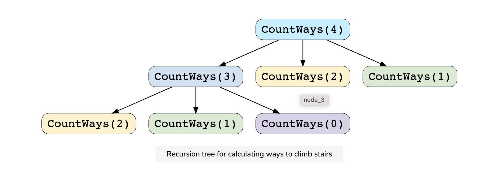
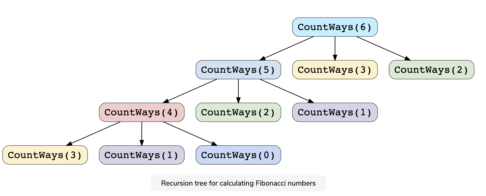

# Pattern 15: 0-1 Knapsack (Dynamic Programming)

from this [course](https://www.educative.io/courses/grokking-dynamic-programming-patterns-for-coding-interviews)
| |
| --------------------------------------------------------------------------------- |
| <b>[Pattern 1: 0/1 Knapsack](#pattern-1-01-knapsack)</b> |
| <b>[Pattern 2: Unbounded Knapsack](#pattern-2-unbounded-knapsack)</b> |
| <b>[Pattern 3: Fibonacci Numbers](#pattern-3-fibonacci-numbers)</b> |
| <b>[Pattern 4: Palindromic Subsequence](#pattern-4-palindromic-subsequence)</b> |
| <b>[Pattern 5: Longest Common Substring](#pattern-5-longest-common-substring)</b> |

<b>Dynamic Programming (DP)</b> is an algorithmic technique for solving an optimization problem by breaking it down into simpler subproblems and utilizing the fact that the optimal solution to the overall problem depends upon the optimal solution to its subproblems.

Let’s take the example of the <b>Fibonacci numbers</b>. As we all know, <i>Fibonacci numbers</i> are a series of numbers in which each number is the sum of the two preceding numbers. The first few <i>Fibonacci numbers</i> are `0, 1, 1, 2, 3, 5, and 8`, and they continue on from there.

If we are asked to calculate the nth Fibonacci number, we can do that with the following equation,

```js
Fib(n) = Fib(n-1) + Fib(n-2), for n > 1
```

As we can clearly see here, to solve the overall problem (i.e. `Fib(n)`), we broke it down into two smaller subproblems (which are `Fib(n-1)` and `Fib(n-2)`). This shows that we can use <b>DP</b> to solve this problem.

## Characteristics of Dynamic Programming

Before moving on to understand different methods of solving a <b>DP</b> problem, let’s first take a look at what are the characteristics of a problem that tells us that we can apply <b>DP</b> to solve it.

### Overlapping Subproblems

Subproblems are smaller versions of the original problem. Any problem has overlapping sub-problems if finding its solution involves solving the same subproblem multiple times. Take the example of the Fibonacci numbers; to find the `fib(4)`, we need to break it down into the following sub-problems:



We can clearly see the overlapping subproblem pattern here, as `fib(2)` has been evaluated twice and `fib(1)` has been evaluated three times.

### Optimal Substructure Property

Any problem has optimal substructure property if its overall optimal solution can be constructed from the optimal solutions of its subproblems. For Fibonacci numbers, as we know,

```js
Fib(n) = Fib(n-1) + Fib(n-2)
```

This clearly shows that a problem of size `n` has been reduced to subproblems of size `n-1` and `n-2`. Therefore, Fibonacci numbers have optimal substructure property.

## Dynamic Programming Methods

DP offers two methods to solve a problem.

### Top-down with Memoization

In this approach, we try to solve the bigger problem by recursively finding the solution to smaller sub-problems. Whenever we solve a sub-problem, we cache its result so that we don’t end up solving it repeatedly if it’s called multiple times. Instead, we can just return the saved result. This technique of storing the results of already solved subproblems is called <b>Memoization</b>.

We’ll see this technique in our example of Fibonacci numbers. First, let’s see the non-DP recursive solution for finding the nth Fibonacci number:

```js
function calculateFibonacci(n) {
  if (n < 2) return n;

  return calculateFibonacci(n - 1) + calculateFibonacci(n - 2);
}

console.log(`5th Fibonacci is ---> ${calculateFibonacci(5)}`);
console.log(`6th Fibonacci is ---> ${calculateFibonacci(6)}`);
console.log(`7th Fibonacci is ---> ${calculateFibonacci(7)}`);
```

As we saw above, this problem shows the overlapping subproblems pattern, so let’s make use of <b>Memoization</b> here. We can use an array to store the already solved subproblems

```js
function calculateFibonacci(n) {
  const memoize = [];

  function fib(n) {
    if (n < 2) return n;

    // if we have already solved this subproblem, simply return the result from the cache
    if (memoize[n]) return memoize[n];

    memoize[n] = fib(n - 1) + fib(n - 2);
    return memoize[n];
  }

  return fib(n);
}

console.log(`5th Fibonacci is ---> ${calculateFibonacci(5)}`);
console.log(`6th Fibonacci is ---> ${calculateFibonacci(6)}`);
console.log(`7th Fibonacci is ---> ${calculateFibonacci(7)}`);
```

### Bottom-up with Tabulation

<b>Tabulation</b> is the opposite of the top-down approach and avoids recursion. In this approach, we solve the problem <i>“bottom-up”</i> (i.e. by solving all the related sub-problems first). This is typically done by filling up an `n`-dimensional table. Based on the results in the table, the solution to the top/original problem is then computed.

<b>Tabulation</b> is the opposite of <b>Memoization</b>, as in <b>Memoization</b> we solve the problem and maintain a map of already solved sub-problems. In other words, in <b>memoization</b> , we do it <i>top-down</i> in the sense that we solve the top problem first (which typically recurses down to solve the sub-problems).

Let’s apply <b>Tabulation</b> to our example of Fibonacci numbers. Since we know that every Fibonacci number is the sum of the two preceding numbers, we can use this fact to populate our table.

Here is the code for our <b>bottom-up dynamic programming</b> approach:

```js
function calculateFibonacci(n) {
  const dp = [0, 1];
  for (let i = 2; i <= n; i++) {
    dp[i] = dp[i - 1] + dp[i - 2];
  }
  return dp[n];
}

console.log(`5th Fibonacci is ---> ${calculateFibonacci(5)}`);
console.log(`6th Fibonacci is ---> ${calculateFibonacci(6)}`);
console.log(`7th Fibonacci is ---> ${calculateFibonacci(7)}`);
```

<b>In this course, we will always start with a brute-force recursive solution, which is the best way to start solving any DP problem!</b> Once we have a recursive solution then we will apply <i>memoization</i> and Tabulation techniques.

Let’s apply this knowledge to solve some of the frequently asked <b>DP</b> problems.

# Pattern 1: 0/1 Knapsack

## Problem Set

1. [🔎 0/1 Knapsack](#🔎-01-knapsack-medium)
2. [Equal Subset Sum Partition](#equal-subset-sum-partition-medium)
3. [Subset Sum](#🔎-subset-sum-medium)
4. [Minimum Subset Sum Difference ](#minimum-subset-sum-difference-hard)
5. [🌟Count of Subset Sum](#🌟count-of-subset-sum-hard)
6. [🌟 Target Sum](#🌟-target-sum-hard)

<b>0/1 Knapsack pattern</b> is based on the famous problem with the same name which is efficiently solved using <b>Dynamic Programming (DP)</b>.

In this pattern, we will go through a set of problems to develop an understanding of <b>DP</b>. We will always start with a brute-force recursive solution to see the overlapping subproblems, i.e., realizing that we are solving the same problems repeatedly.

After the recursive solution, we will modify our algorithm to apply advanced techniques of <b>Memoization</b> and <b>Bottom-Up Dynamic Programming</b> to develop a complete understanding of this pattern.

Let’s jump onto our first problem.

## 🔎 0/1 Knapsack (medium)

https://leetcode.com/problems/maximum-earnings-from-taxi/

> Given the weights and profits of `N` items, we are asked to put these items in a <b>knapsack</b> with a capacity `C`. The goal is to get the `maximum profit` out of the <b>knapsack</b> items. Each item can only be selected once, as we don’t have multiple quantities of any item.

Let’s take Merry’s example, who wants to carry some fruits in the <b>knapsack</b> to get `maximum profit`. Here are the weights and profits of the fruits:

- `Items: { Apple, Orange, Banana, Melon }`
- `Weights: { 2, 3, 1, 4 }`
- `Profits: { 4, 5, 3, 7 }`
- `Knapsack capacity: 5`

Let’s try to put various combinations of fruits in the knapsack, such that their total weight is not more than `5`:

- `Apple + Orange (total weight 5) => 9 profit`
- `Apple + Banana (total weight 3) => 7 profit`
- `Orange + Banana (total weight 4) => 8 profit`
- `Banana + Melon (total weight 5) => 10 profit`

This shows that `Banana + Melon` is the best combination as it gives us the `maximum profit`, and the total weight does not exceed the capacity.

> Given two integer arrays to represent weights and profits of `N` items, we need to find a subset of these items which will give us maximum profit such that their cumulative weight is not more than a given number `C`. Each item can only be selected once, which means either we put an item in the <b>knapsack</b> or we skip it.

### Basic Brute Force Soultion

A basic <b>brute-force solution</b> could be to try all combinations of the given items (as we did above), allowing us to choose the one with `maximum profit` and a weight that doesn’t exceed `C`. Take the example of four items `A, B, C, and D`, as shown in the diagram below. To try all the combinations, our algorithm will look like:


All <b>green boxes</b> have a total weight that is less than or equal to the capacity `7`, and all the <b>red ones</b> have a weight that is more than `7`. The best solution we have is with items `[B, D]` having a total profit of `22` and a total weight of `7`.

### Brute-Force Solution

```js
function solveKnapsack(profits, weights, capacity) {
  function knapsackRecursive(profits, wights, capacity, currIndex) {
    //check base case
    if (capacity <= 0 || currIndex >= profits.length) return 0;

    //recursive call after choosing the element at currIndex
    // create a new set which INCLUDES item at currIndex if the total weight does not exceed the capacity, and
    let currentProfit = 0;

    if (weights[currIndex] <= capacity) {
      currentProfit =
        profits[currIndex] +
        knapsackRecursive(
          profits,
          weights,
          capacity - weights[currIndex],
          currIndex + 1
        );
    }

    // recursively process the remaining capacity and items
    // WITHOUT item at currIndex
    let currentProfitMinusIndexItem = knapsackRecursive(
      profits,
      weights,
      capacity,
      currIndex + 1
    );

    // return the set from the above two sets with higher profit
    return Math.max(currentProfit, currentProfitMinusIndexItem);
  }

  return knapsackRecursive(profits, weights, capacity, 0);
}

console.log(
  `Total knapsack profit: ---> $${solveKnapsack(
    [1, 6, 10, 16],
    [1, 2, 3, 5],
    7
  )}`
);
console.log(
  `Total knapsack profit: ---> $${solveKnapsack(
    [1, 6, 10, 16],
    [1, 2, 3, 5],
    6
  )}`
);
```

#### Time & Space Complexity

- The above algorithm’s <b>time complexity</b> is exponential `O(2ⁿ)`, where `n` represents the total number of items. This can also be confirmed from the above recursion tree. As we can see, we will have a total of `31` 😲 recursive calls – calculated through `(2ⁿ) + (2ⁿ) - 1`, which is <i>asymptotically</i> equivalent to `O(2ⁿ)`.
- The <b>space complexity</b> is `O(n)`. This space will be used to store the <i>recursion stack</i>. Since the recursive algorithm works in a depth-first fashion, which means that we can’t have more than `n` recursive calls on the call stack at any time.

### Overlapping Sub-problems

Let’s visually draw the recursive calls to see if there are any overlapping sub-problems. As we can see, in each recursive call, `profits` and `weights` arrays remain constant, and only `capacity` and `currIndex` change. For simplicity, let’s denote capacity with `c` and `currIndex` with `i`:

We can clearly see that `c:4, i=3` has been called twice. Hence we have an <b>overlapping sub-problems pattern</b>. We can use <b>[Memoization](https://en.wikipedia.org/wiki/Memoization)</b> to solve <b>overlapping sub-problems</b> efficiently.

### Top-down Dynamic Programming with Memoization

We can use <b>memoization</b> to overcome the overlapping sub-problems. <b>[Memoization](https://en.wikipedia.org/wiki/Memoization)</b> is when we store the results of all the previously solved <b>sub-problems</b> and return the results from memory if we encounter a problem that has already been solved.

Since we have two changing values (`capacity` and `currIndex`) in our recursive `function knapsackRecursive()`, we can use a two-dimensional array to store the results of all the solved sub-problems. As mentioned above, we need to store results for every sub-array (i.e., for every possible index `i`) and every possible capacity `c`.

Here is the code with <b>memoization</b>

```js
function solveKnapsack(profits, weights, capacity) {
  const memo = [];

  function knapsackRecursive(profits, weights, capacity, currIndex) {
    //check base case
    if (capacity <= 0 || currIndex >= profits.length) return 0;

    memo[currIndex] = memo[currIndex] || [];

    if (typeof memo[currIndex][capacity] !== 'undefined') {
      return memo[currIndex][capacity];
    }

    //recursive call after choosing the element at currIndex
    // create a new set which INCLUDES item at currIndex if the total weight does not exceed the capacity, and
    let currentProfit = 0;

    if (weights[currIndex] <= capacity) {
      currentProfit =
        profits[currIndex] +
        knapsackRecursive(
          profits,
          weights,
          capacity - weights[currIndex],
          currIndex + 1
        );
    }

    // recursively process the remaining capacity and items
    // WITHOUT item at currIndex
    let currentProfitMinusIndexItem = knapsackRecursive(
      profits,
      weights,
      capacity,
      currIndex + 1
    );

    // return the set from the above two sets with higher profit
    memo[currIndex][capacity] = Math.max(
      currentProfit,
      currentProfitMinusIndexItem
    );
    return memo[currIndex][capacity];
  }

  return knapsackRecursive(profits, weights, capacity, 0, memo);
}

console.log(
  `Total knapsack profit: ---> $${solveKnapsack(
    [1, 6, 10, 16],
    [1, 2, 3, 5],
    7
  )}`
);
console.log(
  `Total knapsack profit: ---> $${solveKnapsack(
    [1, 6, 10, 16],
    [1, 2, 3, 5],
    6
  )}`
);
```

#### Time & Space Complexity

- Since our <b>Memoization</b> array `memo[profits.length][capacity+1]` stores the results for all subproblems, we can conclude that we will not have more than `N*C` subproblems (where `N` is the number of items and `C` is the <b>knapsack</b> capacity). This means that our <b>time complexity</b> will be `O(N*C)`.
- The above algorithm will use `O(N*C)` space for the <b>Memoization</b> array. Other than that, we will use `O(N)` space for the recursion call-stack. So the total <b>space complexity</b> will be `O(N*C + N)`, which is <i>asymptotically</i> equivalent to `O(N*C)`.

### Bottom-up Dynamic Programming

Let’s try to populate our `memo[][]` array from the above solution by working in a <b>bottom-up</b> fashion. Essentially, we want to find the `maximum profit` for every sub-array and every possible capacity. <b>This means that `dp[i][c]` will represent the maximum <b>knapsack</b> profit for capacity `c` calculated from the first `i` items</b>.

So, for each item at index `i` (`0 <= i < items.length`) and capacity `c` (`0 <= c <= capacity`), we have two options:

1. Exclude the item at index `i`. In this case, we will take whatever profit we get from the sub-array excluding this item => `dp[i-1][c]`
2. Include the item at index `i` if its weight is not more than the capacity. In this case, we include its profit plus whatever profit we get from the remaining capacity and from remaining items => `profit[i] + dp[i-1][c-weight[i]]`

Finally, our optimal solution will be maximum of the above two values:

`dp[i][c] = max (dp[i-1][c], profit[i] + dp[i-1][c-weight[i]])`

```js
function solveKnapsack(profits, weights, capacity) {
  //bottom-up dynamic programming approach
  const n = profits.length;

  if (capacity <= 0 || n == 0 || weights.length != n) return 0;

  const dp = Array(n)
    .fill(0)
    .map(() => Array(capacity + 1).fill(0));

  //populate the capacity=0 columns; with 0 capacity we have 0 profit
  for (let i = 0; i < n; i++) {
    dp[i][0] = 0;
  }

  //if we have only one weight, we will take it if it is not more than the capacity
  for (let c = 0; c <= capacity; c++) {
    if (weights[0] <= c) {
      dp[0][c] = profits[0];
    }
  }

  //process all sub-arrays for all the capacities
  for (let i = 1; i < n; i++) {
    for (let c = 1; c <= capacity; c++) {
      let profitWithI = 0;
      let profitMinusI = 0;
      //include the item, if its not more than the capacity
      if (weights[i] <= c) profitWithI = profits[i] + dp[i - 1][c - weights[i]];

      //exclude the item
      profitMinusI = dp[i - 1][c];

      //take the maximum
      dp[i][c] = Math.max(profitWithI, profitMinusI);
      // console.log(dp)
    }
  }
  //maximum profit with be at the bottom-right corner
  return dp[n - 1][capacity];
}

console.log(
  `Total knapsack profit: ---> $${solveKnapsack(
    [1, 6, 10, 16],
    [1, 2, 3, 5],
    7
  )}`
);
console.log(
  `Total knapsack profit: ---> $${solveKnapsack(
    [1, 6, 10, 16],
    [1, 2, 3, 5],
    6
  )}`
);
```

#### Time & Space Complexity

- The above solution has the time and <b>space complexity</b> of `O(N*C)`, where `N` represents total items, and `C` is the maximum capacity.

#### How can we find the selected items?

As we know, the final profit is at the bottom-right corner. Therefore, we will start from there to find the items that will be going into the <b>knapsack</b>.

As you remember, at every step, we had two options: include an item or skip it. If we skip an item, we take the profit from the remaining items (i.e., from the cell right above it); if we include the item, then we jump to the remaining profit to find more items.

Let’s understand this from the above example:


1. `22` did not come from the top cell (which is `17`); hence we must include the item at index `3` (which is item `D`).
2. Subtract the profit of item `D` from `22` to get the remaining profit `6`. We then jump to profit `6` on the same row.
3. `6` came from the top cell, so we jump to row `2`.
4. Again, `6` came from the top cell, so we jump to row `1`.
5. `6` is different from the top cell, so we must include this item (which is item `B`).
6. Subtract the profit of `B` from `6` to get profit `0`. We then jump to profit `0` on the same row. As soon as we hit zero remaining profit, we can finish our item search.
7. Thus, the items going into the <b>knapsack</b> are `{B, D}`.

Let’s write a function to print the set of items included in the <b>knapsack</b>.

```js
function solveKnapsack(profits, weights, capacity) {
  //bottom-up dynamic programming approach
  const n = profits.length;

  if (capacity <= 0 || n == 0 || weights.length != n) return 0;

  const dp = Array(n)
    .fill(0)
    .map(() => Array(capacity + 1).fill(0));

  //populate the capacity=0 columns; with 0 capacity we have 0 profit
  for (let i = 0; i < n; i++) {
    dp[i][0] = 0;
  }

  //if we have only one weight, we will take it if it is not more than the capacity
  for (let c = 0; c <= capacity; c++) {
    if (weights[0] <= c) {
      dp[0][c] = profits[0];
    }
  }

  //process all sub-arrays for all the capacities
  for (let i = 1; i < n; i++) {
    for (let c = 1; c <= capacity; c++) {
      let profitWithI = 0;
      let profitMinusI = 0;
      //include the item, if its not more than the capacity
      if (weights[i] <= c) profitWithI = profits[i] + dp[i - 1][c - weights[i]];

      //exclude the item
      profitMinusI = dp[i - 1][c];

      //take the maximum
      dp[i][c] = Math.max(profitWithI, profitMinusI);
    }
  }

  //**function to print the set of items included in the knapsack**//
  let selectedWeights = '';
  let totalProfit = dp[weights.length - 1][capacity];
  let remainingCapacity = capacity;
  for (let i = weights.length - 1; i > 0; i--) {
    if (totalProfit != dp[i - 1][remainingCapacity]) {
      selectedWeights = `{${weights[i]}lbs @ $${profits[i]}}${selectedWeights}`;
      remainingCapacity -= weights[i];
      totalProfit -= profits[i];
    }
  }

  if (totalProfit != 0) selectedWeights = `${weights[0]} ${selectedWeights}`;

  console.log(
    `Selected weights : ${selectedWeights} with Total knapsack profit of ---> $ ${
      dp[n - 1][capacity]
    }`
  );

  //maximum profit with be at the bottom-right corner
  return dp[n - 1][capacity];
}

console.log(
  `Total knapsack profit: ---> $${solveKnapsack(
    [1, 6, 10, 16],
    [1, 2, 3, 5],
    7
  )}`
);
console.log(
  `Total knapsack profit: ---> $${solveKnapsack(
    [1, 6, 10, 16],
    [1, 2, 3, 5],
    6
  )}`
);
```

### Challenge

Can we improve our <b>bottom-up DP</b> solution even further? Can you find an algorithm that has `O(C)` space complexity?

```js
function solveKnapsack(profits, weights, capacity) {
  //optimal O(C) bottom-up dynamic programming approach
  const n = profits.length;

  if (capacity <= 0 || n == 0 || weights.length != n) return 0;

  //we only need one previous row to find the optimal solutin,
  //overall we need 2 rows
  //the above solution is similar to the previous solution
  //the only difference is that
  //we use i%2 instead of i and (i-1)%2 instead of i-1
  const dp = Array(2)
    .fill(0)
    .map(() => Array(capacity + 1).fill(0));

  //if we have only one weight, we will take it if it is not more than the capacity
  for (let c = 0; c <= capacity; c++) {
    if (weights[0] <= c) {
      dp[0][c] = dp[1][c] = profits[0];
    }
  }

  //process all sub-arrays for all the capacities
  for (let i = 1; i < n; i++) {
    for (let c = 1; c <= capacity; c++) {
      let profitWithI = 0;
      let profitMinusI = 0;
      //include the item, if its not more than the capacity
      if (weights[i] <= c)
        profitWithI = profits[i] + dp[(i - 1) % 2][c - weights[i]];

      //exclude the item
      profitMinusI = dp[(i - 1) % 2][c];

      //take the maximum
      dp[i % 2][c] = Math.max(profitWithI, profitMinusI);
    }
  }
  //**function to print the set of items included in the knapsack**
  let selectedWeights = '';
  let totalProfit = dp[(weights.length - 1) % 2][capacity];
  let remainingCapacity = capacity;
  for (let i = weights.length - 1; i > 0; i--) {
    if (totalProfit != dp[(i - 1) % 2][remainingCapacity]) {
      selectedWeights = `{${weights[i]}lbs @ $${profits[i]}}${selectedWeights}`;
      remainingCapacity -= weights[i];
      totalProfit -= profits[i];
    }
  }

  if (totalProfit != 0) selectedWeights = `${weights[0]} ${selectedWeights}`;

  console.log(
    `Selected weights : ${selectedWeights} with Total knapsack profit of ---> $ ${
      dp[(n - 1) % 2][capacity]
    }`
  );

  //maximum profit with be at the bottom-right corner
  return dp[(n - 1) % 2][capacity];
}

console.log(
  `Total knapsack profit: ---> $${solveKnapsack(
    [1, 6, 10, 16],
    [1, 2, 3, 5],
    7
  )}`
);
console.log(
  `Total knapsack profit: ---> $${solveKnapsack(
    [1, 6, 10, 16],
    [1, 2, 3, 5],
    6
  )}`
);
```

The solution above is similar to the previous solution; the only difference is that we use `i%2` instead of `i` and `(i-1)%2` instead of `i-1`. This solution has a <b>space complexity</b> of `O(2*C) = O(C)`, where `C` is the knapsack’s maximum capacity.

This <b>space optimization solution</b> can also be implemented using a single array. It is a bit tricky, but the intuition is to use the same array for the previous and the next iteration!

If you see closely, we need two values from the previous iteration: `dp[c]` and `dp[c-weight[i]]`

Since our inner loop is iterating over `c:0-->capacity`, let’s see how this might affect our two required values:

1. When we access `dp[c]`, it has not been overridden yet for the current iteration, so it should be fine.
2. `dp[c-weight[i]]` might be overridden if `weight[i] > 0`. Therefore we can’t use this value for the current iteration.

To solve the second case, we can change our inner loop to process in the reverse direction: `c:capacity-->0`. This will ensure that whenever we change a value in `dp[]`, we will not need it again in the current iteration.

```js
function solveKnapsack(profits, weights, capacity) {
  //space optimization solution, O(C) bottom-up dynamic programming approach
  const n = profits.length;

  if (capacity <= 0 || n == 0 || weights.length != n) return 0;

  //we only need one previous row to find the optimal solutin,
  //overall we need 2 rows
  //the above solution is similar to the previous solution
  //the only difference is that
  //we use i%2 instead of i and (i-1)%2 instead of i-1
  const dp = Array(capacity + 1).fill(0);

  //if we have only one weight, we will take it if it is not more than the capacity
  for (let c = 0; c <= capacity; c++) {
    if (weights[0] <= c) {
      dp[c] = profits[0];
    }
  }

  //process all sub-arrays for all the capacities
  for (let i = 1; i < n; i++) {
    for (let c = capacity; c >= 0; c--) {
      let profitWithI = 0;
      let profitMinusI = 0;
      //include the item, if its not more than the capacity
      if (weights[i] <= c) profitWithI = profits[i] + dp[c - weights[i]];

      //exclude the item
      profitMinusI = dp[c];

      //take the maximum
      dp[c] = Math.max(profitWithI, profitMinusI);
    }
  }
  //**function to print the set of items included in the knapsack**
  let selectedWeights = '';
  let totalProfit = dp[capacity];
  let remainingCapacity = capacity;
  //*look into this for loop
  // for (let i = weights.length - 1; i > 0; i--) {
  //   if (totalProfit != dp[(i - 1) % 2][remainingCapacity]) {
  //     selectedWeights = `{${weights[i]}lbs @ $${profits[i]}}${selectedWeights}`;
  //     remainingCapacity -= weights[i];
  //     totalProfit -= profits[i];
  //   }
  // }

  // if (totalProfit != 0) selectedWeights = `${selectedWeights}`;
  console.log(
    `Selected weights : ${selectedWeights} with Total knapsack profit of ---> $ ${dp[capacity]}`
  );

  //maximum profit with be at the bottom-right corner
  return dp[capacity];
}

console.log(
  `Total knapsack profit: ---> $${solveKnapsack(
    [1, 6, 10, 16],
    [1, 2, 3, 5],
    7
  )}`
);
console.log(
  `Total knapsack profit: ---> $${solveKnapsack(
    [1, 6, 10, 16],
    [1, 2, 3, 5],
    6
  )}`
);
```

## Equal Subset Sum Partition (medium)

https://leetcode.com/problems/partition-equal-subset-sum/

> Given a set of positive numbers, find if we can partition it into two subsets such that the sum of elements in both subsets is equal.

This problem follows the <b>[0/1 Knapsack pattern](#pattern-1-01-knapsack)</b>. A basic <b>brute-force</b> solution could be to try all combinations of partitioning the given numbers into two sets to see if any pair of sets has an equal sum.

Assume that `S` represents the total sum of all the given numbers. Then the two equal subsets must have a sum equal to `S/2`. This essentially transforms our problem to: <i>"Find a subset of the given numbers that has a total sum of `S/2`"</i>.

So our <b>brute-force</b> algorithm will look like:

```js
function canPartition(num) {
  //brute force
  let sum = 0;
  for (let i = 0; i < num.length; i++) sum += num[i];

  //if sum is an odd number, we can't have two subset with equal sum
  if (sum % 2 !== 0) return false;

  return canPartitionRecursive(num, sum / 2, 0);

  function canPartitionRecursive(num, sum, currIndex) {
    //recursive base case check
    if (sum === 0) return true;

    if (num.length === 0 || currIndex >= num.length) return false;

    //recursive call after choosing the number at currIndex
    //if the number at currIndex exceed the sum, we shouldn't process
    if (num[currIndex] <= sum) {
      if (canPartitionRecursive(num, sum - num[currIndex], currIndex + 1))
        return true;
    }

    //recursive call after excluding the number at currIndex
    return canPartitionRecursive(num, sum, currIndex + 1);
  }
  return false;
}

console.log(`Can partition: ${canPartition([1, 2, 3, 4])}`); //True
//The given set can be partitioned into two subsets with equal sum: {1, 4} & {2, 3}
console.log(`Can partition: ${canPartition([1, 1, 3, 4, 7])}`); //True
//The given set can be partitioned into two subsets with equal sum: {1, 3, 4} & {1, 7}
console.log(`Can partition: ${canPartition([2, 3, 4, 6])}`); //False
//The given set cannot be partitioned into two subsets with equal sum.
```

- The <b>time complexity</b> of the above algorithm is exponential `O(2ⁿ)`, where `n` represents the total number.
- The <b>space complexity</b> is `O(n)`, which will be used to store the <i>recursion stack</i>.

### Top-down Dynamic Programming with Memoization

We can use <b>Memoization</b> to overcome the overlapping sub-problems. As stated in previous lessons, <b>Memoization</b> is when we store the results of all the previously solved sub-problems so we can return the results from memory if we encounter a problem that has already been solved.

Since we need to store the results for every subset and for every possible `sum`, therefore we will be using a two-dimensional array to store the results of the solved sub-problems. The first dimension of the array will represent different subsets and the second dimension will represent different `sums` that we can calculate from each subset. These two dimensions of the array can also be inferred from the two changing values (`sum` and `currIndex`) in our recursive `function canPartitionRecursive()`.

Here is the code for <b>Top-down Dynamic Programming with Memoization</b>:

```js
function canPartition(num) {
  //Top-down DP with memoization
  let sum = 0;
  for (let i = 0; i < num.length; i++) sum += num[i];

  //if sum is an odd number, we can't have two subset with equal sum
  if (sum % 2 !== 0) return false;

  const dp = [];
  return canPartitionRecursive(num, sum / 2, 0);

  function canPartitionRecursive(dp, num, sum, currIndex) {
    //recursive base case check
    if (sum === 0) return true;

    if (num.length === 0 || currIndex >= num.length) return false;

    dp[currIndex] = dp[currIndex] || [];

    //if we have not already processed a similar problem
    if (typeof dp[currIndex][sum] === 'undefined') {
      //recursive call after choosing the number at currIndex
      //if the number at currIndex exceed the sum, we shouldn't process
      if (num[currIndex] <= sum) {
        if (canPartitionRecursive(dp, num, sum - num[currIndex], currIndex + 1))
          dp[currIndex][sum] = true;

        return true;
      }
    }

    //recursive call after excluding the number at currIndex
    return (dp[currIndex][sum] = canPartitionRecursive(
      dp,
      num,
      sum,
      currIndex + 1
    ));
  }
  return dp[currIndex][sum];
}

console.log(`Can partition: ${canPartition([1, 2, 3, 4])}`); //True
//The given set can be partitioned into two subsets with equal sum: {1, 4} & {2, 3}
console.log(`Can partition: ${canPartition([1, 1, 3, 4, 7])}`); //True
//The given set can be partitioned into two subsets with equal sum: {1, 3, 4} & {1, 7}
console.log(`Can partition: ${canPartition([2, 3, 4, 6])}`); //False
//The given set cannot be partitioned into two subsets with equal sum.
```

- The above algorithm has the time and <b>space complexity</b> of `O(N*S)`, where `N` represents total numbers and `S` is the total sum of all the numbers.

### Bottom-up Dynamic Programming

Let’s try to populate our `dp[][]` array from the above solution by working in a <b>bottom-up</b> fashion. Essentially, we want to find if we can make all possible sums with every subset. This means, `dp[i][s]` will be `true` if we can make the sum `s` from the first `i` numbers.

So, for each number at index `i` (`0 <= i < num.length`) and sum `s` (`0 <= s <= S/2`), we have two options:

1. Exclude the number. In this case, we will see if we can get `s` from the subset excluding this number: `dp[i-1][s]`
2. Include the number if its value is not more than `s`. In this case, we will see if we can find a subset to get the remaining sum: `dp[i-1][s-num[i]]`
   If either of the two above scenarios is `true`, we can find a subset of numbers with a sum equal to `s`.

Let’s start with our <i>base case of zero capacity</i>:

From the above visualization, we can clearly see that it is possible to partition the given set into two subsets with equal sums, as shown by bottom-right cell: `dp[3][5] => T`

```js
function canPartition(num) {
  //Bottom-up Dynamic Programming
  const n = num.length;

  let sum = 0;
  for (let i = 0; i < num.length; i++) sum += num[i];

  //if sum is an odd number, we can't have two subset with equal sum
  if (sum % 2 !== 0) return false;

  //we are trying to find a subset of given numbers that has a total sum of sum/2
  sum /= 2;

  const dp = Array(n)
    .fill(false)
    .map(() => Array(sum + 1).fill(false));

  //populate the sum = 0 columns, as can always for 0 sum with an empty set
  for (let i = 0; i < n; i++) dp[i][0] = true;

  //with only one number, we can form a subset when he required sum is equal to its value
  for (let s = 1; s <= sum; s++) {
    dp[0][s] = num[0] == s;
  }

  //process all subsets for all sums
  for (let i = 1; i < n; i++) {
    for (let s = 1; s <= sum; s++) {
      //if we can get the sum s with the number at index i
      if (dp[i - 1][s]) {
        dp[i][s] = dp[i - 1][s];
      } else if (s >= num[i]) {
        //else if we can find a subset to get the remaining sum
        dp[i][s] = dp[i - 1][s - num[i]];
      }
    }
  }

  //the bottom right corner will have our answer
  return dp[n - 1][sum];
}

console.log(`Can partition: ${canPartition([1, 2, 3, 4])}`); //True
//The given set can be partitioned into two subsets with equal sum: {1, 4} & {2, 3}
console.log(`Can partition: ${canPartition([1, 1, 3, 4, 7])}`); //True
//The given set can be partitioned into two subsets with equal sum: {1, 3, 4} & {1, 7}
console.log(`Can partition: ${canPartition([2, 3, 4, 6])}`); //False
//The given set cannot be partitioned into two subsets with equal sum.
```

- The above solution the has time and <b>space complexity</b> of `O(N*S)`, where `N` represents total numbers and `S` is the total sum of all the numbers.

## 🔎 Subset Sum (medium)

https://www.techiedelight.com/subset-sum-problem/

> Given a set of positive numbers, determine if a subset exists whose sum is equal to a given number `S`.

This problem follows the <b>[0/1 Knapsack pattern](#pattern-1-01-knapsack)</b> and is quite similar to <b>[Equal Subset Sum Partition](#equal-subset-sum-partition-medium)</b>. A basic <b>brute-force</b> solution could be to try all subsets of the given numbers to see if any set has a sum equal to `S`.

So our <b>brute-force</b> algorithm will look like:

```js
for each number 'i'
 create a new set which INCLUDES number 'i' if it does not exceed 'S', and recursively
    process the remaining numbers
 create a new set WITHOUT number 'i', and recursively process the remaining numbers
return true if any of the above two sets has a sum equal to 'S', otherwise return false
```

Since this problem is quite similar to <b>[Equal Subset Sum Partition](#equal-subset-sum-partition-medium)</b>, let’s jump directly to the <b>bottom-up dynamic programming</b> solution.

### Bottom-up Dynamic Programming

We’ll try to find if we can make all possible sums with every subset to populate the array `dp[TotalNumbers][S+1]`.

For every possible sum `s` (where `0 <= s <= S`), we have two options:

1. Exclude the number. In this case, we will see if we can get the sum `s` from the subset excluding this number => `dp[index-1][s]`
2. Include the number if its value is not more than `s`. In this case, we will see if we can find a subset to get the remaining sum => `dp[index-1][s-num[index]]`

If either of the above two scenarios returns `true`, we can find a subset with a sum equal to `s`.

Here is the code for our <b>bottom-up dynamic programming</b> approach:

```js
function canPartition(nums, sum) {
  //bottom-up dynamic programming approach
  let n = nums.length;

  const dp = Array(n)
    .fill(false)
    .map(() => Array(sum + 1).fill(false));

  //populate the sum=0 columns, as we can always for 0 sum with an empty set
  for (let i = 0; i < n; i++) dp[i][0] = true;

  //with only one number, we can form a subset only when the required sum is equal to its value
  for (let s = 1; s <= sum; s++) dp[0][s] = nums[0] === s;

  //process all subsets for all lsum
  for (let i = 1; i < nums.length; i++) {
    for (let s = 1; s <= sum; s++) {
      //if we can get the sum s without the number at index i
      if (dp[i - 1][s]) {
        dp[i][s] = dp[i - 1][s];
      } else if (s >= nums[i]) {
        //else include the number and see if we can find a subset to get the remaining sum
        dp[i][s] = dp[i - 1][s - nums[i]];
      }
    }
  }
  //the bottom right corner will have our answer
  return dp[nums.length - 1][sum];
}

console.log(`Can partitioning be done: ---> ${canPartition([1, 2, 3, 4], 6)}`);
//True
//The given set has a subset whose sum is '6': {1, 2, 3}

console.log(
  `Can partitioning be done: ---> ${canPartition([1, 2, 7, 1, 5], 10)}`
);

//True
//The given set has a subset whose sum is '10': {1, 2, 7}

console.log(`Can partitioning be done: ---> ${canPartition([1, 3, 4, 8], 6)}`);
//False
//The given set does not have any subset whose sum is equal to '6'.
```

- The above solution has the time and <b>space complexity</b> of `O(N*S)`, where `N` represents total numbers and `S` is the required sum.

### Challenge

- [x] Can we improve our <b>bottom-up DP</b> solution even further? Can you find an algorithm that has `O(S)` space complexity?

```js
function canPartition(nums, sum) {
  //O(S) space bottom-up dynamic programming approach
  let n = nums.length;

  const dp = Array(sum + 1).fill(false);

  //sum=0, as we can always have 0 sum with an empty set
  dp[0] = true;

  //with only one number, we can form a subset only when the required sum is equal to its value
  for (let s = 1; s <= sum; s++) dp[s] = nums[0] == s;

  //process all subsets for all lsum
  for (let i = 1; i < nums.length; i++) {
    for (let s = sum; s >= 0; s--) {
      // if dp[s]==true, this means we can get the sum s without
      //num[i], then move on to the next number else we can include num[i]
      //and see if e can find a subset to get the remaining sum

      if (!dp[s] && s >= nums[i]) {
        //else include the number and see if we can find a subset to get the remaining sum
        dp[s] = dp[s - nums[i]];
      }
    }
  }

  return dp[sum];
}

console.log(`Can partitioning be done: ---> ${canPartition([1, 2, 3, 4], 6)}`);
//True
//The given set has a subset whose sum is '6': {1, 2, 3}

console.log(
  `Can partitioning be done: ---> ${canPartition([1, 2, 7, 1, 5], 10)}`
);

//True
//The given set has a subset whose sum is '10': {1, 2, 7}

console.log(`Can partitioning be done: ---> ${canPartition([1, 3, 4, 8], 6)}`);
//False
//The given set does not have any subset whose sum is equal to '6'.
```

## Minimum Subset Sum Difference (hard)

https://leetcode.com/problems/partition-array-into-two-arrays-to-minimize-sum-difference/

> Given a set of positive numbers, partition the set into two subsets with minimum difference between their subset sums.

This problem follows the <b>[0/1 Knapsack pattern](#pattern-1-01-knapsack)</b> and can be converted into a <b>[Subset Sum](#🔎-subset-sum-medium)</b> problem.

Let’s assume `str1` and `str2` are the two desired subsets. A basic <b>brute-force</b> solution could be to try adding each element either in `str1` or `str2` in order to find the combination that gives the minimum sum difference between the two sets.

So our <b>brute-force</b> algorithm will look like:

```js
for each number 'i'
  add number 'i' to str1 and recursively process the remaining numbers
  add number 'i' to str2 and recursively process the remaining numbers
return the minimum absolute difference of the above two sets
```

Here is the code for the <b>brute-force</b> solution:

```js
function canPartition(nums) {
  //brute force

  function canPartitionRecursive(nums, currIndex, sum1, sum2) {
    //recursive base check
    if (currIndex === nums.length) return Math.abs(sum1 - sum2);

    //recursive call after including the number at the
    //currIndex in the first set
    const difference1 = canPartitionRecursive(
      nums,
      currIndex + 1,
      sum1 + nums[currIndex],
      sum2
    );

    //recursive call after including the number at the
    //currIndex in the second set
    const difference2 = canPartitionRecursive(
      nums,
      currIndex + 1,
      sum1,
      sum2 + nums[currIndex]
    );

    return Math.min(difference1, difference2);
  }
  return canPartitionRecursive(nums, 0, 0, 0);
}

console.log(`Can partitioning be done: ---> ${canPartition([1, 2, 3, 9])}`);
//3
//We can partition the given set into two subsets where minimum absolute difference between the sum of numbers is '3'. Following are the two subsets: {1, 2, 3} & {9}.

console.log(`Can partitioning be done: ---> ${canPartition([1, 2, 7, 1, 5])}`);
//0
//We can partition the given set into two subsets where minimum absolute difference between the sum of number is '0'. Following are the two subsets: {1, 2, 5} & {7, 1}.

console.log(`Can partitioning be done: ---> ${canPartition([1, 3, 100, 4])}`);
//92
//We can partition the given set into two subsets where minimum absolute difference between the sum of numbers is '92'. Here are the two subsets: {1, 3, 4} & {100}.
```

- Because of the two recursive calls, the <b>time complexity</b> of the above algorithm is exponential `O(2ⁿ)`, where `n` represents the total number.
- The <b>space complexity</b> is `O(n)` which is used to store the <i>recursion stack</i>.

### Top-down Dynamic Programming with Memoization

We can use <b>memoization</b> to overcome the overlapping sub-problems.

We will be using a two-dimensional array to store the results of the solved sub-problems. We can uniquely identify a sub-problem from `currIndex` and `sum1` as `sum2` will always be the sum of the remaining numbers.

```js
function canPartition(nums) {
  //Top-down Dynamic Programming with Memoization
  let sum = 0;
  for (let i = 0; i < nums.length; i++) sum += nums[i];
  const dp = [];

  function canPartitionRecursive(nums, currIndex, sum1, sum2) {
    //recursive base check
    if (currIndex === nums.length) return Math.abs(sum1 - sum2);

    dp[currIndex] = dp[currIndex] || [];

    //check if we have not already process similar problem
    if (typeof dp[currIndex][sum1] === 'undefined') {
      //recursive call after including the number at the
      //currIndex in the first set
      const difference1 = canPartitionRecursive(
        nums,
        currIndex + 1,
        sum1 + nums[currIndex],
        sum2
      );

      //recursive call after including the number at the
      //currIndex in the second set
      const difference2 = canPartitionRecursive(
        nums,
        currIndex + 1,
        sum1,
        sum2 + nums[currIndex]
      );
      dp[currIndex][sum1] = Math.min(difference1, difference2);
    }
    return dp[currIndex][sum1];
  }

  return canPartitionRecursive(nums, 0, 0, 0);
}

console.log(`Can partitioning be done: ---> ${canPartition([1, 2, 3, 9])}`);
//3
//We can partition the given set into two subsets where minimum absolute difference between the sum of numbers is '3'. Following are the two subsets: {1, 2, 3} & {9}.

console.log(`Can partitioning be done: ---> ${canPartition([1, 2, 7, 1, 5])}`);
//0
//We can partition the given set into two subsets where minimum absolute difference between the sum of number is '0'. Following are the two subsets: {1, 2, 5} & {7, 1}.

console.log(`Can partitioning be done: ---> ${canPartition([1, 3, 100, 4])}`);
//92
//We can partition the given set into two subsets where minimum absolute difference between the sum of numbers is '92'. Here are the two subsets: {1, 3, 4} & {100}.
```

### Bottom-up Dynamic Programming

Let’s assume `S` represents the total sum of all the numbers. So, in this problem, we are trying to find a subset whose sum is as close to `S/2` as possible, because if we can partition the given set into two subsets of an equal sum, we get the minimum difference, i.e. zero. This transforms our problem to <b>Subset Sum</b>, where we try to find a subset whose sum is equal to a given number-- `S/2` in our case. If we can’t find such a subset, then we will take the subset which has the sum closest to `S/2`. This is easily possible, as we will be calculating all possible sums with every subset.

Essentially, we need to calculate all the possible sums up to `S/2` for all numbers. So how can we populate the array `db[TotalNumbers][S/2+1]` in the bottom-up fashion?

For every possible sum `s` (where `0 <= s <= S/2`), we have two options:

1. Exclude the number. In this case, we will see if we can get the sum `s` from the subset excluding this `number => dp[index-1][s]`
2. Include the number if its value is not more than `s`. In this case, we will see if we can find a subset to get the remaining `sum => dp[index-1][s-num[index]]`

If either of the two above scenarios is `true`, we can find a subset with a sum equal to `s`. We should dig into this before we can learn how to find the closest subset.

Let’s draw this visually, with the example input `{1, 2, 3, 9}`. Since the total sum is `15`, we will try to find a subset whose sum is equal to the half of it, i.e. `7`.

[](./subsetsum.jpg)

The above visualization tells us that it is not possible to find a subset whose sum is equal to `7`. So what is the closest subset we can find? We can find the subset if we start moving backwards in the last row from the bottom right corner to find the first `T`. The first `T` in the diagram above is the sum `6`, which means that we can find a subset whose sum is equal to `6`. This means the other set will have a sum of `9` and the minimum difference will be `3`.

Here is the code for our <b>bottom-up dynamic programming</b> approach:

```js
function canPartition(nums) {
  //bottom-up dynamic programming
  let n = nums.length;
  let sum = 0;
  for (let i = 0; i < n; i++) sum += nums[i];

  const requiredSum = Math.floor(sum / 2);
  const dp = Array(n)
    .fill(false)
    .map(() => Array(requiredSum + 1).fill(false));

  //populage the sum=0 columns, as we can always form 0 sum with empty set
  for (let i = 0; i < n; i++) dp[i][0] = true;

  //with only only number, we can form a subset only when the reuired sum is eual to that number
  for (let s = 1; s <= requiredSum; s++) {
    dp[0][s] = nums[0] == s;
  }

  //process all subsets for all sums
  for (let i = 1; i < n; i++) {
    for (let s = 1; s <= requiredSum; s++) {
      // if we can get the sum 's' without the number at index 'i'
      if (dp[i - 1][s]) {
        dp[i][s] = dp[i - 1][s];
      } else if (s >= nums[i]) {
        // else include the number and see if we can find a subset to get the remaining sum
        dp[i][s] = dp[i - 1][s - nums[i]];
      }
    }
  }

  let sum1 = 0;
  // Find the largest index in the last row which is true
  for (let i = requiredSum; i >= 0; i--) {
    if (dp[n - 1][i] === true) {
      sum1 = i;
      break;
    }
  }

  const sum2 = sum - sum1;
  return Math.abs(sum2 - sum1);
}

console.log(`Can partitioning be done: ---> ${canPartition([1, 2, 3, 9])}`);
//3
//We can partition the given set into two subsets where minimum absolute difference between the sum of numbers is '3'. Following are the two subsets: {1, 2, 3} & {9}.

console.log(`Can partitioning be done: ---> ${canPartition([1, 2, 7, 1, 5])}`);
//0
//We can partition the given set into two subsets where minimum absolute difference between the sum of number is '0'. Following are the two subsets: {1, 2, 5} & {7, 1}.

console.log(`Can partitioning be done: ---> ${canPartition([1, 3, 100, 4])}`);
//92
//We can partition the given set into two subsets where minimum absolute difference between the sum of numbers is '92'. Here are the two subsets: {1, 3, 4} & {100}.
```

- The above solution has the time and <b>space complexity</b> of `O(N*S)`, where `N` represents total numbers and `S` is the total sum of all the numbers.

## 🌟Count of Subset Sum (hard)

https://leetcode.com/problems/combination-sum/

> Given a set of positive numbers, find the total number of subsets whose sum is equal to a given number `S`.

This problem follows the <b>[0/1 Knapsack pattern](#pattern-1-01-knapsack)</b> and is quite similar to <b>[Subset Sum](#🔎-subset-sum-medium)</b>. The only difference in this problem is that we need to count the number of subsets, whereas in <b>[Subset Sum](#🔎-subset-sum-medium)</b> we only wanted to know if a subset with the given sum existed.

A basic <b>brute-force</b> solution could be to try all subsets of the given numbers to count the subsets that have a sum equal to `S`. So our <b>brute-force</b> algorithm will look like:

```js
for each number 'i'
  create a new set which includes number 'i' if it does not exceed 'S', and recursively
      process the remaining numbers and sum
  create a new set without number 'i', and recursively process the remaining numbers
return the count of subsets who has a sum equal to 'S'
```

Here is the code for the <b>brute-force</b> solution:

```js
function countSubsets(num, sum) {
  function countSubsetsRecursive(num, sum, currIndex) {
    //recursive base case check
    if (sum === 0) return 1;

    if (num.length === 0 || currIndex >= num.length) return 0;

    //recursive call after selecting the number at the currIndex
    //if the number at currIndex exceeds the sum, we shouldn't process this
    let sum1 = 0;
    if (num[currIndex] <= sum) {
      sum1 = countSubsetsRecursive(num, sum - num[currIndex], currIndex + 1);
    }

    //recursive call after excluding the number at currIndex
    const sum2 = countSubsetsRecursive(num, sum, currIndex + 1);
    return sum1 + sum2;
  }

  return countSubsetsRecursive(num, sum, 0);
}

console.log(`Count of subset sum is: ---> ${countSubsets([1, 1, 2, 3], 4)}`);
// 3
//The given set has '3' subsets whose sum is '4': {1, 1, 2}, {1, 3}, {1, 3}
//Note that we have two similar sets {1, 3}, because we have two '1' in our input.
console.log(`Count of subset sum is: ---> ${countSubsets([1, 2, 7, 1, 5], 9)}`);
//3
//The given set has '3' subsets whose sum is '9': {2, 7}, {1, 7, 1}, {1, 2, 1, 5}
```

- The <b>time complexity</b> of the above algorithm is exponential `O(2ⁿ)`, where `n` represents the total number.
- The <b>space complexity</b> is `O(n)` which is used to store the <i>recursion stack</i>.

### Top-down Dynamic Programming with Memoization

We can use <b>memoization</b> to overcome the overlapping sub-problems. We will be using a two-dimensional array to store the results of solved sub-problems. As mentioned above, we need to store results for every subset and for every possible sum.

```js
function countSubsets(num, sum) {
  const dp = [];

  function countSubsetsRecursive(num, sum, currIndex) {
    //recursive base case check
    if (sum === 0) return 1;

    if (num.length === 0 || currIndex >= num.length) return 0;

    dp[currIndex] = dp[currIndex] || [];

    //check if we have not already processed a similar problem
    if (typeof dp[currIndex][sum] === 'undefined') {
      //recursive call after selecting the number at the currIndex
      //if the number at currIndex exceeds the sum, we shouldn't process this
      let sum1 = 0;
      if (num[currIndex] <= sum) {
        sum1 = countSubsetsRecursive(num, sum - num[currIndex], currIndex + 1);
      }
      //recursive call after excluding the number at currIndex
      const sum2 = countSubsetsRecursive(num, sum, currIndex + 1);
      dp[currIndex][sum] = sum1 + sum2;
    }

    return dp[currIndex][sum];
  }

  return countSubsetsRecursive(num, sum, 0);
}

console.log(`Count of subset sum is: ---> ${countSubsets([1, 1, 2, 3], 4)}`);
// 3
//The given set has '3' subsets whose sum is '4': {1, 1, 2}, {1, 3}, {1, 3}
//Note that we have two similar sets {1, 3}, because we have two '1' in our input.
console.log(`Count of subset sum is: ---> ${countSubsets([1, 2, 7, 1, 5], 9)}`);
//3
//The given set has '3' subsets whose sum is '9': {2, 7}, {1, 7, 1}, {1, 2, 1, 5}
```

### Bottom-up Dynamic Programming

We will try to find if we can make all possible sums with every subset to populate the array `db[TotalNumbers][S+1]`.

So, at every step we have two options:

1. Exclude the number. Count all the subsets without the given number up to the given `sum => dp[index-1][sum]`
2. Include the number if its value is not more than the `sum`. In this case, we will count all the subsets to get the remaining `sum => dp[index-1][sum-num[index]]`

To find the total sets, we will add both of the above two values:

```js
    dp[index][sum] = dp[index-1][sum] + dp[index-1][sum-num[index]])
```

Here is the code for our <b>bottom-up dynamic programming</b> approach:

```js
function countSubsets(num, sum) {
  //bottom-up dynamic programming approach
  const n = num.length;
  const dp = Array(n)
    .fill(0)
    .map(() => Array(sum + 1).fill(0));

  //populate the sum=0 columns, as we will always have an empty set for zero sum
  for (let i = 0; i < n; i++) {
    dp[i][0] = 1;
  }

  //with only one number, we can form a subset only when the required sum is equal to its value
  for (let s = 1; s <= sum; s++) {
    dp[0][s] = num[0] == s ? 1 : 0;
  }

  //process all subsets for all sums
  for (let i = 1; i < num.length; i++) {
    for (let s = 1; s <= sum; s++) {
      //exclude the number
      dp[i][s] = dp[i - 1][s];
      //include the number, if it does not exceed the sum
      if (s >= num[i]) {
        dp[i][s] += dp[i - 1][s - num[i]];
      }
    }
  }

  //the bottom-right corner will have our answer
  return dp[num.length - 1][sum];
}

console.log(`Count of subset sum is: ---> ${countSubsets([1, 1, 2, 3], 4)}`);
// 3
//The given set has '3' subsets whose sum is '4': {1, 1, 2}, {1, 3}, {1, 3}
//Note that we have two similar sets {1, 3}, because we have two '1' in our input.
console.log(`Count of subset sum is: ---> ${countSubsets([1, 2, 7, 1, 5], 9)}`);
//3
//The given set has '3' subsets whose sum is '9': {2, 7}, {1, 7, 1}, {1, 2, 1, 5}
```

- The above solution has the time and <b>space complexity</b> of `O(N*S)`, where `N` represents total numbers and `S` is the desired sum.

### Challenge

- [ ] Can we improve our <b>bottom-up DP</b> solution even further? Can you find an algorithm that has `O(S)` space complexity?

```js
function countSubsets(num, sum) {
  //O(S) bottom-up dynamic programming approach
  const n = num.length;
  const dp = Array(sum + 1).fill(0);
  dp[0] = 1;

  // with only one number, we can form a subset only when the required sum is equal to its value
  for (let s = 1; s <= sum; s++) {
    dp[s] = num[0] == s ? 1 : 0;
  }

  // process all subsets for all sums
  for (let i = 1; i < num.length; i++) {
    for (let s = sum; s >= 0; s--) {
      if (s >= num[i]) {
        dp[s] += dp[s - num[i]];
      }
    }
  }

  return dp[sum];
}

console.log(`Count of subset sum is: ---> ${countSubsets([1, 1, 2, 3], 4)}`);
// 3
//The given set has '3' subsets whose sum is '4': {1, 1, 2}, {1, 3}, {1, 3}
//Note that we have two similar sets {1, 3}, because we have two '1' in our input.
console.log(`Count of subset sum is: ---> ${countSubsets([1, 2, 7, 1, 5], 9)}`);
//3
//The given set has '3' subsets whose sum is '9': {2, 7}, {1, 7, 1}, {1, 2, 1, 5}
```

## 🌟 Target Sum (hard)

https://leetcode.com/problems/target-sum/

> You are given a set of positive numbers and a target sum `S`. Each number should be assigned either a `+` or `-` sign. We need to find the total ways to assign symbols to make the sum of the numbers equal to the target `S`.

This problem follows the <b>[0/1 Knapsack pattern](#01-knapsack-medium)</b> and can be converted into <b>[Count of Subset Sum](#count-of-subset-sum-hard)</b>. Let’s dig into this.

We are asked to find two subsets of the given numbers whose difference is equal to the given target `S`. Take the first example above. As we saw, one solution is `{+1-1-2+3}`. So, the two subsets we are asked to find are `{1, 3}` & `{1, 2}` because,

```js
    (1 + 3) - (1 + 2 ) = 1
```

Now, let’s say `Sum(str1)` denotes the total sum of set `str1`, and `Sum(str2)` denotes the total sum of set `str2`. So the required equation is:

```js
    Sum(str1) - Sum(str2) = S
```

This equation can be reduced to the [subset sum](#🔎-subset-sum-medium) problem. Let’s assume that `Sum(num)` denotes the total sum of all the numbers, therefore:

```js
    Sum(str1) + Sum(str2) = Sum(num)
```

Let’s add the above two equations:

```js
    => Sum(str1) - Sum(str2) + Sum(str1) + Sum(str2) = S + Sum(num)
    => 2 * Sum(str1) =  S + Sum(num)
    => Sum(str1) = (S + Sum(num)) / 2
```

Which means that one of the set `str1` has a sum equal to `(S + Sum(num)) / 2`. This essentially converts our problem to: <b>"Find the count of subsets of the given numbers whose sum is equal to `(S + Sum(num)) / 2`"</b>

Let’s take the <b>dynamic programming</b> code of <b>[Count of Subset Sum](#count-of-subset-sum-hard)</b> and extend it to solve this problem:

```js
function findTargetSubsets(num, s) {
  let totalSum = 0;

  for (let i = 0; i < num.length; i++) totalSum += num[i];

  //if s + totalSum is odd
  //we cannot find a subset with sum equal to (s + totalSum)/2
  if (totalSum < s || (s + totalSum) % 2 == 1) return 0;

  return countSubsets(num, (s + totalSum) / 2);
}

function countSubsets(num, sum) {
  // this function is the exactly similar to what we
  //have in 'Count of Subsets Sum' problem
  let n = num.length;

  let dp = Array(n)
    .fill(0)
    .map(() => Array(sum + 1).fill(0));

  //populate the sum=0 columns,
  //as we will always have an empty set for zero sum
  for (let i = 0; i < n; i++) dp[i][0] = 1;

  //with only one number,
  //we can form a subset only when the required sum is equal to its value
  for (let s = 1; s <= sum; s++) {
    dp[0][s] = num[0] == s ? 1 : 0;
  }

  //process all subsets for all sums
  for (let i = 1; i < num.length; i++) {
    for (let s = 1; s <= sum; s++) {
      //exclude the number
      dp[i][s] = dp[i - 1][s];

      // include the number
      // if it does not exceed the sum
      if (s >= num[i]) dp[i][s] += dp[i - 1][s - num[i]];
    }
  }

  //the bottom-right corner will have our answer
  return dp[n - 1][sum];
}

console.log(
  `Count of Target sum is: ---> ${findTargetSubsets([1, 1, 2, 3], 1)}`
);
//3
// The given set has '3' ways to make a sum of '1': {+1-1-2+3} & {-1+1-2+3} & {+1+1+2-3}
console.log(
  `Count of Target sum is: ---> ${findTargetSubsets([1, 2, 7, 1], 9)}`
);
//2
// The given set has '2' ways to make a sum of '9': {+1+2+7-1} & {-1+2+7+1}
```

- The above solution has time and <b>space complexity</b> of `O(N*S)`, where `N` represents total numbers and `S` is the desired sum.

- We can further improve the solution to use only `O(S)` space.

Here is the code for the <b>space-optimized solution</b>, using only a single array:

```js
function findTargetSubsets(num, s) {
  //O(s) space optimized solution
  let totalSum = 0;

  for (let i = 0; i < num.length; i++) totalSum += num[i];

  //if s + totalSum is odd
  //we cannot find a subset with sum equal to (s + totalSum)/2
  if (totalSum < s || (s + totalSum) % 2 == 1) return 0;

  return countSubsets(num, (s + totalSum) / 2);
}

function countSubsets(num, sum) {
  // this function is the exactly simialar to what we
  //have in 'Count of Subsets Sum' problem
  let n = num.length;

  let dp = Array(sum + 1).fill(0);
  dp[0] = 1;

  //with only one number,
  //we can form a subset only when the required sum is equal to its value
  for (let s = 1; s <= sum; s++) {
    dp[s] = num[0] == s ? 1 : 0;
  }

  //process all subsets for all sums
  for (let i = 1; i < num.length; i++) {
    for (let s = sum; s >= 0; s--) {
      if (s >= num[i]) dp[s] += dp[s - num[i]];
    }
  }

  return dp[sum];
}

console.log(
  `Count of Target sum is: ---> ${findTargetSubsets([1, 1, 2, 3], 1)}`
);
//3
// The given set has '3' ways to make a sum of '1': {+1-1-2+3} & {-1+1-2+3} & {+1+1+2-3}
console.log(
  `Count of Target sum is: ---> ${findTargetSubsets([1, 2, 7, 1], 9)}`
);
//2
// The given set has '2' ways to make a sum of '9': {+1+2+7-1} & {-1+2+7+1}
```

# Pattern 2: Unbounded Knapsack

## Problem Set

1. [Unbounded Knapsack](#unbounded-knapsack)
2. [Rod Cutting](#rod-cutting)
3. [🔎👩🏽‍🦯 Coin Change](#🔎👩🏽‍🦯-coin-change)
4. [Minimum Coin Change](#minimum-coin-change)
5. [Maximum Ribbon Cut](#maximum-ribbon-cut)

##

> Given the weights and profits of `N` items, we are asked to put these items in a <b>knapsack</b> with a capacity `C`. The goal is to get the `maximum profit` out of the <b>knapsack</b> items. The only difference between the <b>[0/1 Knapsack pattern](#pattern-1-01-knapsack)</b> problem and this problem is that we are allowed to use an unlimited quantity of an item.

Let’s take Merry’s example, who wants to carry some fruits in the <b>knapsack</b> to get `maximum profit`. Here are the weights and profits of the fruits:

- `Items: { Apple, Orange, Banana, Melon }`
- `Weights: { 2, 3, 1, 4 }`
- `Profits: { 4, 5, 3, 7 }`
- `Knapsack capacity: 5`

Let’s try to put various combinations of fruits in the knapsack, such that their total weight is not more than `5`:

- `Apple + Orange (total weight 5) => 9 profit`
- `Apple + Banana (total weight 3) => 7 profit`
- `Orange + Banana (total weight 4) => 8 profit`
- `Banana + Melon (total weight 5) => 10 profit`

## Unbounded Knapsack

> Given two integer arrays to represent weights and profits of `N` items, we need to find a subset of these items which will give us maximum profit such that their cumulative weight is not more than a given number `C`. We can assume an infinite supply of item quantities; therefore, each item can be selected multiple times.

### Basic Brute Force Solution

A basic <b>brute-force solution</b> could be to try all combinations of the given items to choose the one with maximum profit and a weight that doesn’t exceed `C`. This is what our algorithm will look like:

```js
for each item 'i'
  create a new set which includes one quantity of item 'i' if it does not exceed the capacity, and
     recursively call to process all items
  create a new set without item 'i', and recursively process the remaining items
return the set from the above two sets with higher profit
```

The only difference between the <b>[0/1 Knapsack pattern](#pattern-1-01-knapsack)</b> problem and this one is that, after including the item, we recursively call to process all the items (including the current item). In <b>[0/1 Knapsack pattern](#pattern-1-01-knapsack)</b>., however, we recursively call to process the remaining items.

```js
function solveKnapsack(profits, weights, capacity) {
  function knapsackRecursive(profits, weights, capacity, currIndex) {
    //recursive base case check
    if (
      capacity <= 0 ||
      profits.length === 0 ||
      weights.length !== profits.length ||
      currIndex >= profits.length
    )
      return 0;

    //recursive call after choosing the items at the currIndex
    //**recursive call on all items as we did not increment currIndex**
    let currentProfit = 0;
    if (weights[currIndex] <= capacity) {
      currentProfit =
        profits[currIndex] +
        knapsackRecursive(
          profits,
          weights,
          capacity - weights[currIndex],
          currIndex
        );
    }

    //recursive call after excluding the element at the currIndex
    const currentProfitMinusIndexItem = knapsackRecursive(
      profits,
      weights,
      capacity - weights[currIndex],
      currIndex + 1
    );

    return Math.max(currentProfit, currentProfitMinusIndexItem);
  }

  return knapsackRecursive(profits, weights, capacity, 0);
}

const profits = [15, 50, 60, 90];
const weights = [1, 3, 4, 5];
console.log(
  `Total knapsack profit: ---> ${solveKnapsack(profits, weights, 8)}`
);
```

- The <b>time complexity</b> of the above algorithm is exponential `O(2ᴺ⁺ᶜ)`, where `N` represents the total number of items.
- The <b>space complexity</b> will be `O(N+C)` to store the <i>recursion stack</i>.

Let’s try to find a better solution.

### Top-down Dynamic Programming with Memoization

Once again, we can use <b>memoization</b> to overcome the overlapping sub-problems.

We will be using a two-dimensional array to store the results of solved sub-problems. As mentioned above, we need to store results for every sub-array and for every possible capacity. Here is the code:

```js
function solveKnapsack(profits, weights, capacity) {
  const dp = [];
  function knapsackRecursive(profits, weights, capacity, currIndex) {
    //recursive base case check
    if (
      capacity <= 0 ||
      profits.length === 0 ||
      weights.length !== profits.length ||
      currIndex >= profits.length
    )
      return 0;

    dp[currIndex] = dp[currIndex] || [];

    //recursive call after choosing the items at the currIndex
    //**recursive call on all items as we did not increment currIndex**
    let currentProfit = 0;
    if (weights[currIndex] <= capacity) {
      currentProfit =
        profits[currIndex] +
        knapsackRecursive(
          profits,
          weights,
          capacity - weights[currIndex],
          currIndex
        );
    }

    //recursive call after excluding the element at the currIndex
    const currentProfitMinusIndexItem = knapsackRecursive(
      profits,
      weights,
      capacity - weights[currIndex],
      currIndex + 1
    );

    dp[currIndex][capacity] = Math.max(
      currentProfit,
      currentProfitMinusIndexItem
    );

    // console.log(dp)
    return dp[currIndex][capacity];
  }

  return knapsackRecursive(profits, weights, capacity, 0);
}

const profits = [15, 50, 60, 90];
const weights = [1, 3, 4, 5];
console.log(
  `Total knapsack profit: ---> ${solveKnapsack(profits, weights, 8)}`
);
```

#### What is the time and space complexity of the above solution?

- Since our <i>memoization</i> array `dp[profits.length][capacity+1]` stores the results for all the subproblems, we can conclude that we will not have more than `N*C` subproblems (where `N` is the number of items and `C` is the <b>knapsack</b> capacity). This means that our <b>time complexity</b> will be `O(N∗C)`.
- The above algorithm will be using `O(N*C)` space for the <i>memoization</i> array. Other than that we will use `O(N)` space for the recursion call-stack. So the total <b>space complexity</b> will be `O(N*C + N)`, which is <i>asymptotically</i> equivalent to `O(N*C)`.

### Bottom-up Dynamic Programming

Let’s try to populate our `dp[][]` array from the above solution, working in a <i>bottom-up</i> fashion. Essentially, what we want to achieve is: <i>“Find the maximum profit for every sub-array and for every possible capacity”</i>.

So for every possible capacity `c` (`0 <= c <= capacity`), we have two options:

1. Exclude the item. In this case, we will take whatever profit we get from the sub-array excluding this item: `dp[index-1][c]`
2. Include the item if its weight is not more than the `c`. In this case, we include its profit plus whatever profit we get from the remaining capacity: `profit[index] + dp[index][c-weight[index]]`

Finally, we have to take the maximum of the above two values:

```js
dp[index][c] = max(
  dp[index - 1][c],
  profit[index] + dp[index][c - weight[index]]
);
```

```js
function solveKnapsack(profits, weights, capacity) {
  //base case check
  if (
    capacity <= 0 ||
    profits.length === 0 ||
    weights.length !== profits.length
  )
    return 0;

  const n = profits.length;
  const dp = Array(n)
    .fill(0)
    .map(() => Array(capacity + 1).fill(0));

  //populate the capacity=0 columns
  for (let i = 0; i < n; i++) dp[i][0] = 0;

  //process all sub-arrays for all capacities
  for (let i = 0; i < n; i++) {
    for (let c = 1; c <= capacity; c++) {
      let currentProfit = 0;
      let currentProfitMinusIndex = 0;

      if (weights[i] <= c) currentProfit = profits[i] + dp[i][c - weights[i]];
      if (i > 0) currentProfitMinusIndex = dp[i - 1][c];
      dp[i][c] =
        currentProfit > currentProfitMinusIndex
          ? currentProfit
          : currentProfitMinusIndex;
    }
  }
  //maximum profit will be in the bottom right corner
  return dp[n - 1][capacity];

  console.log(dp);
}

const profits = [15, 50, 60, 90];
const weights = [1, 3, 4, 5];
console.log(
  `Total knapsack profit: ---> ${solveKnapsack(profits, weights, 8)}`
);
console.log(
  `Total knapsack profit: ---> ${solveKnapsack(profits, weights, 6)}`
);
```

- The above solution has time and <b>space complexity</b> of `O(N*C)`, where `N` represents total items and `C` is the maximum capacity.

As we know, the final profit is at the right-bottom corner; hence we will start from there to find the items that will be going to the <b>knapsack</b>.

As you remember, at every step we had two options: include an item or skip it. If we skip an item, then we take the profit from the cell right above it; if we include the item, then we jump to the remaining profit to find more items.

Let’s assume the four items are identified as `{A, B, C, and D}`, and use the above example to better understand this:

1. `140` did not come from the top cell (which is `130`); hence we must include the item at index `3`, which is `D`.
2. Subtract the profit of `D` from `140` to get the remaining profit `50`. We then jump to profit `50` on the same row.
3. `50` came from the top cell, so we jump to row `2`.
4. Again, `50` came from the top cell, so we jump to row `1`.
5. `50` is different than the top cell, so we must include this item, which is `B`.
6. Subtract the profit of `B` from `50` to get the remaining profit `0`. We then jump to profit `0` on the same row. As soon as we hit zero remaining profit, we can finish our item search.
7. So items going into the <b>knapsack</b> are `{B, D}`.



## Rod Cutting

https://leetcode.com/problems/minimum-cost-to-cut-a-stick/

> Given a rod of length `n`, we are asked to cut the rod and sell the pieces in a way that will maximize the profit. We are also given the price of every piece of length `i` where `1 <= i <= n`.

```
Lengths: [1, 2, 3, 4, 5]
Prices: [2, 6, 7, 10, 13]
Rod Length: 5
```

Let’s try different combinations of cutting the rod:

- Five pieces of length `1` => `10` price
- Two pieces of length `2` and one piece of length `1` => `14` price
- One piece of length `3` and two pieces of length `1` => `11` price
- One piece of length `3` and one piece of length `2` => `13` price
- One piece of length `4` and one piece of length `1` => `12` price
- One piece of length `5` => `13` price

This shows that we get the maximum price (`14`) by cutting the rod into two pieces of length `2` and one piece of length `1`.

This problem can be mapped to the <b>[Unbounded Knapsack pattern](#unbounded-knapsack)</b>. The `Weights` array of the <b>[Unbounded Knapsack pattern](#unbounded-knapsack)</b> problem is equivalent to the `Lengths` array, and `Profits` is equivalent to `Prices`.

### Brute Force

A <b>basic brute-force solution</b> could be to try all combinations of the given rod lengths to choose the one with the maximum sale price. This is what our algorithm will look like:

```js
for each rod length 'i'
  create a new set which includes one quantity of length 'i', and recursively process
      all rod lengths for the remaining length
  create a new set without rod length 'i', and recursively process for remaining rod lengths
return the set from the above two sets with a higher sales price
```

```js
function solveRodCutting(lengths, prices, n) {
  function solveRodCuttingRecursive(lengths, prices, n, currIndex) {
    //recursive base case check
    if (
      n <= 0 ||
      prices.length === 0 ||
      lengths.length !== prices.length ||
      currIndex >= prices.length
    )
      return 0;

    //recursive call after choosing the items at the currIndex
    //**recursive call on all items as we did not increment currIndex**
    let currentProfit = 0;
    if (lengths[currIndex] <= n) {
      currentProfit =
        prices[currIndex] +
        solveRodCuttingRecursive(
          prices,
          lengths,
          n - lengths[currIndex],
          currIndex
        );
    }

    //recursive call after excluding the element at the currIndex
    const currentProfitMinusIndexItem = solveRodCuttingRecursive(
      prices,
      lengths,
      n - lengths[currIndex],
      currIndex + 1
    );

    return Math.max(currentProfit, currentProfitMinusIndexItem);
  }

  return solveRodCuttingRecursive(lengths, prices, n, 0);
}

console.log(
  `Maximum profit: ---> ${solveRodCutting(
    (lengths = [1, 2, 3, 4, 5]),
    (prices = [2, 6, 7, 10, 13]),
    5
  )}`
);
```

Since this problem is quite similar to <b>[Unbounded Knapsack pattern](#unbounded-knapsack)</b>, let’s jump directly to the <b>bottom-up dynamic solution</b>.

### Bottom-up Dynamic Programming

Let’s try to populate our `dp[][]` array in a <b>bottom-up fashion</b>. Essentially, what we want to achieve is: <i>“Find the maximum sales price for every rod length and for every possible sales price”</i>.

So for every possible rod length `len` (`0<= len <= n`), we have two options:

1. Exclude the piece. In this case, we will take whatever price we get from the rod length excluding this piece => `dp[index-1][len]`
2. Include the piece if its length is not more than `len`. In this case, we include its price plus whatever price we get from the remaining `rod` `length` => `prices[index] + dp[index][len-lengths[index]]`

Finally, we have to take the maximum of the above two values:

```js
dp[index][len] = max(
  dp[index - 1][len],
  prices[index] + dp[index][len - lengths[index]]
);
```

Here is the code for our <b>bottom-up dynamic programming</b> approach:

```js
function solveRodCutting(lengths, prices, n) {
  //base checks
  if (n <= 0 || prices.length === 0 || prices.length !== lengths.length)
    return 0;

  let lCount = lengths.length;
  const dp = Array(lCount)
    .fill(0)
    .map(() => Array(n + 1).fill(0));

  //process all rod lengths for all prices
  for (let i = 0; i < lCount; i++) {
    for (let len = 1; len <= n; len++) {
      let pointer1 = 0;
      let pointer2 = 0;

      if (lengths[i] <= len) {
        pointer1 = prices[i] + dp[i][len - lengths[i]];
      }
      if (i > 0) {
        pointer2 = dp[i - 1][len];
      }
      dp[i][len] = Math.max(pointer1, pointer2);
    }
  }

  console.log(dp);
  //max price will be in the bottom-right corner
  return dp[lCount - 1][n];
}

console.log(
  `Maximum profit: ---> $${solveRodCutting(
    (lengths = [1, 2, 3, 4, 5]),
    (prices = [2, 6, 7, 10, 13]),
    5
  )}`
);
```

- The above solution has time and <b>space complexity</b> of `O(N*C)`, where `N` represents total items and `C` is the maximum capacity.

#### Find the selected items

As we know, the final price is at the right-bottom corner; hence we will start from there to find the rod lengths.

As you remember, at every step we had two options: include a rod piece or skip it. If we skip it, then we take the price from the cell right above it; if we include it, then we jump to the remaining length to find more pieces.

Let’s understand this from the above example:

1. `14` did come from the top cell, so we jump to the fourth row.
2. `14` came from the top cell, so we jump to the third row.
3. Again, `14` came from the top cell, so we jump to the second row.
4. Now `14` is different from the top cell, so we must include rod of length `2`. After this, we subtract the price of the rod of length `2` from `14` and jump to that cell.
5. `8` is different than the top cell, so we must include rod of length `2` again. After this, we subtract the price of the rod of length `2` from `8` and jump to that cell.
6. 7. `2` did come from the top cell, so we jump to the first row.
      Now we must include a piece of length `1`. So the desired rod lengths are `{2, 2, 1}`.



## 🔎👩🏽‍🦯 Coin Change

https://leetcode.com/problems/coin-change/

> Given an infinite supply of `n` coin denominations and a total money amount, we are asked to find the total number of distinct ways to make up that amount.

<b>Example:</b>

```js
Denominations: {1,2,3}
Total amount: 5
Output: 5
```

<b>Explanation:</b> There are five ways to make the change for `5`, here are those ways:

1. `{1,1,1,1,1} `
2. `{1,1,1,2} `
3. `{1,2,2}`
4. `{1,1,3}`
5. `{2,3}`

> Given a number array to represent different `coin` denominations and a total amount `T`, we need to find all the different ways to make a change for `T` with the given `coin` denominations. We can assume an infinite supply of coins, therefore, each `coin` can be chosen multiple times.

This problem follows the <b>[Unbounded Knapsack](#pattern-2-unbounded-knapsack)</b> pattern.

### Basic Brute Force Solution

A basic <b>brute-force solution</b> could be to try all combinations of the given coins to select the ones that give a total sum of `T`. This is what our algorithm will look like:

```js
for each coin 'c'
  create a new set which includes one quantity of coin 'c' if it does not exceed 'T', and
     recursively call to process all coins
  create a new set without coin 'c', and recursively call to process the remaining coins
return the count of sets who have a sum equal to 'T'
```

This problem is quite similar to <b>[Count of Subset Sum](#🔎-subset-sum-medium)</b>. The only difference here is that after including the item (i.e., `coin`), we recursively call to process all the items (including the current `coin`). In <b>[Count of Subset Sum](#🔎-subset-sum-medium)</b>, however, we were recursively calling to process only the remaining items.

Here is the code for the <b>brute-force</b> solution:

```js
function countChange(denominations, total) {
  function countChangeRecursive(denominations, total, currIndex) {
    //base checks
    if (total === 0) return 1;

    if (denominations.length === 0 || currIndex >= denominations.length)
      return 0;

    //recursive call after selecting the coin at currIndex
    //if the coin at currIndex exceeds the total, we shouldn't process
    let currSum = 0;
    if (denominations[currIndex] <= total) {
      currSum = countChangeRecursive(
        denominations,
        total - denominations[currIndex],
        currIndex
      );
    }

    //recursive call after excluding the coin at the currIndex
    let sumAtNextIndex = countChangeRecursive(
      denominations,
      total,
      currIndex + 1
    );

    return currSum + sumAtNextIndex;
  }

  return countChangeRecursive(denominations, total, 0);
}

console.log(
  `Number of ways to make change: ---> ${countChange(
    (denominations = [1, 2, 3]),
    (total = 5)
  )}`
);
```

- The <b>time complexity</b> of the above algorithm is exponential `O(2ᶜ⁺ᵀ)`, where `C` represents total `coin` denominations and `T` is the total amount that we want to make change. The <b>space complexity</b> will be `O(C+T)`.

Let’s try to find a better solution.

### Top-down Dynamic Programming with Memoization

We can use <b>memoization</b> to overcome the <i>overlapping sub-problems</i>. We will be using a two-dimensional array to store the results of solved sub-problems. As mentioned above, we need to store results for every `coin` combination and for every possible sum:

```js
function countChange(denominations, total) {
  const dp = [];
  function countChangeRecursive(denominations, total, currIndex) {
    //base checks
    if (total === 0) return 1;

    if (denominations.length === 0 || currIndex >= denominations.length)
      return 0;

    dp[currIndex] = dp[currIndex] || [];

    //if we have already processed a similar sub-problem, return the result
    if (typeof dp[currIndex][total] !== 'undefined')
      return dp[currIndex][total];

    //recursive call after selecting the coin at currIndex
    //if the coin at currIndex exceeds the total, we shouldn't process
    let currSum = 0;
    if (denominations[currIndex] <= total) {
      currSum = countChangeRecursive(
        denominations,
        total - denominations[currIndex],
        currIndex
      );
    }

    //recursive call after excluding the coin at the currIndex
    let sumAtNextIndex = countChangeRecursive(
      denominations,
      total,
      currIndex + 1
    );

    dp[currIndex][total] = currSum + sumAtNextIndex;
    return dp[currIndex][total];
  }

  return countChangeRecursive(denominations, total, 0);
}
console.log(
  `Number of ways to make change: ---> ${countChange(
    (denominations = [1, 2, 3]),
    (total = 5)
  )}`
);
```

### Bottom-up Dynamic Programming

We will try to find if we can make all possible sums, with every combination of coins, to populate the array `dp[TotalDenominations][Total+1]`.

So for every possible total `t` (`0<= t <= Total`) and for every possible `coin` index (`0 <= index < denominations.length`), we have two options:

1. Exclude the `coin`. Count all the `coin` combinations without the given `coin` up to the total `t` => `dp[index-1][t]`
2. Include the `coin` if its value is not more than `t`. In this case, we will count all the `coin` combinations to get the remaining total: `dp[index][t-denominations[index]]`

Finally, to find the total combinations, we will add both the above two values:

```js
dp[index][t] = dp[index - 1][t] + dp[index][t - denominations[index]];
```

Here is the code for our <b>bottom-up dynamic programming</b> approach:

```js
function countChange(denominations, total) {
  const n = denominations.length;
  const dp = Array(n)
    .fill(0)
    .map(() => Array(total + 1).fill(0));

  // populate the total=0 columns
  //as we will always have an empty set for 0 total
  for (let i = 0; i < n; i++) dp[i][0] = 1;

  //process all sub-arrays for all capacities
  for (let i = 0; i < n; i++) {
    for (let t = 1; t <= total; t++) {
      if (i > 0) dp[i][t] = dp[i - 1][t];
      if (t >= denominations[i]) dp[i][t] += dp[i][t - denominations[i]];
    }
  }
  //total combos will be at the bottom-right corner
  console.log(dp);
  return dp[n - 1][total];
}

console.log(
  `Number of ways to make change: ---> ${countChange(
    (denominations = [1, 2, 3]),
    (total = 5)
  )}`
);
```

- The above solution has time and <b>space complexity</b> of `O(C*T)`, where `C` represents total `coin` denominations and `T` is the total amount that we want to make change.

## Minimum Coin Change

https://leetcode.com/problems/coin-change-2/

> Given an infinite supply of `n` `coin` denominations and a total money amount, we are asked to find the minimum number of coins needed to make up that amount.

### Example 1:

```js
Denominations: {1,2,3}
Total amount: 5
Output: 2
Explanation: We need a minimum of two coins {2,3} to make a total of '5'
```

### Example 2:

```js
Denominations: {1,2,3}
Total amount: 11
Output: 4
Explanation: We need a minimum of four coins {2,3,3,3} to make a total of '11'
```

> Given a number array to represent different `coin` denominations and a total amount `T`, we need to find the minimum number of coins needed to make a change for `T`. We can assume an infinite supply of coins, therefore, each `coin` can be chosen multiple times.

This problem follows the <b>[Unbounded Knapsack pattern](#pattern-2-unbounded-knapsack)</b>.

### Basic Brute Force Solution

A basic <b>brute-force solution</b> could be to try all combinations of the given coins to select the ones that give a total sum of `T`. This is what our algorithm will look like:

```js
for each coin 'c'
  create a new set which includes one quantity of coin 'c' if it does not exceed 'T', and
     recursively call to process all coins
  create a new set without coin 'c', and recursively call to process the remaining coins
return the count of coins from the above two sets with a smaller number of coins
```

Here is the code for the <b>brute-force solution:</b>

```js
function countChange(denominations, total) {
  function countChangeRecursive(denominations, total, currIndex) {
    //base check
    if (total === 0) return 0;
    if (denominations.length === 0 || currIndex >= denominations.length)
      return Infinity;

    //recursive call after selecting the coin at currIndex
    //if the coin at currIndex exceeds the total, we won't process
    let currCoinCount = Infinity;
    if (denominations[currIndex] <= total) {
      const nextCoinCount = countChangeRecursive(
        denominations,
        total - denominations[currIndex],
        currIndex
      );
      if (nextCoinCount !== Infinity) currCoinCount = nextCoinCount + 1;
    }
    //recursive call after excluding the coin at currIndex
    const currCountMinusIndex = countChangeRecursive(
      denominations,
      total,
      currIndex + 1
    );
    return Math.min(currCoinCount, currCountMinusIndex);
  }

  const result = countChangeRecursive(denominations, total, 0);
  return result === Infinity ? -1 : result;
}

console.log(`Number of ways to make change: ---> ${countChange([1, 2, 3], 5)}`);
console.log(
  `Number of ways to make change: ---> ${countChange([1, 2, 3], 11)}`
);
console.log(`Number of ways to make change: ---> ${countChange([1, 2, 3], 7)}`);
console.log(`Number of ways to make change: ---> ${countChange([3, 5], 7)}`);
```

- The <b>time complexity</b> of the above algorithm is exponential `O(2ᶜ⁺ᵀ)`, where `C` represents total `coin` denominations and `T` is the total amount that we want to make change. The <b>space complexity</b> will be `O(C+T)`.

Let’s try to find a better solution.

### Top-down Dynamic Programming with Memoization

We can use <b>memoization</b> to overcome the <b>overlapping sub-problems</b>. We will be using a two-dimensional array to store the results of solved <i>sub-problems</i>. As mentioned above, we need to store results for every `coin` combination and for every possible sum:

```js
function countChange(denominations, total) {
  const dp = [];
  function countChangeRecursive(denominations, total, currIndex) {
    //base check
    if (total === 0) return 0;
    if (denominations.length === 0 || currIndex >= denominations.length)
      return Infinity;

    dp[currIndex] = dp[currIndex] || [];

    //check if we. have not alreay processed a similar subproblem
    if (typeof dp[currIndex][total] === 'undefined') {
      //recursive call after selecting the coin at currIndex
      //if the coin at currIndex exceeds the total, we won't process
      let currCoinCount = Infinity;
      if (denominations[currIndex] <= total) {
        const nextCoinCount = countChangeRecursive(
          denominations,
          total - denominations[currIndex],
          currIndex
        );
        if (nextCoinCount !== Infinity) currCoinCount = nextCoinCount + 1;
      }
      //recursive call after excluding the coin at currIndex
      const currCountMinusIndex = countChangeRecursive(
        denominations,
        total,
        currIndex + 1
      );
      dp[currIndex][total] = Math.min(currCoinCount, currCountMinusIndex);
    }

    return dp[currIndex][total];
  }

  const result = countChangeRecursive(denominations, total, 0);
  return result === Infinity ? -1 : result;
}

console.log(`Number of ways to make change: ---> ${countChange([1, 2, 3], 5)}`);
console.log(
  `Number of ways to make change: ---> ${countChange([1, 2, 3], 11)}`
);
console.log(`Number of ways to make change: ---> ${countChange([1, 2, 3], 7)}`);
console.log(`Number of ways to make change: ---> ${countChange([3, 5], 7)}`);
```

### Bottom-up Dynamic Programming

Let’s try to populate our array `dp[TotalDenominations][Total+1]` for every possible total with a minimum number of coins needed.

So for every possible total `t` (`0<= t <= Total`) and for every possible `coin` index (`0 <= index < denominations.length`), we have two options:

1. Exclude the `coin`: In this case, we will take the minimum `coin` count from the previous `set => dp[index-1][t]`
2. Include the `coin` if its value is not more than `t`: In this case, we will take the minimum count needed to get the remaining total, plus include `1` for the current `coin` => `dp[index][t-denominations[index]] + 1`

Finally, we will take the minimum of the above two values for our solution:

```js
dp[index][t] = min(dp[index - 1][t], dp[index][t - denominations[index]] + 1);
```

Here is the code for our <b>bottom-up dynamic programming</b> approach:

```js
function countChange(denominations, total) {
  const n = denominations.length;
  const dp = Array(n)
    .fill(0)
    .map(() => Array(total + 1).fill(0));

  for (let i = 0; i < n; i++) {
    for (let j = 0; j <= total; j++) {
      dp[i][j] = Infinity;
    }
  }

  //populate the total=0 columns, as we don't need any coin to make 0 total
  for (let i = 0; i < n; i++) dp[i][0] = 0;

  for (let i = 0; i < n; i++) {
    for (let t = 1; t <= total; t++) {
      if (i > 0) {
        //exclude the coin
        dp[i][t] = dp[i - 1][t];
      }
      if (t >= denominations[i]) {
        //include the coin
        dp[i][t] = Math.min(dp[i][t], dp[i][t - denominations[i]] + 1);
      }
    }
  }

  console.log(dp);
  //total combos will be in the bottom-right corner
  return dp[n - 1][total] === Infinity ? -1 : dp[n - 1][total];
}

console.log(`Number of ways to make change: ---> ${countChange([1, 2, 3], 5)}`);
console.log(
  `Number of ways to make change: ---> ${countChange([1, 2, 3], 11)}`
);
console.log(`Number of ways to make change: ---> ${countChange([1, 2, 3], 7)}`);
console.log(`Number of ways to make change: ---> ${countChange([3, 5], 7)}`);
```

- The above solution has time and <b>space complexity</b> of `O(C*T)`, where `C` represents total `coin` denominations and `T` is the total amount that we want to make change.

## Maximum Ribbon Cut

https://leetcode.com/problems/cutting-ribbons/

We are given a ribbon of length `n` and a set of possible `ribbonLengths`. We need to cut the ribbon into the maximum number of pieces that comply with the above-mentioned possible lengths. Write a method that will return the count of pieces.

> Given a number array to represent possible `ribbonLengths` and a total ribbon length `n`, we need to find the maximum number of pieces that the ribbon can be cut into.

This problem follows the <b>[Unbounded Knapsack pattern](#pattern-2-unbounded-knapsack)</b> and is quite similar to <b>[Minimum Coin Change (MCC)](#minimum-coin-change)</b>. The only difference is that in <b>[Minimum Coin Change (MCC)](#minimum-coin-change)</b>, we were asked to find the <b>minimum</b> number of coin changes, whereas, in this problem, we need to find the <b>maximum</b> number of pieces.

#### Example 1:

```js
n: 5
Ribbon Lengths: {2,3,5}
Output: 2
Explanation: Ribbon pieces will be {2,3}.
```

#### Example 2:

```js
n: 7
Ribbon Lengths: {2,3}
Output: 3
Explanation: Ribbon pieces will be {2,2,3}.
```

#### Example 3:

```js
n: 13
Ribbon Lengths: {3,5,7}
Output: 3
Explanation: Ribbon pieces will be {3,3,7}.
```

### Basic Brute Force Solution

A <b>basic brute-force solution</b> could be to try all combinations of the given lengths to select the maximum one that gives the total length of `n`. This is what our algorithm will look like:

```js
for each length 'l'
  create a new set which includes one quantity of length 'l' if it does not exceed 'n', and
     recursively call to process all lengths
  create a new set without length 'l', and recursively call to process the remaining lengths
return the number of pieces from the above two sets with a higher number of pieces
```

Here is the code for the <b>brute-force solution:</b>

```js
function countRibbonPieces(ribbonLengths, total) {
  function countRibbonPiecesRecursive(ribbonLengths, total, currIndex) {
    //base check
    if (total === 0) return 0;

    if (ribbonLengths.length === 0 || currIndex >= ribbonLengths.length)
      return -Infinity;

    //recursive call after selecting the ribbon length at currIndex
    //if the ribbon length at the currIndex exceeds total, we shouldn't process
    let currRibbon = -Infinity;
    if (ribbonLengths[currIndex] <= total) {
      let withoutIndexRibbon = countRibbonPiecesRecursive(
        ribbonLengths,
        total - ribbonLengths[currIndex],
        currIndex
      );

      if (withoutIndexRibbon !== -Infinity) currRibbon = withoutIndexRibbon + 1;
    }

    //recursive call after excluding the ribbon at currIndex
    const nextRibbon = countRibbonPiecesRecursive(
      ribbonLengths,
      total,
      currIndex + 1
    );
    return Math.min(currRibbon, nextRibbon);
  }
  const result = countRibbonPiecesRecursive(ribbonLengths, total, 0);
  return result === -Infinity ? -1 : result;
}

console.log(
  `Maximum number of ribbons: ---> ${countRibbonPieces([2, 3, 5], 5)}`);
console.log(
  `Maximum number of ribbons: ---> ${countRibbonPieces([2, 3], 7)}`);
console.log(
  `Maximum number of ribbons: ---> ${countRibbonPieces([3, 5, 7], 13)}`;
console.log(
  `Maximum number of ribbons: ---> ${countRibbonPieces([3, 5], 7)}`);
```

The above algorithm’s <b>time complexity</b> is exponential `O(2 ᴸ⁺ᴺ)`, where `L` represents total ribbon lengths, and `N` is the total length that we want to cut. The <b>space complexity</b> will be `O(L+N)`.

Since this problem is quite similar to <b>[Minimum Coin Change](#minimum-coin-change)</b>, let’s jump on to the <b>bottom-up dynamic programming solution</b>.

### Bottom-up Dynamic Programming

Let’s try to populate our array `dp[ribbonLength][total+1]` for every possible ribbon length with a maximum number of pieces.

So for every possible length `len` (`0 <= len <= total`) and for every possible ribbon length index (`0 <= index < ribbonLengths.length`), we have two options:

1. <b>Exclude the ribbon length:</b> In this case, we will take the maximum piece count from the previous set => `dp[index-1][len]`
2. <b>Include the ribbon length</b> if its value is not more than `len`: In this case, we will take the maximum pieces needed to get the remaining total, plus include `1` for the current ribbon length => `1 + dp[index][len-ribbonLengths[index]]`

Finally, we will take the maximum of the above two values for our solution:

```js
dp[index][len] = max(
  dp[index - 1][len],
  1 + dp[index][len - ribbonLengths[index]]
);
```

Here is the code for our <b>bottom-up dynamic programming approach</b>:

```js
function countRibbonPieces(ribbonLengths, total) {
  let n = ribbonLengths.length;
  const dp = Array(n)
    .fill(0)
    .map(() => Array(total + 1).fill(0));

  for (let i = 0; i < n; i++) {
    for (let j = 0; j <= total; j++) {
      dp[i][j] = -Infinity;
    }
  }

  //populate the total=0 columns, as we don't need any ribbons to make 0 total
  for (let i = 0; i < n; i++) dp[i][0] = 0;

  for (let i = 0; i < n; i++) {
    for (let t = 1; t <= total; t++) {
      if (i > 0) {
        //exclude the ribbon
        dp[i][t] = dp[i - 1][t];
      }

      if (t >= ribbonLengths[i] && dp[i][t - ribbonLengths[i]] !== -Infinity) {
        //include the ribbon and check if the remaining length can be cut into available lengths
        dp[i][t] = Math.max(dp[i][t], dp[i][t - ribbonLengths[i]] + 1);
      }
    }
  }

  return dp[n - 1][total] === -Infinity ? -1 : dp[n - 1][total];
}

console.log(
  `Maximum number of ribbons: ---> ${countRibbonPieces([2, 3, 5], 5)}`);
console.log(
  `Maximum number of ribbons: ---> ${countRibbonPieces([2, 3], 7)}`);
console.log(
  `Maximum number of ribbons: ---> ${countRibbonPieces([3, 5, 7], 13)}`;
console.log(
  `Maximum number of ribbons: ---> ${countRibbonPieces([3, 5], 7)}`);
```

- The above solution has time and <b>space complexity</b> of `O(L*N)`, where `L` represents total ribbon lengths and `N` is the total length that we want to cut.

# Pattern 3: Fibonacci Numbers

## Problem Set

1. [Fibonacci numbers](#fibonacci-numbers)
2. [🔎👩🏽‍🦯 Staircase](#🔎👩🏽‍🦯-staircase)
3. [Number factors](#number-factors)
4. [🌴 Minimum jumps to reach the end](#🌴-minimum-jumps-to-reach-the-end)
5. [Minimum jumps with fee](#minimum-jumps-with-fee)
6. [🌴 🔎 👩🏽‍🦯 House thief](#🌴-🔎-👩🏽‍🦯-house-thief)

## Fibonacci numbers

https://leetcode.com/problems/fibonacci-number/

> Write a function to calculate the `nth` <b>Fibonacci number</b>.

<b>Fibonacci numbers</b> are a series of numbers in which each number is the sum of the two preceding numbers. First few <b>Fibonacci numbers</b> are: `0, 1, 1, 2, 3, 5, 8, …`

Mathematically we can define the <b>Fibonacci numbers</b> as:

```js
Fib(n) = Fib(n-1) + Fib(n-2), for n > 1

Given that: Fib(0) = 0, and Fib(1) = 1
```

### Basic Brute Force Solution

A <i>Basic Brute Force Solution</i> could be to have a recursive implementation of the mathematical formula discussed above:

```js
function calculateFibonacci(n) {
  if (n < 2) return n;
  return calculateFibonacci(n - 1) + calculateFibonacci(n - 2);
}

console.log(`5th Fibonacci is ---> ${calculateFibonacci(5)}`);
console.log(`6th Fibonacci is ---> ${calculateFibonacci(6)}`);
console.log(`7th Fibonacci is ---> ${calculateFibonacci(7)}`);
```

The <b>time complexity</b> of the above algorithm is exponential `O(2ᴺ)` as we are making two recursive calls in the same function. The <b>space complexity</b> is `O(n)` which is used to store the <i>recursion stack</i>.

Let’s visually draw the recursion for `CalculateFibonacci(4)` to see the overlapping subproblems:


We can use an array to store the already solved subproblems. Here is the code:

```js
function calculateFibonacci(n) {
  const memoize = [];

  function fib(n) {
    if (n < 2) return n;

    //if we have already solved this subproblem, simply return the result from the cache
    if (memoize[n]) return memoize[n];

    memoize[n] = calculateFibonacci(n - 1) + calculateFibonacci(n - 2);

    return memoize[n];
  }

  return fib(n);
}

console.log(`5th Fibonacci is ---> ${calculateFibonacci(5)}`);
console.log(`6th Fibonacci is ---> ${calculateFibonacci(6)}`);
console.log(`7th Fibonacci is ---> ${calculateFibonacci(7)}`);
```

### Bottom-up Dynamic Programming

Let’s try to populate our `dp[]` array from the above solution, working in a bottom-up fashion. Since every <b>Fibonacci number</b> is the sum of the previous two numbers, we can use this fact to populate our array.

Here is the code for the <b>bottom-up dynamic programming approach</b>:

```js
function calculateFibonacci(n) {
  if (n < 2) return n;
  const dp = [0, 1];

  for (let i = 2; i <= n; i++) {
    dp[i] = dp[i - 1] + dp[i - 2];
  }

  return dp[n];
}

console.log(`5th Fibonacci is ---> ${calculateFibonacci(5)}`);
console.log(`6th Fibonacci is ---> ${calculateFibonacci(6)}`);
console.log(`7th Fibonacci is ---> ${calculateFibonacci(7)}`);
```

- The above solution has time and <b>space complexity</b> of `O(n)`.

#### Memory optimization

We can optimize the space used in our previous solution. We don’t need to store all the <b>Fibonacci numbers</b> up to `n`, as we only need two previous numbers to calculate the next <b>Fibonacci number</b>. We can use this fact to further improve our solution:

```js
function calculateFibonacci(n) {
  if (n < 2) return n;

  let n1 = 0;
  let n2 = 1;

  for (let i = 2; i <= n; i++) {
    [n1, n2] = [n2, n1 + n2];
  }

  return n2;
}

console.log(`5th Fibonacci is ---> ${calculateFibonacci(5)}`);
console.log(`6th Fibonacci is ---> ${calculateFibonacci(6)}`);
console.log(`7th Fibonacci is ---> ${calculateFibonacci(7)}`);
```

- The above solution has a <b>time complexity</b> of `O(n)` but a constant <b>space complexity</b> `O(1)`.

## 🔎👩🏽‍🦯 Staircase

https://leetcode.com/problems/climbing-stairs/

> Given a stair with `n` steps, implement a method to count how many possible ways are there to reach the top of the staircase, given that, at every step you can either take `1` step, `2` steps, or `3` steps.

#### Example 1:

```js
Number of stairs (n) : 3
Number of ways = 4
Explanation: Following are the four ways we can climb : {1,1,1}, {1,2}, {2,1}, {3}
```

#### Example 2:

```js
Number of stairs (n) : 4
Number of ways = 7
Explanation: Following are the seven ways we can climb : {1,1,1,1}, {1,1,2}, {1,2,1}, {2,1,1},
{2,2}, {1,3}, {3,1}
```

Let’s first start with a <b>recursive brute-force solution</b>.

### Brute-Force Solution

At every step, we have three options:

- either jump `1` step,
- `2` steps,
- or `3` steps.

So our algorithm will look like this:

```js
function countWays(n) {
  if (n === 0) {
    return 1;
  } // base case, we don't need to take any step, so there is only one way

  if (n === 1) {
    return 1;
  } // we can take one step to reach the end, and that is the only way

  if (n === 2) {
    return 2;
  } // we can take one step twice or jump two steps to reach at the top

  // if we take 1 step, we are left with 'n-1' steps;
  const take1Step = countWays(n - 1);
  // similarly, if we took 2 steps, we are left with 'n-2' steps;
  const take2Step = countWays(n - 2);
  // if we took 3 steps, we are left with 'n-3' steps;
  const take3Step = countWays(n - 3);

  return take1Step + take2Step + take3Step;
}

console.log(`Number of ways: ---> ${countWays(3)}`);
console.log(`Number of ways: ---> ${countWays(4)}`);
console.log(`Number of ways: ---> ${countWays(5)}`);
```

- The <b>time complexity</b> of the above algorithm is exponential `O(3ᴺ)` as we are making three <i>recursive calls</i> in the same function. The <b>space complexity</b> is `O(n)` which is used to store the <i>recursion stack</i>.

Let’s visually draw the recursion for `countWays(4)` to see the <i>overlapping subproblems</i>:


We can clearly see the overlapping subproblem pattern: `countWays(2)` and `countWays(1)` have been called twice. We can optimize this using <b>memoization</b>.

### Top-down Dynamic Programming with Memoization

We can use an array to store the already solved subproblems. Here is the code:

```js
function countWays(n) {
  const dp = [1, 1, 2];

  function countWaysRecursive(n) {
    // base case
    if (n <= 2) {
      return dp[n];
    }

    // if we take 1 step, we are left with 'n-1' steps;
    const take1Step = countWaysRecursive(n - 1);
    // similarly, if we took 2 steps, we are left with 'n-2' steps;
    const take2Step = countWaysRecursive(n - 2);
    // if we took 3 steps, we are left with 'n-3' steps;
    const take3Step = countWaysRecursive(n - 3);
    dp[n] = take1Step + take2Step + take3Step;

    console.log(dp);
    return dp[n];
  }

  return countWaysRecursive(n);
}

console.log(`Number of ways: ---> ${countWays(0)}`);
console.log(`Number of ways: ---> ${countWays(1)}`);
console.log(`Number of ways: ---> ${countWays(2)}`);
console.log(`Number of ways: ---> ${countWays(3)}`);
console.log(`Number of ways: ---> ${countWays(4)}`);
console.log(`Number of ways: ---> ${countWays(5)}`);
```

#### What is the time and space complexity of the above solution?

- Since our <b>memoization</b> array `dp[n+1]` stores the results for all the subproblems, we can conclude that we will not have more than `n+1` subproblems (where `n` represents the total number of steps). This means that our <b>time complexity</b> will be `O(N)`.
- The <b>space complexity</b> will also be `O(n)`; this space will be used to store the <i>recursion-stack</i>.

### Bottom-up Dynamic Programming

Let’s try to populate our `dp[]` array from the above solution, working in a <i>bottom-up fashion</i>. As we saw in the above code, every `countWaysRecursive(n`) is the sum of the previous three counts. We can use this fact to populate our array.

Here is the code for our <b>bottom-up dynamic programming approach</b>:

```js
function countWays(n) {
  const dp = Array(n + 1).fill(1);
  dp[2] = 2;

  for (let i = 3; i <= n; i++) {
    // if we take 1 step, we are left with 'n-1' steps;
    const take1Step = dp[n - 1];
    // similarly, if we took 2 steps, we are left with 'n-2' steps;
    const take2Step = dp[n - 2];
    // if we took 3 steps, we are left with 'n-3' steps;
    const take3Step = dp[n - 3];

    dp[i] = take1Step + take2Step + take3Step;
  }

  return dp[n];
}

console.log(`Number of ways: ---> ${countWays(0)}`);
console.log(`Number of ways: ---> ${countWays(1)}`);
console.log(`Number of ways: ---> ${countWays(2)}`);
console.log(`Number of ways: ---> ${countWays(3)}`);
console.log(`Number of ways: ---> ${countWays(4)}`);
console.log(`Number of ways: ---> ${countWays(5)}`);
```

- The above solution has <b>time and space complexity</b> of `O(n)`.

#### Memory optimization

We can optimize the space used in our previous solution. We don’t need to store all the counts up to `n`, as we only need three previous numbers to calculate the next count. We can use this fact to further improve our solution:

```js
function countWays(n) {
  const dp = [1, 1, 2];

  for (let i = 3; i <= n; i++) {
    dp[i] = dp[i - 1] + dp[i - 2] + dp[i - 3];
  }

  return dp[n];
}

console.log(`Number of ways: ---> ${countWays(0)}`);
console.log(`Number of ways: ---> ${countWays(1)}`);
console.log(`Number of ways: ---> ${countWays(2)}`);
console.log(`Number of ways: ---> ${countWays(3)}`);
console.log(`Number of ways: ---> ${countWays(4)}`);
console.log(`Number of ways: ---> ${countWays(5)}`);
```

- The above solution has a <b>time complexity</b> of `O(n)` and a constant <b>space complexity</b> `O(1)`.

#### Fibonacci number pattern

We can clearly see that this problem follows the <b>[Fibonacci number pattern](#fibonacci-number-pattern)</b>. The only difference is that in <b>Fibonacci numbers</b> every number is a sum of the two preceding numbers, whereas in this problem every count is a sum of three preceding counts. Here is the <i>recursive formula</i>for this problem:

```js
countWays(n) = countWays(n-1) + countWays(n-2) + countWays(n-3),
for n >=3
```

This problem can be extended further. Instead of taking `1`, `2`, or `3` steps at any time, what if we can take up to `k` steps at any time? In that case, our <i>recursive formula</i>will look like:

```js
countWays(n) = countWays(n-1) + countWays(n-2) + countWays(n-3) + ... + countWays(n-k),
for n >= k
```

## Number factors

https://www.geeksforgeeks.org/count-ofdifferent-ways-express-n-sum-1-3-4/

> Given a number `n`, implement a method to count how many possible ways there are to express `n` as the sum of `1`, `3`, or `4`.

#### Example 1:

```js
n : 4
Number of ways = 4
Explanation: Following are the four ways we can express 'n' : {1,1,1,1}, {1,3}, {3,1}, {4}
```

#### Example 2:

```js
n : 5
Number of ways = 6
Explanation: Following are the six ways we can express 'n' : {1,1,1,1,1}, {1,1,3}, {1,3,1}, {3,1,1},
{1,4}, {4,1}
```

### Brute-Force Solution

Let’s first start with a <b>recursive brute-force solution</b>.

For every number `i`, we have three option: subtract either `1`, `3`, or `4` from `i` and recursively process the remaining number. So our algorithm will look like:

```js
function countWays(n) {
  function countWaysRecursive(n) {
    //base case
    if (n <= 2) return 1;
    if (n === 3) return 2;

    // if we subtract 1, we are left with 'n-1'
    const subtract1 = countWays(n - 1);
    // if we subtract 3, we are left with 'n-3'
    const subtract3 = countWays(n - 3);
    // if we subtract 4, we are left with 'n-4'
    const subtract4 = countWays(n - 4);

    return subtract1 + subtract3 + subtract4;
  }
  return countWaysRecursive(n);
}

console.log(`Number of ways: ---> ${countWays(4)}`);
console.log(`Number of ways: ---> ${countWays(5)}`);
console.log(`Number of ways: ---> ${countWays(6)}`);
```

The <b>time complexity</b> of the above algorithm is exponential `O(3ᴺ)`. The <b>space complexity</b> is `O(n)` which is used to store the <i>recursion stack</i>.

Let’s visually draw the recursion for `CountWays(5)` to see the <i>overlapping subproblems</i>:


We can clearly see the <i>overlapping subproblems pattern</i>: `CountWays(3)`, `CountWays(2)` and` CountWays(1)` have been called twice. We can optimize this using <b>memoization</b> to store the results for <i>subproblems</i>.

### Top-down Dynamic Programming with Memoization

We can use an array to store the already solved <i>subproblems</i>. Here is the code:

```js
function countWays(n) {
  const dp = [];
  function countWaysRecursive(n) {
    //base case
    if (n <= 2) return 1;
    if (n === 3) return 2;

    // if(typeod dp[n] === 'undefined'){
    // if we subtract 1, we are left with 'n-1'
    const subtract1 = countWaysRecursive(n - 1);
    // if we subtract 3, we are left with 'n-3'
    const subtract3 = countWaysRecursive(n - 3);
    // if we subtract 4, we are left with 'n-4'
    const subtract4 = countWaysRecursive(n - 4);

    dp[n] = subtract1 + subtract3 + subtract4;

    return dp[n];
  }
  return countWaysRecursive(n);
}

console.log(`Number of ways: ---> ${countWays(4)}`);
console.log(`Number of ways: ---> ${countWays(5)}`);
console.log(`Number of ways: ---> ${countWays(6)}`);
```

### Bottom-up Dynamic Programming

Let’s try to populate our `dp[]` array from the above solution, working in a <i>bottom-up fashion</i>. As we saw in the above code, every `CountWaysRecursive(n)` is the sum of the three counts. We can use this fact to populate our array.

Here is the code for our <b>bottom-up dynamic programming approach</b>:

```js
function countWays(n) {
  const dp = [1, 1, 1, 2];

  for (let i = 4; i <= n; i++) {
    dp[i] = dp[i - 1] + dp[i - 3] + dp[i - 4];
  }
  return dp[n];
}

console.log(`Number of ways: ---> ${countWays(4)}`);
console.log(`Number of ways: ---> ${countWays(5)}`);
console.log(`Number of ways: ---> ${countWays(6)}`);
```

The above solution has time and space complexity of `O(n)`.

#### Fibonacci number pattern

We can clearly see that this problem follows the <b>[Fibonacci number pattern](#fibonacci-number-pattern)</b>. However, every number in a <b>Fibonacci series</b> is the sum of the previous two numbers, whereas in this problem every count is a sum of previous three numbers: `previous-1`, `previous-3`, and `previous-4`. Here is the <i>recursive formula</i>for this problem:

```js
countWays(n) = countWays(n-1) + countWays(n-3) + countWays(n-4),
for n >= 4
```

## 🌴 Minimum jumps to reach the end

https://leetcode.com/problems/jump-game-ii/

> Given an array of positive numbers, where each element represents the max number of `jumps` that can be made forward from that element, write a program to find the minimum number of `jumps` needed to reach the end of the array (starting from the first element). If an element is `0`, then we cannot move through that element.

#### Example 1:

```js
Input = {2,1,1,1,4}
Output = 3
Explanation: Starting from index '0', we can reach the last index through: 0->2->3->4
```

#### Example 2:

```js
Input = {1,1,3,6,9,3,0,1,3}
Output = 4
Explanation: Starting from index '0', we can reach the last index through: 0->1->2->3->8
```

Let’s first start with a <b>recursive brute-force solution</b>.

### Basic brute-force solution

We will start with the `0`th index and try all options. So, if the value at the current index is `p`, we will try every jump in the range (`1` to `p`) from that index. After taking a jump, we <i>recursively</i> try all options from that index.

Here is the code:

```js
function countMinJumps(jumps) {
  function countMinJumpsRecursive(jumps, jumpIndex) {
    //if we have reached the last index
    //we don't need to do any more jumping
    if (jumpIndex >= jumps.length - 1) return 0;

    if (jumps[jumpIndex] === 0) return Infinity;

    let totalJumps = Infinity;
    let start = jumpIndex + 1;
    let end = jumpIndex + jumps[jumpIndex];
    while (start < jumps.length && start <= end) {
      //jump one step and recurse for the remainder
      const minJumps = countMinJumpsRecursive(jumps, start++);

      if (minJumps !== Infinity) {
        totalJumps = Math.min(totalJumps, minJumps + 1);
      }
    }

    return totalJumps;
  }

  return countMinJumpsRecursive(jumps, 0);
}

console.log(`Minimum jumps needed: ---> ${countMinJumps([2, 1, 1, 1, 4])}`);
console.log(
  `Minimum jumps needed: ---> ${countMinJumps([1, 1, 3, 6, 9, 3, 0, 1, 3])}`
);
```

- The <b>time complexity</b> of the above algorithm is `O(2ⁿ)`, where `n` is the size of the input array. The <i>while loop</i> can execute a maximum of `n` times (for the case where we can jump to all the steps ahead) and since in each iteration, the function <i>recursively calls</i> itself, therefore, the <b>time complexity</b> is `O(2ⁿ)`. The <b>space complexity</b> is `O(n)` which is used to store the <i>recursion stack</i>.

We can clearly see the <i>overlapping subproblem pattern</i>. We can optimize this using <b>memoization</b> to store the results for <i>subproblems</i>.

### Top-down Dynamic Programming with Memoization

We can use an array to store the already solved <i>subproblems</i>. Here is the code for this:

```js
function countMinJumps(jumps) {
  const dp = Array(jumps.length).fill(0);
  function countMinJumpsRecursive(jumps, jumpIndex) {
    //if we have reached the last index
    //we don't need to do any more jumping
    if (jumpIndex >= jumps.length - 1) return 0;

    if (jumps[jumpIndex] === 0) return Infinity;

    let totalJumps = Infinity;
    let start = jumpIndex + 1;
    let end = jumpIndex + jumps[jumpIndex];
    while (start < jumps.length && start <= end) {
      //jump one step and recurse for the remainder
      const minJumps = countMinJumpsRecursive(jumps, start++);

      if (minJumps !== Infinity) {
        totalJumps = Math.min(totalJumps, minJumps + 1);
      }
      dp[jumpIndex] = totalJumps;
    }

    return dp[jumpIndex];
  }

  return countMinJumpsRecursive(jumps, 0);
}

console.log(`Minimum jumps needed: ---> ${countMinJumps([2, 1, 1, 1, 4])}`);
console.log(
  `Minimum jumps needed: ---> ${countMinJumps([1, 1, 3, 6, 9, 3, 0, 1, 3])}`
);
```

### Bottom-up Dynamic Programming

Let’s try to populate our `dp[]` array from the above solution, working in the <i>bottom-up fashion</i>. As we saw in the above code, we were trying to find the minimum jumps needed to reach every index (if it is within the range) from the current index. We can use this fact to populate our array.

As we know, every index within the range of current index can be reached in one jump. Therefore, we can say that we can reach every index (within the range of current index) in:

```js
'jumps to reach current index' + 1;
```

So, while going through all the indices, we will take the minimum value between the `current jump-count` and the jumps needed to reach the `current index + 1`.

Here is the code for our <b>bottom-up dynamic programming approach</b>:

```js
function countMinJumps(jumps) {
  const dp = Array(jumps.length).fill(Infinity);
  dp[0] = 0;

  for (let start = 0; start < jumps.length - 1; start++) {
    for (
      let end = start + 1;
      end <= start + jumps[start] && end < jumps.length;
      end++
    ) {
      dp[end] = Math.min(dp[end], dp[start] + 1);
    }
  }

  return dp[jumps.length - 1];
}

console.log(`Minimum jumps needed: ---> ${countMinJumps([2, 1, 1, 1, 4])}`);
console.log(
  `Minimum jumps needed: ---> ${countMinJumps([1, 1, 3, 6, 9, 3, 0, 1, 3])}`
);
```

- The above solution has a <b>time complexity</b> of `O(n²)` (because of the two `for` loops) and <b>space complexity</b> of `O(n)` to store `dp[]`.

#### Fibonacci number pattern

We can clearly see that this problem follows the <b>[Fibonacci number pattern](#fibonacci-number-pattern)</b>. The only difference is that every <b>Fibonacci number</b> is a sum of the two preceding numbers, whereas in this problem every number is the minimum of two numbers (`start` and `end`):

```js
dp[end] = Math.min(dp[end], dp[start] + 1);
```

## Minimum jumps with fee

https://leetcode.com/problems/min-cost-climbing-stairs/

> Given a staircase with `n` steps and an array of `n` numbers representing the fee that you have to pay if you take the step. Implement a method to calculate the minimum fee required to reach the top of the staircase (beyond the top-most step). At every step, you have an option to take either `1` step, `2` steps, or `3` steps. You should assume that you are standing at the first step.

#### Example 1:

```js
Number of stairs (n) : 6
Fee: {1,2,5,2,1,2}
Output: 3
Explanation: Starting from index '0', we can reach the top through: 0->3->top
The total fee we have to pay will be (1+2).
```

#### Example 2:

```js
Number of stairs (n): 4
Fee: {2,3,4,5}
Output: 5
Explanation: Starting from index '0', we can reach the top through: 0->1->top
The total fee we have to pay will be (2+3).
```

Let’s first start with a <b>recursive brute-force solution</b>.

### Brute-Force Solution

At every step, we have three options:

- either jump `1` step,
- `2` steps,
- or `3` steps.

So our algorithm will look like:

```js
function findMinFee(fee) {
  function findMinFeeRecursive(fee, currIndex) {
    if (currIndex > fee.length - 1) return 0;

    //if we take 1 step, we are left with n-1 steps
    const take1Step = findMinFeeRecursive(fee, currIndex + 1);
    //similarly, if we take 2 steps, we are left with n-2 steps
    const take2Steps = findMinFeeRecursive(fee, currIndex + 2);
    //if we take 3 steps, we are left with n-3 steps
    const take3Steps = findMinFeeRecursive(fee, currIndex + 3);

    const minCost = Math.min(take1Step, take2Steps, take3Steps);

    return minCost + fee[currIndex];
  }
  return findMinFeeRecursive(fee, 0);
}

console.log(`Minimum fee needed: ---> ${findMinFee([1, 2, 5, 2, 1, 2])}`);
console.log(`Minimum fee needed: ---> ${findMinFee([2, 3, 4, 5])}`);
```

- The <b>time complexity</b> of the above algorithm is exponential `O(3ⁿ)`. The <b>space complexity</b> is `O(n)` which is used to store the <i>recursion stack</i>.

### Top-down Dynamic Programming with Memoization

To resolve <i>overlapping subproblems</i>, we can use an array to store the already solved subproblems. Here is the code:

```js
function findMinFee(fee) {
  const dp = [];
  function findMinFeeRecursive(fee, currIndex) {
    if (currIndex > fee.length - 1) return 0;

    //if we take 1 step, we are left with n-1 steps
    const take1Step = findMinFeeRecursive(fee, currIndex + 1);
    //similarly, if we take 2 steps, we are left with n-2 steps
    const take2Steps = findMinFeeRecursive(fee, currIndex + 2);
    //if we take 3 steps, we are left with n-3 steps
    const take3Steps = findMinFeeRecursive(fee, currIndex + 3);

    dp[currIndex] =
      Math.min(take1Step, take2Steps, take3Steps) + fee[currIndex];

    return dp[currIndex];
  }
  return findMinFeeRecursive(fee, 0);
}

console.log(`Minimum fee needed: ---> ${findMinFee([1, 2, 5, 2, 1, 2])}`);
console.log(`Minimum fee needed: ---> ${findMinFee([2, 3, 4, 5])}`);
```

### Bottom-up Dynamic Programming

Let’s try to populate our `dp[]` array from the above solution, working in a <i>bottom-up fashion</i>. As we saw in the above code, every `findMinFeeRecursive(n)` is the minimum of the three <i>recursive calls</i>; we can use this fact to populate our array.

Here is the code for our <b>bottom-up dynamic programming approach</b>:

```js
function findMinFee(fee) {
  const dp = Array(fee.length + 1).fill(0);
  // if there are no steps, we dont have to pay any fee
  // only one step, so we have to pay its fee
  dp[1] = fee[0];
  // for 2 steps, since we start from the first step, so we have to pay its fee
  dp[2] = fee[0];
  // and from the first step we can reach the top by taking two steps, so
  // we dont have to pay any other fee.

  //please note that dp[] has one extra element to handle the 0th step
  for (let i = 2; i < fee.length; i++) {
    dp[i + 1] = Math.min(
      fee[i] + dp[i],
      fee[i - 1] + dp[i - 1],
      fee[i - 2] + dp[i - 2]
    );
  }

  return dp[fee.length];
}

console.log(`Minimum fee needed: ---> ${findMinFee([1, 2, 5, 2, 1, 2])}`);
console.log(`Minimum fee needed: ---> ${findMinFee([2, 3, 4, 5])}`);
```

- The above solution has <b>time and space complexity</b> of `O(n)`.

#### Fibonacci number pattern

We can clearly see that this problem follows the <b>[Fibonacci number pattern](#fibonacci-number-pattern)</b>. The only difference is that every <b>Fibonacci number</b> is a sum of the two preceding numbers, whereas in this problem every number (total `fee`) is the minimum of previous three numbers.

## 🌴 🔎 👩🏽‍🦯 House thief

https://leetcode.com/problems/house-robber/

There are `n` houses built in a line. A thief wants to steal the maximum possible money from these houses. The only restriction the thief has is that he can’t steal from two consecutive houses, as that would alert the security system. How should the thief maximize his stealing?

> Given a number array representing the wealth of `n` houses, determine the maximum amount of money the thief can steal without alerting the security system.

#### Example 1:

```js
Input: {2, 5, 1, 3, 6, 2, 4}
Output: 15
Explanation: The thief should steal from houses 5 + 6 + 4
```

#### Example 2:

```js
Input: {2, 10, 14, 8, 1}
Output: 18
Explanation: The thief should steal from houses 10 + 8
```

Let’s first start with a <b>recursive brute-force solution</b>.

### Brute-Force Solution

For every house `i`, we have two options:

1. Steal from the current house `i`, skip one and steal from `i+2`.
2. Skip the current house `i`, and steal from the adjacent house `i+1`.

The thief should choose the one with the maximum amount from the above two options. So our algorithm will look like this:

```js
function findMaxSteal(wealth) {
  function findMaxStealRecursive(wealth, currIndex) {
    if (currIndex >= wealth.length) return 0;

    //steal from the current house and skip one to steal from the next house
    const stealCurr =
      wealth[currIndex] + findMaxStealRecursive(wealth, currIndex + 2);

    //skip current house to steal from the adjacent house
    const skipCurr = findMaxStealRecursive(wealth, currIndex + 1);

    return Math.max(stealCurr, skipCurr);
  }
  return findMaxStealRecursive(wealth, 0);
}

console.log(`Maximum stealing: ---> ${findMaxSteal([2, 5, 1, 3, 6, 2, 4])}`);
console.log(`Maximum stealing: ---> ${findMaxSteal([2, 10, 14, 8, 1])}`);
```

- The <b>time complexity</b> of the above algorithm is exponential `O(2ⁿ)`. The <b>space complexity</b> is `O(n)` which is used to store the <i>recursion stack</i>.

### Top-down Dynamic Programming with Memoization

To resolve <i>overlapping subproblems</i>, we can use an array to store the already solved <i>subproblems</i>.

```js
function findMaxSteal(wealth) {
  const dp = [];

  function findMaxStealRecursive(wealth, currIndex) {
    if (currIndex >= wealth.length) return 0;

    //steal from the current house and skip one to steal from the next house
    const stealCurr =
      wealth[currIndex] + findMaxStealRecursive(wealth, currIndex + 2);

    //skip current house to steal from the adjacent house
    const skipCurr = findMaxStealRecursive(wealth, currIndex + 1);

    dp[currIndex] = Math.max(stealCurr, skipCurr);
    return dp[currIndex];
  }
  return findMaxStealRecursive(wealth, 0);
}

console.log(`Maximum stealing: ---> ${findMaxSteal([2, 5, 1, 3, 6, 2, 4])}`);
console.log(`Maximum stealing: ---> ${findMaxSteal([2, 10, 14, 8, 1])}`);
```

### Bottom-up Dynamic Programming

Let’s try to populate our `dp[]` array from the above solution, working in a <i>bottom-up fashion</i>. As we saw in the above code, every `findMaxStealRecursive()` is the maximum of the two <i>recursive calls</i>; we can use this fact to populate our array.

Here is the code for our <b>bottom-up dynamic programming approach</b>:

```js
function findMaxSteal(wealth) {
  //+1 to handle the 0 index house
  const dp = Array(wealth.length + 1).fill(0);
  //if there are no houses, the thief can't steal anything
  //only one house, so the thief will only be able to steal from that single house
  dp[1] = wealth[1];

  //please note that dp[] has one extra to handle house zero
  for (let i = 1; i < wealth.length; i++) {
    dp[i + 1] = Math.max(wealth[i] + dp[i - 1], dp[i]);
  }

  return dp[wealth.length];
}

console.log(`Maximum stealing: ---> ${findMaxSteal([2, 5, 1, 3, 6, 2, 4])}`);
console.log(`Maximum stealing: ---> ${findMaxSteal([2, 10, 14, 8, 1])}`);
```

- The above solution has <b>time and space complexity</b> of `O(n)`.

#### Memory optimization

We can optimize the space used in our previous solution. We don’t need to store all the previous numbers up to `n`, as we only need two previous numbers to calculate the next number in the <b>sequence</b>. Let’s use this fact to further improve our solution:

```js
function findMaxSteal(wealth) {
  if (wealth.length === 0) return 0;

  let house1 = 0;
  let house2 = wealth[0];
  for (let i = 1; i < wealth.length; i++) {
    [house1, house2] = [house2, Math.max(house1 + wealth[i], house2)];
  }

  return house2;
}

console.log(`Maximum stealing: ---> ${findMaxSteal([2, 5, 1, 3, 6, 2, 4])}`);
console.log(`Maximum stealing: ---> ${findMaxSteal([2, 10, 14, 8, 1])}`);
```

- The above solution has a <b>time complexity</b> of `O(n)` and a constant <b>space complexity</b> `O(1)`.

#### Fibonacci number pattern

We can clearly see that this problem follows the <b>[Fibonacci number pattern](#fibonacci-number-pattern)</b>. The only difference is that every <b>Fibonacci number</b> is a sum of the two preceding numbers, whereas in this problem every number (total `wealth`) is the maximum of previous two numbers.

# Pattern 4: Palindromic Subsequence

### Problem Set

1. [Longest Palindromic Subsequence](#longest-palindromic-subsequence)
2. [👩🏽‍🦯 🌴 Longest Palindromic Substring](#👩🏽‍🦯-🌴-longest-palindromic-substring)
3. [👩🏽‍🦯 Count of Palindromic Substrings](#👩🏽‍🦯-count-of-palindromic-substrings)
4. [🔎 Minimum Deletions in a String to make it a Palindrome](#🔎-minimum-deletions-in-a-string-to-make-it-a-palindrome)
5. [Minimum insertions in a string to make it a palindrome](#1-minimum-insertions-in-a-string-to-make-it-a-palindrome)
6. [Find if a string is K-Palindromic](#2-find-if-a-string-is-k-palindromic)
7. [Palindromic Partitioning](#palindromic-partitioning)

## Longest Palindromic Subsequence

https://leetcode.com/problems/longest-palindromic-subsequence/

> Given a <b>sequence</b>, find the length of its <b>Longest Palindromic Subsequence (LPS)</b>. In a <b>palindromic subsequence</b>, <i>elements read the same backward and forward</i>.

A <b>subsequence</b> is a <i>sequence</i> that can be derived from another <i>sequence</i> by <i>deleting some or no elements without changing the order of the remaining elements</i>.

#### Example 1:

```js
Input: "abdbca"
Output: 5
Explanation: LPS is "abdba".
```

#### Example 2:

```js
Input: = "cddpd"
Output: 3
Explanation: LPS is "ddd".
```

#### Example 3:

```js
Input: = "pqr"
Output: 1
Explanation: LPS could be "p", "q" or "r".
```

### Basic Brute-Force Solution

A <b>basic brute-force solution</b> could be to try all the <b>subsequences</b> of the given <i>sequence</i>. We can start processing from the beginning and the end of the <i>sequence</i>. So at any step, we have two options:

1. If the element at the beginning and the end are the same, we increment our count by two and make a recursive call for the remaining <i>sequence</i>.
2. We will skip the element either from the beginning or the end to make two recursive calls for the remaining <b>subsequence</b>.

If option one applies then it will give us the length of <b>LPS</b>; otherwise, the length of <b>LPS</b> will be the maximum number returned by the two recurse calls from the second option.

Here is the code:

```js
function findLPSLength(str) {
  function findLPSLengthRecursive(str, startIndex, endIndex) {
    //base checks
    if (startIndex > endIndex) return 0;

    //every sequence with 1 element is a palindrome with length of 1
    if (startIndex === endIndex) return 1;

    //case 1: elements ar the start and end are the same
    if (str[startIndex] === str[endIndex]) {
      return 2 + findLPSLengthRecursive(str, startIndex + 1, endIndex - 1);
    }

    //case 2: skip one element either from the start or end
    let startSkip = findLPSLengthRecursive(str, startIndex + 1, endIndex);
    let endSkip = findLPSLengthRecursive(str, startIndex, endIndex - 1);

    return Math.max(startSkip, endSkip);
  }
  return findLPSLengthRecursive(str, 0, str.length - 1);
}

findLPSLength('abdbca');
// Output: 5
// Explanation: LPS is "abdba".

findLPSLength('cddpd');
// Output: 3
// Explanation: LPS is "ddd".

findLPSLength('pqr');
// Output: 1
// Explanation: LPS could be "p", "q" or "r".
```

- In each function call, we are either having one <i>recursive call</i> or <i>two recursive calls</i> (we will never have <i>three recursive calls</i>); hence, the <b>time complexity</b> of the above algorithm is exponential `O(2ⁿ)`, where `n` is the length of the input <i>sequence</i>. The <b>space complexity</b> is `O(n)`, which is used to store the <i>recursion stack</i>.

### Top-down Dynamic Programming with Memoization

We can use an array to store the already solved <i>subproblems</i>.

The two changing values to our recursive function are the two indices, `startIndex` and `endIndex`. Therefore, we can store the results of all the <i>subproblems</i> in a two-dimensional array. (Another alternative could be to use a <i>hash-table</i> whose key would be a string (`startIndex + “|” + endIndex`))

Here is the code for this:

```js
function findLPSLength(str) {
  const dp = [];
  function findLPSLengthRecursive(str, startIndex, endIndex) {
    //base checks
    if (startIndex > endIndex) return 0;

    //every sequence with 1 element is a palindrome with length of 1
    if (startIndex === endIndex) return 1;

    dp[startIndex] = dp[startIndex] || [];

    //case 1: elements ar the start and end are the same
    if (str[startIndex] === str[endIndex]) {
      dp[startIndex][endIndex] =
        2 + findLPSLengthRecursive(str, startIndex + 1, endIndex - 1);
    } else {
      //case 2: skip one element either from the start or end
      let startSkip = findLPSLengthRecursive(str, startIndex + 1, endIndex);
      let endSkip = findLPSLengthRecursive(str, startIndex, endIndex - 1);

      dp[startIndex][endIndex] = Math.max(startSkip, endSkip);
    }

    // console.log(dp)
    return dp[startIndex][endIndex];
  }
  return findLPSLengthRecursive(str, 0, str.length - 1);
}

findLPSLength('abdbca');
// Output: 5
// Explanation: LPS is "abdba".

findLPSLength('cddpd');
// Output: 3
// Explanation: LPS is "ddd".

findLPSLength('pqr');
// Output: 1
// Explanation: LPS could be "p", "q" or "r".
```

- Since our <b>memoization</b> array `dp[str.length][str.length]` stores the results for all the <i>subproblems</i>, we can conclude that we will not have more than `N*N` <i>subproblems</i>(where `N` is the length of the input <i>sequence</i>). This means that our time complexity will be `O(N²)`.
- The above algorithm will be using `O(N²)` <b>space</b> for the <b>memoization</b> array. Other than that we will use `O(N)` <b>space</b> for the <i>recursion call-stack</i>. So the total <b>space complexity</b> will be `O(N² + N)`, which is <i>asymptotically</i> equivalent to `O(N²)`.

### Bottom-up Dynamic Programming

Since we want to try all the <b>subsequences</b> of the given <i>sequence</i>, we can use a two-dimensional array to store our results. We can start from the beginning of the <i>sequence</i> and keep adding one element at a time. At every step, we will try all of its <b>subsequences</b>. So for every `startIndex` and `endIndex` in the given string, we will choose one of the following two options:

1. If the element at the `startIndex` matches the element at the `endIndex`, the length of <b>LPS</b> would be two plus the length of <b>LPS</b> until `startIndex+1` and `endIndex-1`.
2. If the element at the `startIndex` does not match the element at the `endIndex`, we will take the maximum <b>LPS</b> created by either skipping element at the `startIndex` or the `endIndex`.

So our <i>recursive formula</i>would be:

```js
if st[endIndex] == st[startIndex]
  dp[startIndex][endIndex] = 2 + dp[startIndex + 1][endIndex - 1]

else
  dp[startIndex][endIndex] = Math.max(dp[startIndex + 1][endIndex], dp[startInde[endIndex - 1])
```

Here is the code for our <b>bottom-up dynamic programming approach</b>:

```js
function findLPSLength(str) {
  //dp[i][j] stores the length of LPS from index start to end
  const dp = Array(str.length)
    .fill(0)
    .map(() => Array(str.length).fill(0));

  //every sequence with 1 element is a palindrome with length of 1
  for (let start = 0; start < str.length; start++) {
    dp[start][start] = 1;
  }

  for (let startIndex = str.length - 1; startIndex >= 0; startIndex--) {
    for (let endIndex = startIndex + 1; endIndex < str.length; endIndex++) {
      //case 1: elements ar the start and end are the same
      if (str.charAt(startIndex) === str.charAt(endIndex)) {
        dp[startIndex][endIndex] = 2 + dp[startIndex + 1][endIndex - 1];
      } else {
        //case 2: skip one element either from the start or end
        dp[startIndex][endIndex] = Math.max(
          dp[startIndex + 1][endIndex],
          dp[startIndex][endIndex - 1]
        );
      }
    }
  }

  return dp[0][str.length - 1];
}

console.log('Length of LPS ---> ' + findLPSLength('abdbca'));
// Output: 5
// Explanation: LPS is "abdba".

console.log('Length of LPS ---> ' + findLPSLength('cddpd'));
// Output: 3
// Explanation: LPS is "ddd".

console.log('Length of LPS ---> ' + findLPSLength('pqr'));
// Output: 1
// Explanation: LPS could be "p", "q" or "r".
```

- The <b>time and space complexity</b> of the above algorithm is `O(n²)`, where `n` is the length of the input <i>sequence</i>.

## 👩🏽‍🦯 🌴 Longest Palindromic Substring

https://leetcode.com/problems/longest-palindromic-substring/

> Given a string, find the length of its <b>Longest Palindromic Substring (LPS)</b>. In a <i>palindromic</i> string, <i>elements read the same backward and forward</i>.

#### Example 1:

```js
Input: "abdbca"
Output: 3
Explanation: LPS is "bdb".
```

#### Example 2:

```js
Input: = "cddpd"
Output: 3
Explanation: LPS is "dpd".
```

#### Example 3:

```js
Input: = "pqr"
Output: 1
Explanation: LPS could be "p", "q" or "r".
```

### Basic Brute-Force Solution

This problem follows the <b>[Longest Palindromic Subsequence pattern](#pattern-4-palindromic-subsequence)</b>. The only difference is that in a <i>palindromic subsequence</i> characters can be non-adjacent, whereas in a <i>substring</i> all characters should form a <i>palindrome</i>. We will follow a similar approach though.

The <b>basic brute-force solution</b> will be to try all the <i>substrings</i> of the given string. We can start processing from the beginning and the end of the string. So at any step, we will have two options:

1. If the element at the beginning and the end are the same, we make a <i>recursive call</i> to check if the remaining <i>substring</i> is also a <i>palindrome</i>. If so, the <i>substring</i> is a <i>palindrome</i> from beginning to end.
2. We will skip either the element from the beginning or the end to make two <i>recursive calls</i> for the remaining <i>substring</i>. The length of <b>LPS</b> would be the maximum of these two <i>recursive calls</i>.

Here is the code:

```js
function findLPSLength(str) {
  function findLPSLengthRecursive(str, startIndex, endIndex) {
    //base check
    if (startIndex > endIndex) return 0;

    //every string with one character is a palindrome
    if (startIndex === endIndex) return 1;

    //case 1: elements at the start and the end are the same
    if (str[startIndex] === str[endIndex]) {
      const remainingLength = endIndex - startIndex - 1;

      //check if the remaining string is also a palindrom
      if (
        remainingLength ===
        findLPSLengthRecursive(str, startIndex + 1, endIndex - 1)
      ) {
        return remainingLength + 2;
      }
    }

    //case 2: skip one character either from the start or end
    const skipStartChar = findLPSLengthRecursive(str, startIndex + 1, endIndex);
    const skipEndChar = findLPSLengthRecursive(str, startIndex, endIndex - 1);
    return Math.max(skipStartChar, skipEndChar);
  }

  return findLPSLengthRecursive(str, 0, str.length - 1);
}

console.log('Length of LPS ---> ' + findLPSLength('abdbca'));
// Output: 3
// Explanation: LPS is "bdb".

console.log('Length of LPS ---> ' + findLPSLength('cddpd'));
// Output: 3
// Explanation: LPS is "dpd".

console.log('Length of LPS ---> ' + findLPSLength('pqr'));
// Output: 1
// Explanation: LPS could be "p", "q" or "r".
```

- Due to the three <b>recursive calls</b>, the <b>time complexity</b> of the above algorithm is exponential `O(3ⁿ)`, where `n` is the length of the input string.
- The <b>space complexity</b> is `O(n)` which is used to store the <b>recursion stack</b>.

### Top-down Dynamic Programming with Memoization

We can use an array to store the already solved <i>subproblems</i>.

The two changing values to our <b>recursive function</b> are the two indices, `startIndex` and `endIndex`. Therefore, we can store the results of all the <i>subproblems</i> in a two-dimensional array. (Another alternative could be to use a <i>hash-table</i> whose key would be a string (`startIndex + “|” + endIndex`))

Here is the code for this:

```js
function findLPSLength(str) {
  const dp = [];
  function findLPSLengthRecursive(str, startIndex, endIndex) {
    //base check
    if (startIndex > endIndex) return 0;

    //every string with one character is a palindrome
    if (startIndex === endIndex) return 1;

    dp[startIndex] = dp[startIndex] || [];

    //case 1: elements at the start and the end are the same
    if (str[startIndex] === str[endIndex]) {
      const remainingLength = endIndex - startIndex - 1;

      //check if the remaining string is also a palindrom
      if (
        remainingLength ===
        findLPSLengthRecursive(str, startIndex + 1, endIndex - 1)
      ) {
        dp[startIndex][endIndex] = remainingLength + 2;
        return dp[startIndex][endIndex];
      }
    }

    //case 2: skip one character either from the start or end
    const skipStartChar = findLPSLengthRecursive(str, startIndex + 1, endIndex);
    const skipEndChar = findLPSLengthRecursive(str, startIndex, endIndex - 1);
    dp[startIndex][endIndex] = Math.max(skipStartChar, skipEndChar);
    return dp[startIndex][endIndex];
  }

  return findLPSLengthRecursive(str, 0, str.length - 1);
}

console.log('Length of LPS ---> ' + findLPSLength('abdbca'));
// Output: 3
// Explanation: LPS is "bdb".

console.log('Length of LPS ---> ' + findLPSLength('cddpd'));
// Output: 3
// Explanation: LPS is "dpd".

console.log('Length of LPS ---> ' + findLPSLength('pqr'));
// Output: 1
// Explanation: LPS could be "p", "q" or "r".
```

- The above algorithm has a <b>time and space complexity</b> of `O(n²)` because we will not have more than `n∗n` <i>subproblems</i>.

### Bottom-up Dynamic Programming

Since we want to try all the <i>substrings</i> of the given string, we can use a two-dimensional array to store the <i>subproblems’</i> results. So `dp[i][j]` will be `true` if the <i>substring</i> from index `i` to index `j` is a <i>palindrome</i>.

We can start from the beginning of the string and keep adding one element at a time. At every step, we will try all of its <i>substrings</i>. So for every `endIndex` and `startIndex` in the given string, we need to check the following thing:

- If the element at the `startIndex` matches the element at the `endIndex`, we will further check if the remaining <i>substring</i> (from `startIndex+1` to `endIndex-1`) is a <i>substring</i> too.

So our <i>recursive</i> formula will look like:

```js
if st[startIndex] == st[endIndex], and
  if the remaing string is of zero length or dp[startIndex+1][endIndex-1] is a palindrome then

  dp[startIndex][endIndex] = true
```

Here is the code for our <b>bottom-up dynamic programming approach</b>:

```js
function findLPSLength(str) {
  // dp[i][j] will be 'true' if the string from index 'start' to index 'end' is a palindrome
  const dp = Array(str.length)
    .fill(0)
    .map(() => Array(str.length).fill(0));
  //every string with one character is a palindrome
  for (let start = 0; start < str.length; start++) {
    dp[start][start] = true;
  }

  let maxLength = 1;

  for (let startIndex = str.length - 1; startIndex >= 0; startIndex--) {
    for (let endIndex = startIndex + 1; endIndex < str.length; endIndex++) {
      if (str.charAt(startIndex) === str.charAt(endIndex)) {
        //if it's a two character string or if the
        //remain string is a palindrome too
        if (endIndex - startIndex === 1 || dp[startIndex + 1][endIndex - 1]) {
          dp[startIndex][endIndex] = true;
          maxLength = Math.max(maxLength, endIndex - startIndex + 1);
        }
      }
    }
  }
  return maxLength;
}

console.log('Length of LPS ---> ' + findLPSLength('abdbca'));
// Output: 3
// Explanation: LPS is "bdb".

console.log('Length of LPS ---> ' + findLPSLength('cddpd'));
// Output: 3
// Explanation: LPS is "dpd".

console.log('Length of LPS ---> ' + findLPSLength('pqr'));
// Output: 1
// Explanation: LPS could be "p", "q" or "r".
```

- The <b>time and space complexity</b> of the above algorithm is `O(n²)`, where `n` is the length of the input string.

#### Manacher’s Algorithm

The best-known algorithm to find the <b>[longest palindromic substring](#👩🏽‍🦯-longest-palindromic-substring)</b> which runs in linear time `O(n)` is <b>[Manacher’s Algorithm](https://en.wikipedia.org/wiki/Longest_palindromic_substring)</b>. However, it is a non-trivial algorithm that doesn’t use <b>DP</b>. Please take a look to familiarize yourself with this algorithm, however, no one expects you to come up with such an algorithm in a 45 minute coding interview.

## 👩🏽‍🦯 Count of Palindromic Substrings

https://leetcode.com/problems/palindromic-substrings/

> Given a <i>string</i>, find the total number of <i>palindromic substrings</i> in it. Please note we need to find the total number of <i>substrings</i> and not <i>subsequences</i>.

#### Example 1:

```js
Input: "abdbca"
Output: 7
Explanation: Here are the palindromic substrings, "a", "b", "d", "b", "c", "a", "bdb".
```

#### Example 2:

```js
Input: = "cddpd"
Output: 7
Explanation: Here are the palindromic substrings, "c", "d", "d", "p", "d", "dd", "dpd".
```

#### Example 3:

```js
Input: = "pqr"
Output: 3
Explanation: Here are the palindromic substrings,"p", "q", "r".
```

This problem follows the <b>[Longest Palindromic Subsequence pattern](#pattern-4-palindromic-subsequence)</b>and can be easily converted to <b>[Longest Palindromic Substring](#👩🏽‍🦯-🌴-longest-palindromic-substring)</b>. The only difference is that instead of calculating the <b>longest palindromic substring</b>, we will instead count all the <b>palindromic substrings</b>.

### Bottom-up Dynamic Programming

Let’s jump directly to the <b>bottom-up dynamic programming</b> solution:

```js
function findCPS(str) {
  // dp[i][j] will be 'true' if the string from index 'i' to index 'j' is a palindrome
  const dp = Array(str.length)
    .fill(false)
    .map(() => Array(str.length).fill(false));

  let count = 0;

  //every string with one character is a palindrome
  for (let i = 0; i < str.length; i++) {
    dp[i][i] = true;
    count++;
  }

  for (let startIndex = str.length - 1; startIndex >= 0; startIndex--) {
    for (let endIndex = startIndex + 1; endIndex < str.length; endIndex++) {
      if (str.charAt(startIndex) === str.charAt(endIndex)) {
        //if it's a two character string or if the remaining string is palindrome too
        if (endIndex - startIndex === 1 || dp[startIndex + 1][endIndex - 1]) {
          dp[startIndex][endIndex] = true;
          count++;
        }
      }
    }
  }
  console.log(dp);
  return count;
}

console.log('Length of LPS: ---> ' + findCPS('abdbca'));
// Output: 7
// Explanation: Here are the palindromic substrings, "a", "b", "d", "b", "c", "a", "bdb".

console.log('Length of LPS: ---> ' + findCPS('cddpd'));
// Output: 7
// Explanation: Here are the palindromic substrings, "c", "d", "d", "p", "d", "dd", "dpd".

console.log('Length of LPS: ---> ' + findCPS('pqr'));
// Output: 3
// Explanation: Here are the palindromic substrings,"p", "q", "r".
```

- The <b>time and space complexity</b> of the above algorithm is `O(n²)`, where `n` is the length of the input string.

## 🔎 Minimum Deletions in a String to make it a Palindrome

https://www.geeksforgeeks.org/minimum-number-deletions-make-string-palindrome/

> Given a string, find the minimum number of characters that we can remove to make it a <i>palindrome</i>.

#### Example 1:

```js
Input: "abdbca"
Output: 1
Explanation: By removing "c", we get a palindrome "abdba".
```

#### Example 2:

```js
Input: = "cddpd"
Output: 2
Explanation: Deleting "cp", we get a palindrome "ddd".
```

#### Example 3:

```js
Input: = "pqr"
Output: 2
Explanation: We have to remove any two characters to get a palindrome,
e.g. if we remove "pq", we get palindrome "r".
```

This problem can be easily converted to the <b>[Longest Palindromic Subsequence (LPS)](#longest-palindromic-subsequence)</b> problem. We can use the fact that <b>LPS</b> is the best subsequence we can have, so any character that is not part of <b>LPS</b> must be removed. Please note that it is [‘Longest Palindromic SubSequence’](#longest-palindromic-subsequence) and not [‘Longest Palindrome Substring’](#👩🏽‍🦯-🌴-longest-palindromic-substring).

So, our solution for a given string `str` will be:

```js
Minimum_deletions_to_make_palindrome = Length(st) - LPS(st);
```

### Bottom-up Dynamic Programming

Let’s jump directly to <b>bottom-up dynamic programming</b>:

```js
function findMinimumDeletions(str) {
  function findLPSLength(str) {
    // dp[i][j] stores the length of LPS from index 'i' to index 'j'
    const dp = Array(str.length)
      .fill(0)
      .map(() => Array(str.length).fill(0));

    //every sequence with one element is a palindrome of length 1
    for (let i = 0; i < str.length; i++) dp[i][i] = 1;

    for (let startIndex = str.length - 1; startIndex >= 0; startIndex--) {
      for (let endIndex = startIndex + 1; endIndex < str.length; endIndex++) {
        // case: 1 elements at the beggining and end are the same
        if (str.charAt(startIndex) === str.charAt(endIndex)) {
          dp[startIndex][endIndex] = 2 + dp[startIndex + 1][endIndex - 1];
        } else {
          // case: 2 skip one element either from the beginning or the end
          dp[startIndex][endIndex] = Math.max(
            dp[startIndex + 1][endIndex],
            dp[startIndex][endIndex - 1]
          );
        }
      }
    }
    // console.log(dp);
    return dp[0][str.length - 1];
  }

  //subtracting the length of the LPS from the length
  //of the input string to get minimum number of deletions
  return str.length - findLPSLength(str);
}

console.log(
  'Minimum number of deletions required ---> ' + findMinimumDeletions('abdbca')
);
// Output: 1
// Explanation: By removing "c", we get a palindrome "abdba".

console.log(
  'Minimum number of deletions required ---> ' + findMinimumDeletions('cddpd')
);
// Output: 2
// Explanation: Deleting "cp", we get a palindrome "ddd".

console.log(
  'Minimum number of deletions required ---> ' + findMinimumDeletions('pqr')
);
// 2
// Explanation: We have to remove any two characters to get a palindrome, e.g. if we
// remove "pq", we get palindrome "r".
```

- The <b>time and space complexity</b> of the above algorithm is `O(n²)`, where `n` is the length of the input string.

### Similar problems

Here are a couple of similar problems:

## 1. Minimum insertions in a string to make it a palindrome

https://leetcode.com/problems/minimum-insertion-steps-to-make-a-string-palindrome/

Will the above approach work if we make insertions instead of deletions?

Yes, the length of the <b>Longest Palindromic Subsequence</b> is the best <i>palindromic subsequence</i> we can have. Let’s take a few examples:

### Example 1:

```js
Input: "abdbca"
Output: 1
Explanation: By inserting “c”, we get a palindrome “acbdbca”.
```

### Example 2:

```js
Input: = "cddpd"
Output: 2
Explanation: Inserting “cp”, we get a palindrome “cdpdpdc”. We can also get a palindrome by inserting “dc”: “cddpddc”
```

### Example 3:

```js
Input: = "pqr"
Output: 2
Explanation: We have to insert any two characters to get a palindrome (e.g. if we insert “pq”, we get a palindrome “pqrqp”).
```

```js
function minInsertions(s) {
  function findLPSLength(s) {
    // dp[i][j] stores the length of LPS from index 'i' to index 'j'
    const dp = Array(s.length)
      .fill(0)
      .map(() => Array(s.length).fill(0));

    //every sequence with one element is a palindrome of length 1
    for (let i = 0; i < s.length; i++) dp[i][i] = 1;

    for (let startIndex = s.length - 1; startIndex >= 0; startIndex--) {
      for (let endIndex = startIndex + 1; endIndex < s.length; endIndex++) {
        // case: 1 elements at the beggining and end are the same
        if (s.charAt(startIndex) === s.charAt(endIndex)) {
          dp[startIndex][endIndex] = 2 + dp[startIndex + 1][endIndex - 1];
        } else {
          // case: 2 skip one element either from the beginning or the end
          dp[startIndex][endIndex] = Math.max(
            dp[startIndex + 1][endIndex],
            dp[startIndex][endIndex - 1]
          );
        }
      }
    }
    // console.log(dp);
    return dp[0][s.length - 1];
  }

  //subtracting the length of the LPS from the length
  //of the input string to get minimum number of deletions
  return s.length - findLPSLength(s);
}

console.log(
  'Minimum number of insertions required ---> ' + minInsertions('abdbca')
);
// Output: 1
// Explanation: Explanation: By inserting “c”, we get a palindrome “aCbdbca”.

console.log(
  'Minimum number of insertions required ---> ' + minInsertions('cddpd')
);
// Output: 2
// Explanation: Inserting “cp”, we get a palindrome “cdPdpdC”. We can also get a palindrome by inserting “dc”: “cddpdDC”

console.log(
  'Minimum number of insertions required ---> ' + minInsertions('pqr')
);
// 2
// Explanation: We have to insert any two characters to get a palindrome (e.g. if we insert “pq”, we get a palindrome “pqrQP”).

console.log(
  'Minimum number of insertions required ---> ' + minInsertions('zzazz')
);
// Output: 0
// Explanation: The string "zzazz" is already palindrome we don't need any insertions.

console.log(
  'Minimum number of insertions required ---> ' + minInsertions('mbadm')
);
// Output: 2
// Explanation: String can be "mbdadbm" or "mdbabdm".

console.log(
  'Minimum number of insertions required ---> ' + minInsertions('leetcode')
);
// Output: 5
// Explanation: Inserting 5 characters the string becomes "leetcodocteel".
```

## 2. Find if a string is K-Palindromic

https://leetcode.com/problems/valid-palindrome-iii/

Any string will be called `K`<b>-palindromic</b> if it can be transformed into a <i>palindrome</i> by removing at most `K` characters from it.

This problem can easily be converted to our base problem of <i>finding the minimum deletions in a string to make it a palindrome</i>. If the <i>“minimum deletion count”</i> is not more than `K`, the string will be `K`<b>-palindromic</b>.

```js
function isValidPalindrome(s, K) {
  function findLPSLength(s) {
    // dp[i][j] stores the length of LPS from index 'i' to index 'j'
    const dp = Array(s.length)
      .fill(0)
      .map(() => Array(s.length).fill(0));

    //every sequence with one element is a palindrome of length 1
    for (let i = 0; i < s.length; i++) dp[i][i] = 1;

    for (let startIndex = s.length - 1; startIndex >= 0; startIndex--) {
      for (let endIndex = startIndex + 1; endIndex < s.length; endIndex++) {
        // case: 1 elements at the beggining and end are the same
        if (s.charAt(startIndex) === s.charAt(endIndex)) {
          dp[startIndex][endIndex] = 2 + dp[startIndex + 1][endIndex - 1];
        } else {
          // case: 2 skip one element either from the beginning or the end
          dp[startIndex][endIndex] = Math.max(
            dp[startIndex + 1][endIndex],
            dp[startIndex][endIndex - 1]
          );
        }
      }
    }
    // console.log(dp[0]);
    return dp[0][s.length - 1];
  }

  //subtracting the length of the LPS from the length
  //of the input string to get minimum number of deletions < k
  return s.length - findLPSLength(s) <= k;
}

console.log(
  `Is ${(s = 'abcdeca')} a k-palindrome ---> ` + isValidPalindrome(s, 2)
);
// Output: true
// Explanation: Remove 'b' and 'e' characters.

console.log(
  `Is ${(s = 'abbababa')} a k-palindrome ---> ` + isValidPalindrome(s, 1)
);
// Output: true
```

## Palindromic Partitioning

https://leetcode.com/problems/palindrome-partitioning-ii/

> Given a string, we want to cut it into pieces such that each piece is a <b>palindrome</b>. Write a function to return the minimum number of cuts needed.

#### Example 1:

```js
Input: "abdbca"
Output: 3
Explanation: Palindrome pieces are "a", "bdb", "c", "a".
```

#### Example 2:

```js
Input: = "cddpd"
Output: 2
Explanation: Palindrome pieces are "c", "d", "dpd".
```

#### Example 3:

```js
Input: = "pqr"
Output: 2
Explanation: Palindrome pieces are "p", "q", "r".
```

#### Example 4:

```js
Input: = "pp"
Output: 0
Explanation: We do not need to cut, as "pp" is a palindrome.
```

### Brute-Force Recursive Solution

This problem follows the <b>[Longest Palindromic Subsequence pattern](#pattern-4-palindromic-subsequence)</b> and shares a similar approach as that of the [Longest Palindromic Substring](#longest-palindromic-subsequence).

The <b>brute-force solution</b> will be to try all the <i>substring combinations</i> of the given string. We can start processing from the beginning of the string and keep adding one character at a time. At any step, if we get a <i>palindrome</i>, we take it as one piece and <i>recursively</i> process the remaining length of the string to find the minimum cuts needed.

Here is the code:

```js
function findMPPCuts(str) {
  function findMPPCutsRecursive(str, startIndex, endIndex) {
    //base case: we don't need to cut the str if it is a palindrom
    if (startIndex >= endIndex || isPalindrome(str, startIndex, endIndex))
      return 0;

    //at most, we need to cut the str into it's length-1 pieces
    let minimumCuts = endIndex - startIndex;
    for (let i = startIndex; i <= endIndex; i++) {
      if (isPalindrome(str, startIndex, i)) {
        //we can cut here as we have a palindrome from
        // startIndex to i
        minimumCuts = Math.min(
          minimumCuts,
          1 + findMPPCutsRecursive(str, i + 1, endIndex)
        );
      }
    }
    return minimumCuts;
  }

  function isPalindrome(str, start, end) {
    while (start <= end) {
      if (str[start++] !== str[end--]) return false;
    }
    return true;
  }

  return findMPPCutsRecursive(str, 0, str.length - 1);
}

console.log(`Minimum palindrome partitions ---> ${findMPPCuts('abdbca')}`);
// Output: 3
// Explanation: Palindrome pieces are "a", "bdb", "c", "a".

console.log(`Minimum palindrome partitions ---> ${findMPPCuts('cdpdd')}`);
// Output: 2
// Explanation: Palindrome pieces are "c", "d", "dpd".

console.log(`Minimum palindrome partitions ---> ${findMPPCuts('pqr')}`);
// Output: 2
// Explanation: Palindrome pieces are "p", "q", "r".

console.log(`Minimum palindrome partitions ---> ${findMPPCuts('pp')}`);
// Output: 0
// Explanation: We do not need to cut, as "pp" is a palindrome.
```

- The <b>time complexity</b> of the above algorithm is exponential `O(2ⁿ)`, where `n` represents the total number.
- The <b>space complexity</b> is `O(n)`, which will be used to store the <i>recursion stack</i>.

### Top-down Dynamic Programming with Memoization

We can <i>memoize</i> both functions `findMPPCutsRecursive()` and `isPalindrome()`. The two changing values in both these functions are the two indices; therefore, we can store the results of all the <i>subproblems</i> in a two-dimensional array. (alternatively, we can use a <i>hash-table</i>).

Here is the code:

```js
function findMPPCuts(str) {
  const dp = [];
  const dpIsPalindrome = [];

  function findMPPCutsRecursive(str, startIndex, endIndex) {
    //base case: we don't need to cut the str if it is a palindrom
    if (startIndex >= endIndex || isPalindrome(str, startIndex, endIndex))
      return 0;

    //at most, we need to cut the str into it's length-1 pieces
    let minimumCuts = endIndex - startIndex;
    for (let i = startIndex; i <= endIndex; i++) {
      if (isPalindrome(str, startIndex, i)) {
        //we can cut here as we have a palindrome from
        // startIndex to i
        minimumCuts = Math.min(
          minimumCuts,
          1 + findMPPCutsRecursive(str, i + 1, endIndex)
        );
      }
    }
    return minimumCuts;
  }

  function isPalindrome(str, start, end) {
    dpIsPalindrome[start] = dpIsPalindrome[start] || [];
    if (typeof dpIsPalindrome[start][end] === 'undefined') {
      dpIsPalindrome[start][end] = true;
      let i = start;
      let j = end;

      while (i <= j) {
        if (str[i++] !== str[j--]) {
          dpIsPalindrome[start][end] = false;
          break;
        }
        //use <i>memoization</i> to find if the remaining string is a palindrome
        dpIsPalindrome[i] = dpIsPalindrome[i] || [];
        if (i < j && typeof dpIsPalindrome[i][j] !== 'undefined') {
          dpIsPalindrome[start][end] = dpIsPalindrome[i][j];
          break;
        }
      }
    }

    return dpIsPalindrome[start][end];
  }

  return findMPPCutsRecursive(str, 0, str.length - 1);
}

console.log(`Minimum palindrome partitions ---> ${findMPPCuts('abdbca')}`);
// Output: 3
// Explanation: Palindrome pieces are "a", "bdb", "c", "a".

console.log(`Minimum palindrome partitions ---> ${findMPPCuts('cdpdd')}`);
// Output: 2
// Explanation: Palindrome pieces are "c", "d", "dpd".

console.log(`Minimum palindrome partitions ---> ${findMPPCuts('pqr')}`);
// Output: 2
// Explanation: Palindrome pieces are "p", "q", "r".

console.log(`Minimum palindrome partitions ---> ${findMPPCuts('pp')}`);
// Output: 0
// Explanation: We do not need to cut, as "pp" is a palindrome.
```

### Bottom-up Dynamic Programming

The above solution tells us that we need to build two tables, one for the `isPalindrome()` and one for `findMPPCuts()`.

If you remember, we built a table in the <b>[Longest Palindromic Substring (LPS)](#longest-palindromic-subsequence)</b> chapter that can tell us what <i>substrings</i> (of the input <i>string</i>) are <i>palindrome</i>. We will use the same approach here to build the table required for `isPalindrome()`.

To build the second table for finding the minimum cuts, we can iterate through the first table built for `isPalindrome()`. At any step, if we get a <i>palindrome</i>, we can cut the <i>string</i> there. Which means minimum cuts will be one plus the cuts needed for the <i>remaining string</i>.

Here is the code for the <b>bottom-up approach</b>:

```js
function findMPPCuts(str) {
  // isPalindrome[i][j] will be 'true' if the string from index 'i' to index 'j' is a palindrome
  const isPalindrome = Array(str.length)
    .fill(false)
    .map(() => Array(str.length).fill(false));

  //every string with one character is a palindrome
  for (let i = 0; i < str.length; i++) {
    isPalindrome[i][i] = true;
  }

  //populate isPalindrome[][]
  for (let startIndex = str.length - 1; startIndex >= 0; startIndex--) {
    for (let endIndex = startIndex + 1; endIndex < str.length; endIndex++) {
      if (str.charAt(startIndex) === str.charAt(endIndex)) {
        //if it's a two cahracter strin or if the remaing
        //string is a palindrome too
        if (
          endIndex - startIndex === 1 ||
          isPalindrome[startIndex + 1][endIndex - 1]
        ) {
          isPalindrome[startIndex][endIndex] = true;
        }
      }
    }
  }

  //now lets populate the other [][], every index in cuts
  //stores the min cuts needed for the substring
  //from that index until the end
  const cuts = Array(str.length).fill(0);

  for (let startIndex = str.length - 1; startIndex >= 0; startIndex--) {
    //maximum cuts
    let minCuts = str.length;

    for (let endIndex = str.length - 1; endIndex >= startIndex; endIndex--) {
      if (isPalindrome[startIndex][endIndex]) {
        //we can cut here as we got a palindrome
        //also we dont need any cut if the whole substring is a palindrome
        minCuts =
          endIndex === str.length - 1
            ? 0
            : Math.min(minCuts, 1 + cuts[endIndex + 1]);
      }
    }
    cuts[startIndex] = minCuts;
  }

  return cuts[0];
}

console.log(`Minimum palindrome partitions ---> ${findMPPCuts('abdbca')}`);
// Output: 3
// Explanation: Palindrome pieces are "a", "bdb", "c", "a".

console.log(`Minimum palindrome partitions ---> ${findMPPCuts('cdpdd')}`);
// Output: 2
// Explanation: Palindrome pieces are "c", "d", "dpd".

console.log(`Minimum palindrome partitions ---> ${findMPPCuts('pqr')}`);
// Output: 2
// Explanation: Palindrome pieces are "p", "q", "r".

console.log(`Minimum palindrome partitions ---> ${findMPPCuts('pp')}`);
// Output: 0
// Explanation: We do not need to cut, as "pp" is a palindrome.

console.log(`Minimum palindrome partitions ---> ${findMPPCuts('madam')}`);
// Output: 0
// Explanation: We do not need to cut, as "madam" is a palindrome.
```

- The <b>time and space complexity</b> of the above algorithm is `O(n²)`, where `n` is the length of the input string.

# Pattern 5: Longest Common Substring

## Problem Set

1. [Longest Common Substring](#longest-common-substring)
2. [🔎 Longest Common Subsequence](#🔎-longest-common-subsequence)
3. [Minimum Deletions & Insertions to Transform a String into another](#minimum-deletions--insertions-to-transform-a-string-into-another)
4. [👩🏽‍🦯 🔎 Longest Increasing Subsequence](#👩🏽‍🦯-🔎-longest-increasing-subsequence)
5. [Maximum Sum Increasing Subsequence](#maximum-sum-increasing-subsequence)
6. [Shortest Common Super-sequence](#shortest-common-super-sequence)
7. [Minimum Deletions to Make a Sequence Sorted](#minimum-deletions-to-make-a-sequence-sorted)
8. [Longest Repeating Subsequence](#longest-repeating-subsequence)
9. [Subsequence Pattern Matching](#subsequence-pattern-matching)
10. [Longest Bitonic Subsequence](#longest-bitonic-subsequence)
11. [Longest Alternating Subsequence](#longest-alternating-subsequence)
12. [🔎 Edit Distance](#🔎-edit-distance)
13. [🔎 Strings Interleaving](#🔎-strings-interleaving)

## Longest Common Substring

https://www.geeksforgeeks.org/longest-common-substring-dp-29/

> Given two strings `str1` and `str2`, find the length of the longest <b>substring</b> which is common in both the strings.

#### Example 1:

```js
Input: str1 = "abdca"
       str2 = "cbda"
Output: 2
Explanation: The longest common substring is "bd".
```

#### Example 2:

```js
Input: str1 = "passport"
       str2 = "ppsspt"
Output: 3
Explanation: The longest common substring is "ssp".
```

### Brute-Force Solution

A basic <b>brute-force solution</b> could be to try all substrings of `str1` and `str2` to find the longest common one. We can start matching both the strings one character at a time, so we have two options at any step:

1. If the strings have a matching character, we can <i>recursively</i> match for the remaining lengths and keep a track of the current matching length.
2. If the strings don’t match, we start two new <i>recursive calls</i> by skipping one character separately from each string and reset the matching length.

The length of the <b>Longest Common Substring (LCS)</b> will be the maximum number returned by the three <i>recurse calls</i> in the above two options.

Here is the code:

```js
function findLCSLength(str1, str2) {
  function findLCSLengthRecursive(str1, str2, index1, index2, count) {
    //base case
    if (index1 === str1.length || index2 === str2.length) return count;

    if (str1[index1] === str2[index2]) {
      count = findLCSLengthRecursive(
        str1,
        str2,
        index1 + 1,
        index2 + 1,
        count + 1
      );
    }

    let checkFirstString = findLCSLengthRecursive(
      str1,
      str2,
      index1,
      index2 + 1,
      0
    );
    let checkSecondString = findLCSLengthRecursive(
      str1,
      str2,
      index1 + 1,
      index2,
      0
    );

    return Math.max(count, Math.max(checkFirstString, checkSecondString));
  }
  return findLCSLengthRecursive(str1, str2, 0, 0, 0);
}

console.log(
  `Length of Longest Common Substring: ---> ${findLCSLength('abdca', 'cbda')}`
);
// Output: 2
// Explanation: The longest common substring is "bd".

console.log(
  `Length of Longest Common Substring: ---> ${findLCSLength(
    'passport',
    'ppsspt'
  )}`
);
// Output: 3
// Explanation: The longest common substring is "ssp".
```

- Because of the three <i>recursive calls</i>, the <b>time complexity</b> of the above algorithm is exponential `O(3ᵐ⁺ⁿ)`, where `m` and `n` are the lengths of the two input strings. The <b>space complexity</b> is `O(m+n)`, this <b>space</b> will be used to store the <i>recursion stack</i>.

### Top-down Dynamic Programming with Memoization

We can use an array to store the already solved <i>subproblems</i>.

The three changing values to our <i>recursive function</i> are the two indices (`index1` and `index2`) and the `count`. Therefore, we can store the results of all <i>subproblems</i>in a <i>three-dimensional array</i>. (Another alternative could be to use a <i>hash-table</i> whose key would be a string (`index1` + `“|”` `index2` + `“|”` + `count`)).

Here is the code:

```js
function findLCSLength(str1, str2) {
  const maxLength = Math.min(str1.length, str2.length);
  const dp = [];

  function findLCSLengthRecursive(str1, str2, index1, index2, count) {
    //base case
    if (index1 === str1.length || index2 === str2.length) return count;

    dp[index1] = dp[index1] || [];
    dp[index1][index2] = dp[index1][index2] || [];

    if (typeof dp[index1][index2][count] === 'undefined') {
      let checkFirstString = count;
      if (str1[index1] === str2[index2]) {
        checkFirstString = findLCSLengthRecursive(
          str1,
          str2,
          index1 + 1,
          index2 + 1,
          count + 1
        );
      }

      let checkSecondString = findLCSLengthRecursive(
        str1,
        str2,
        index1,
        index2 + 1,
        0
      );
      let checkThirdString = findLCSLengthRecursive(
        str1,
        str2,
        index1 + 1,
        index2,
        0
      );
      dp[index1][index2][count] = Math.max(
        checkFirstString,
        Math.max(checkSecondString, checkThirdString)
      );
    }

    return dp[index1][index2][count];
  }
  return findLCSLengthRecursive(str1, str2, 0, 0, 0);
}

console.log(
  `Length of Longest Common Substring: ---> ${findLCSLength('abdca', 'cbda')}`
);
// Output: 2
// Explanation: The longest common substring is "bd".

console.log(
  `Length of Longest Common Substring: ---> ${findLCSLength(
    'passport',
    'ppsspt'
  )}`
);
// Output: 3
// Explanation: The longest common substring is "ssp".
```

### Bottom-up Dynamic Programming

Since we want to match all the <i>substrings</i> of the given two <i>strings</i>, we can use a two-dimensional array to store our results. The lengths of the two <i>strings</i> will define the size of the two dimensions of the array. So for every index `index1` in string `str1` and `index2` in string `str2`, we have two options:

1. If the character at `str1[index1]` matches `str2[index2]`, the length of the <i>common substring</i> would be one plus the length of the <i>common substring</i> until `index1-1` and `index2-1` indices in the two <i>strings</i>.
2. If the character at the `str1[index1]` does not match `str2[index2]`, we don’t have any <i>common substring</i>.
   So our <i>recursive formula</i> would be:

```js
if str1[index1] == str2[index2]
  dp[index1][index2] = 1 + dp[index1-1][index2-1]
else
  dp[index1][index2] = 0
```

we can clearly see that the <b>longest common substring</b> is of length `2`-- as shown by `dp[3][3]`.

Here is the code for our <b>bottom-up dynamic programming approach</b>:

```js
function findLCSLength(str1, str2) {
  const dp = Array(str1.length + 1)
    .fill(0)
    .map(() => Array(str2.length + 1).fill(0));
  let maxLength = 0;

  for (let i = 1; i <= str1.length; i++) {
    for (let j = 1; j <= str2.length; j++) {
      if (str1.charAt(i - 1) === str2.charAt(j - 1)) {
        dp[i][j] = 1 + dp[i - 1][j - 1];
        maxLength = Math.max(maxLength, dp[i][j]);
      }
    }
  }

  return maxLength;
}

console.log(
  `Length of Longest Common Substring: ---> ${findLCSLength('abdca', 'cbda')}`
);
// Output: 2
// Explanation: The longest common substring is "bd".

console.log(
  `Length of Longest Common Substring: ---> ${findLCSLength(
    'passport',
    'ppsspt'
  )}`
);
// Output: 3
// Explanation: The longest common substring is "ssp".
```

- The <b>time and space complexity</b> of the above algorithm is `O(m∗n)`, where `m` and `n` are the lengths of the two input <i>strings</i>.

### Challenge

Can we further improve our <b>bottom-up DP</b> solution? Can you find an algorithm that has `O(n)` <b>space complexity</b>

## 🔎 Longest Common Subsequence

https://leetcode.com/problems/longest-common-subsequence/

> Given two strings `str1` and `str2`, find the length of the <i>longest subsequence</i> which is common in both the strings.

A <b>subsequence</b> is a <i>sequence that can be derived from another sequence by deleting some or no elements without changing the order of the remaining elements</i>.

#### Example :

```js
Input: str1 = "abdca"
       str2 = "cbda"
Output: 3
Explanation: The longest common subsequence is "bda".
```

#### Example 2:

```js
Input: str1 = "passport"
       str2 = "ppsspt"
Output: 5
Explanation: The longest common subsequence is "psspt".
```

### Basic Brute-Force Solution

A <b>basic brute-force solution</b> could be to try all <i>subsequences</i> of `str1` and `str2` to find the longest one. We can match both the strings one character at a time. So for every index `index1` in `str1` and `index2` in `str2` we must choose between:

1. If the character `str1[index1]` matches `str2[index2`, we can <i>recursively</i> match for the remaining lengths.
2. If the character `str1[index1]` does not match `str2[index2]`, we will start two new <i>recursive calls</i> by skipping one character separately from each string.

Here is the code:

```js
function findLCSLength(str1, str2) {
  function findLCSLengthRecursive(str1, str2, index1, index2) {
    // base check
    if (index1 === str1.length || index2 === str2.length) return 0;

    if (str1[index1] === str2[index2])
      return 1 + findLCSLengthRecursive(str1, str2, index1 + 1, index2 + 1);

    let checkFirstString = findLCSLengthRecursive(
      str1,
      str2,
      index1,
      index2 + 1
    );
    let checkSecondString = findLCSLengthRecursive(
      str1,
      str2,
      index1 + 1,
      index2
    );
    return Math.max(checkFirstString, checkSecondString);
  }
  return findLCSLengthRecursive(str1, str2, 0, 0);
}

console.log(
  `Length of Longest Common Subsequence: ---> ${findLCSLength('abdca', 'cbda')}`
);
// Output: 3
// Explanation: The longest common subsequence is "bda".

console.log(
  `Length of Longest Common Subsequence: ---> ${findLCSLength(
    'passport',
    'ppsspt'
  )}`
);
// Output: 5
// Explanation: The longest common subsequence is "psspt".
```

- The <b>time complexity</b> of the above algorithm is exponential `O(2ᵐ⁺ⁿ)`, where `m` and `n` are the lengths of the two input strings.
- The <b>space complexity</b> is `O(m+n)`, this <b>space</b> will be used to store the <i>recursion stack</i>.

### Top-down Dynamic Programming with Memoization

We can use an array to store the already solved <i>subproblems</i>.

The two changing values to our <i>recursive function</i> are the two indices, `index1` and `index2`. Therefore, we can store the results of all the <i>subproblems</i> in a two-dimensional array. (Another alternative could be to use a <i>hash-table</i> whose key would be a <i>string</i> (`index1` + `“|”` + `index2`)).

Here is the code:

```js
function findLCSLength(str1, str2) {
  const dp = [];
  function findLCSLengthRecursive(str1, str2, index1, index2) {
    // base check
    if (index1 === str1.length || index2 === str2.length) return 0;

    dp[index1] = dp[index1] || [];

    if (typeof dp[index1][index2] === 'undefined') {
      if (str1[index1] === str2[index2]) {
        dp[index1][index2] =
          1 + findLCSLengthRecursive(str1, str2, index1 + 1, index2 + 1);
      } else {
        let checkFirstString = findLCSLengthRecursive(
          str1,
          str2,
          index1,
          index2 + 1
        );
        let checkSecondString = findLCSLengthRecursive(
          str1,
          str2,
          index1 + 1,
          index2
        );
        dp[index1][index2] = Math.max(checkFirstString, checkSecondString);
      }
    }
    // console.log(dp);
    return dp[index1][index2];
  }
  return findLCSLengthRecursive(str1, str2, 0, 0);
}

console.log(
  `Length of Longest Common Subsequence: ---> ${findLCSLength('abdca', 'cbda')}`
);
// Output: 3
// Explanation: The longest common subsequence is "bda".

console.log(
  `Length of Longest Common Subsequence: ---> ${findLCSLength(
    'passport',
    'ppsspt'
  )}`
);
// Output: 5
// Explanation: The longest common subsequence is "psspt".
```

### Bottom-up Dynamic Programming

Since we want to match all the <b>subsequences</b> of the given two strings, we can use a two-dimensional array to store our results. The lengths of the two strings will define the size of the array’s two dimensions. So for every index `index1` in string `str1` and `index2` in string `str2`, we will choose one of the following two options:

1. If the character `str1[index1]` matches `str2[index2]`, the length of the <b>common subsequence</b> would be one plus the length of the <b>common subsequence</b> until the `index1-1` and `index2-1` indices in the two respective strings.
2. If the character `str1[index1]`does not match `str2[index2]`, we will take the <i>longest subsequence</i> by either skipping `[index1]th` or `[index2]th` character from the respective strings.

So our <b>recursive formula</b> would be:

```js
if str1[index1] == str2[index2]
  dp[index1][index2] = 1 + dp[index1-1][index2-1]
else
  dp[index1][index2] = Math.max(dp[index1-1][index2], dp[index1][index2-1])
```

From the above visualization, we can clearly see that the <b>longest common subsequence</b> is of length `3` – as shown by `dp[4][5]`.

Here is the code for our <b>bottom-up dynamic programming approach</b>:

```js
function findLCSLength(str1, str2) {
  const dp = Array(str1.length + 1)
    .fill(0)
    .map(() => Array(str2.length + 1).fill(0));

  let maxLength = 0;

  for (let index1 = 1; index1 <= str1.length; index1++) {
    for (let index2 = 1; index2 <= str2.length; index2++) {
      if (str1[index1 - 1] === str2[index2 - 1]) {
        dp[index1][index2] = 1 + dp[index1 - 1][index2 - 1];
      } else {
        dp[index1][index2] = Math.max(
          dp[index1 - 1][index2],
          dp[index1][index2 - 1]
        );
      }
      // console.log(dp)
      maxLength = Math.max(maxLength, dp[index1][index2]);
    }
  }

  return maxLength;
}

console.log(
  `Length of Longest Common Subsequence: ---> ${findLCSLength('abdca', 'cbda')}`
);
// Output: 3
// Explanation: The longest common subsequence is "bda".

console.log(
  `Length of Longest Common Subsequence: ---> ${findLCSLength(
    'passport',
    'ppsspt'
  )}`
);
// Output: 5
// Explanation: The longest common subsequence is "psspt".
```

- The <b>time and space complexity</b> of the above algorithm is `O(m*n)`, where `m` and `n` are the lengths of the two input strings.

### Challenge

Can we further improve our <b>bottom-up DP solution</b>? Can you find an algorithm that has `O(n)` <b>space complexity</b>?

## Minimum Deletions & Insertions to Transform a String into another

https://practice.geeksforgeeks.org/problems/minimum-number-of-deletions-and-insertions0209/1/

> Given strings `str1` and `str2`, we need to transform `str1` into `str2` by deleting and inserting characters. Write a function to calculate the count of the minimum number of deletion and insertion operations.

### Example 1:

```js
Input: str1 = "abc"
       str2 = "fbc"
Output: 1 deletion and 1 insertion.
Explanation: We need to delete {'a'} and insert {'f'} to str1 to transform it into str2.
```

### Example 2:

```js
Input: str1 = "abdca"
       str2 = "cbda"
Output: 2 deletions and 1 insertion.
Explanation: We need to delete {'a', 'c'} and insert {'c'} to str1 to transform it into str2.
```

### Example 3:

```js
Input: str1 = "passport"
       str2 = "ppsspt"
Output: 3 deletions and 1 insertion
Explanation: We need to delete {'a', 'o', 'r'} and insert {'p'} to str1 to transform it into str2.
```

This problem can easily be converted to the <b>[Longest Common Subsequence (LCS)](#🔎-longest-common-subsequence)</b>. If we can find the <b>LCS</b> of the two input strings, we can easily find how many characters we need to insert and delete from `str1`. Here is how we can do this:

1. Let’s assume `length1` is the length of `str1` and `length2` is the length of `str2`.
2. Now let’s assume `c1` is the length of <b>LCS</b> of the two strings `str1` and `str2`.
3. To transform `str1` into `str2`, we need to delete everything from `str1` which is not part of <b>LCS</b>, so minimum deletions we need to perform from `str1` => `length1 - c1`
4. Similarly, we need to insert everything in `str1` which is present in `str2` but not part of <b>LCS</b>, so minimum insertions we need to perform in `str1` => `length2 - c1`

### Bottom-up Dynamic Programming Solution

Let’s jump directly to the <b>bottom-up dynamic programming solution</b>:

```js
function findMDI(str1, str2) {
  const c1 = findLCSLength(str1, str2);

  function findLCSLength(str1, str2) {
    const dp = Array(str1.length + 1)
      .fill(0)
      .map(() => Array(str2.length + 1).fill(0));

    let maxLength = 0;

    for (let i = 1; i <= str1.length; i++) {
      for (let j = 1; j <= str2.length; j++) {
        if (str1[i - 1] === str2[j - 1]) {
          dp[i][j] = 1 + dp[i - 1][j - 1];
        } else {
          dp[i][j] = Math.max(dp[i - 1][j], dp[i][j - 1]);
        }
        maxLength = Math.max(maxLength, dp[i][j]);
      }
    }
    // console.log(dp);
    return maxLength;
  }

  console.log(
    `We need ${str1.length - c1} deletions and ${
      str2.length - c1
    } insertions to transform "${str1}" into "${str2}"`
  );
}

findMDI('abc', 'fbc');
// Output: 1 deletion and 1 insertion.
// Explanation: We need to delete {'a'} and insert {'f'} to s1 to transform it into s2.

findMDI('abdca', 'cbda');
// Output: 2 deletions and 1 insertion.
// Explanation: We need to delete {'a', 'c'} and insert {'c'} to s1 to transform it into s2.

findMDI('passport', 'ppsspt');
// Output: 3 deletions and 1 insertion
// Explanation: We need to delete {'a', 'o', 'r'} and insert {'p'} to s1 to transform it into s2.
```

- The <b>time and space complexity</b> of the above algorithm is `O(m*n)`, where `m` and `n` are the lengths of the two input strings.

## 👩🏽‍🦯 🔎 Longest Increasing Subsequence

https://leetcode.com/problems/longest-increasing-subsequence/

> Given a number `sequence`, find the length of its <b>Longest Increasing Subsequence (LIS)</b>. In an <b>increasing subsequence</b>, <i>all the elements are in increasing order (from lowest to highest)</i>.

### Example 1:

```js
Input: {4,2,3,6,10,1,12}
Output: 5
Explanation: The LIS is {2,3,6,10,12}.
```

### Example 2:

```js
Input: {-4,10,3,7,15}
Output: 4
Explanation: The LIS is {-4,3,7,15}.
```

### Basic Brute-Force Solution

A <b>basic brute-force solution</b> could be to try all the <i>subsequences</i> of the given number sequence. We can process one number at a time, so we have two options at any step:

1. If the current number is greater than the previous number that we included, we can <i>increment our count</i> and make a <i>recursive call</i> for the remaining array.
2. We can skip the current number to make a <i>recursive call</i> for the remaining array.

The length of the <b>longest increasing subsequence</b> will be the maximum number returned by the two recurse calls from the above two options.

Here is the code:

```js
function findLISLength(nums) {
  function findLISLengthRecursive(nums, currIndex, prevIndex) {
    // base check
    if (currIndex === nums.length) return 0;

    //include nums[currIndex] if if is larger than the last included number
    let count1 = 0;

    if (prevIndex === -1 || nums[currIndex] > nums[prevIndex]) {
      count1 = 1 + findLISLengthRecursive(nums, currIndex + 1, currIndex);
    }

    //exluding number at currIndex
    let count2 = findLISLengthRecursive(nums, currIndex + 1, prevIndex);
    return Math.max(count1, count2);
  }
  return findLISLengthRecursive(nums, 0, -1);
}

console.log(
  `Length of Longest Increasing Subsequence: ---> ${findLISLength([
    4, 2, 3, 6, 10, 1, 12,
  ])}`
);
// Output: 5
// Explanation: The LIS is {2,3,6,10,12}.

console.log(
  `Length of Longest Increasing Subsequence: ---> ${findLISLength([
    -4, 10, 3, 7, 15,
  ])}`
);
// Output: 4
// Explanation: The LIS is {-4,3,7,15}.
```

- The <b>time complexity</b> of the above algorithm is exponential `O(2ⁿ)`, where `n` is the lengths of the input array.
- The <b>space complexity</b> is `O(n)` which is used to store the <i>recursion stack</i>.

### Top-down Dynamic Programming with Memoization

To overcome the <i>overlapping subproblems</i>, we can use an array to store the already solved <i>subproblems</i>.

The two changing values for our <i>recursive function</i> are the `currIndex` and the `prevIndex`. Therefore, we can store the results of all <i>subproblems</i> in a two-dimensional array. (Another alternative could be to use a <i>hash-table</i> whose key would be a string (`currIndex` + `“|”` + `prevIndex`)).

Here is the code:

```js
function findLISLength(nums) {
  const dp = [];
  function findLISLengthRecursive(nums, currIndex, prevIndex) {
    // base check
    if (currIndex === nums.length) return 0;

    dp[currIndex] = dp[currIndex] || [];

    if (typeof dp[currIndex][prevIndex + 1] === 'undefined') {
      //include nums[currIndex] if if is larger than the last included number
      let count1 = 0;

      if (prevIndex === -1 || nums[currIndex] > nums[prevIndex]) {
        count1 = 1 + findLISLengthRecursive(nums, currIndex + 1, currIndex);
      }
      //exluding number at currIndex
      let count2 = findLISLengthRecursive(nums, currIndex + 1, prevIndex);
      dp[currIndex][prevIndex + 1] = Math.max(count1, count2);
    }

    return dp[currIndex][prevIndex + 1];
  }
  return findLISLengthRecursive(nums, 0, -1);
}

console.log(
  `Length of Longest Increasing Subsequence: ---> ${findLISLength([
    4, 2, 3, 6, 10, 1, 12,
  ])}`
);
// Output: 5
// Explanation: The LIS is {2,3,6,10,12}.

console.log(
  `Length of Longest Increasing Subsequence: ---> ${findLISLength([
    -4, 10, 3, 7, 15,
  ])}`
);
// Output: 4
// Explanation: The LIS is {-4,3,7,15}.
```

- Since our <i>memoization</i> array `dp[nums.length()][nums.length()]` stores the results for all the <i>subproblems</i>, we can conclude that we will not have more than `N*N` <i>subproblems</i> (where `N` is the length of the input sequence). This means that our <b>time complexity</b> will be `O(N²)`.
- The above algorithm will be using `O(N²)` <b>space</b> for the <i>memoization array</i>. Other than that we will use `O(N)` <b>space</b> for the <i>recursion call-stack</i>. So the total <b>space complexity</b> will be `O(N² + N)`, which is <i>asymptotically</i> equivalent to `O(N²)`.

### Bottom-up Dynamic Programming

The above algorithm tells us two things:

1. If the number at the `currIndex` is bigger than the number at the `prevIndex`, we increment the count for <b>LIS</b> up to the `currIndex`.
2. But if there is a bigger <b>LIS</b> without including the number at the `currIndex`, we take that.
   So we need to find all the <i>increasing subsequences</i> for the number at index `i`, from all the previous numbers (i.e. number until index `i-1`), to eventually find the <i>longest increasing subsequence.</i>

If `i` represents the `currIndex` and `j` represents the `prevIndex`, our <i>recursive formula</i> would look like:

```js
    if num[i] > num[j] => dp[i] = dp[j] + 1 if there is no bigger LIS for 'i'
```

Here is the code for our <b>bottom-up dynamic programming approach</b>:

```js
function findLISLength(nums) {
  const dp = [1];

  let maxLength = 1;

  for (let i = 0; i < nums.length; i++) {
    dp[i] = 1;
    for (let j = 0; j < i; j++) {
      if (nums[i] > nums[j] && dp[i] <= dp[j]) {
        dp[i] = dp[j] + 1;
        maxLength = Math.max(maxLength, dp[i]);
      }
    }
  }

  return maxLength;
}

console.log(
  `Length of Longest Increasing Subsequence: ---> ${findLISLength([
    4, 2, 3, 6, 10, 1, 12,
  ])}`
);
// Output: 5
// Explanation: The LIS is {2,3,6,10,12}.

console.log(
  `Length of Longest Increasing Subsequence: ---> ${findLISLength([
    -4, 10, 3, 7, 15,
  ])}`
);
// Output: 4
// Explanation: The LIS is {-4,3,7,15}.
```

- The <b>time complexity</b> of the above algorithm is `O(N²)` and the <b>space complexity</b> is `O(n)`.

## Maximum Sum Increasing Subsequence

https://www.geeksforgeeks.org/maximum-sum-increasing-subsequence-dp-14/

> Given a number sequence, find the increasing subsequence with the highest `sum`. Write a method that returns the highest `sum`.

#### Example 1:

```js
Input: {4,1,2,6,10,1,12}
Output: 32
Explanation: The increaseing sequence is {4,6,10,12}.
Please note the difference, as the LIS is {1,2,6,10,12} which has a sum of '31'.
```

#### Example 2:

```js
Input: {-4,10,3,7,15}
Output: 25
Explanation: The increaseing sequences are {10, 15} and {3,7,15}.
```

### Basic Brute Force Solution

The problem is quite similar to the <b>[Longest Increasing Subsequence](#👩🏽‍🦯-🔎-longest-increasing-subsequence)</b>. The only difference is that, instead of finding the increasing subsequence with the maximum length, we need to find an increasing sequence with the maximum `sum`.

A <b>basic brute-force solution</b> could be to try all the <i>subsequences</i> of the given array. We can process one number at a time, so we have two options at any step:

1. If the current number is greater than the previous number that we included, we include that number in a running `sum` and make a <i>recursive call</i> for the remaining array.
2. We can skip the current number to make a <i>recursive call</i> for the remaining array.

The highest `sum` of any <i>increasing subsequence</i> would be the max value returned by the two <i>recurse calls</i> from the above two options.

Here is the code:

```js
function findMSIS(nums) {
  function findMSISRecursive(nums, currIndex, prevIndex, sum) {
    //base check
    if (currIndex === nums.length) return sum;

    //include nums[currIndex] if it is larger than the last include number
    let sumIncludingCurrIndex = sum;

    if (prevIndex === -1 || nums[currIndex] > nums[prevIndex]) {
      sumIncludingCurrIndex = findMSISRecursive(
        nums,
        currIndex + 1,
        currIndex,
        sum + nums[currIndex]
      );
    }

    //exclude the number at currIndex
    let sumWithoutCurrIndex = findMSISRecursive(
      nums,
      currIndex + 1,
      prevIndex,
      sum
    );
    return Math.max(sumIncludingCurrIndex, sumWithoutCurrIndex);
  }
  return findMSISRecursive(nums, 0, -1, 0);
}

console.log(
  `Maximum Sum Increasing Subsequence is: ---> ${findMSIS([
    4, 1, 2, 6, 10, 1, 12,
  ])}`
);
// Output: 32
// Explanation: The increaseing sequence is {4,6,10,12}.
// Please note the difference, as the LIS is {1,2,6,10,12} which has a sum of '31'.

console.log(
  `Maximum Sum Increasing Subsequence is: ---> ${findMSIS([-4, 10, 3, 7, 15])}`
);
// Output: 25
// Explanation: The increaseing sequences are {10, 15} and {3,7,15}.
```

- The <b>time complexity</b> of the above algorithm is exponential `O(2ⁿ)`, where `n` is the lengths of the input array.
- The <b>space complexity</b> is `O(n)` which is used to store the <i>recursion stack</i>.

### Top-down Dynamic Programming with Memoization

We can use <b>memoization</b> to overcome the <i>overlapping subproblems</i>.

The three changing values for our <i>recursive function</i> are the `currIndex`, the `prevIndex`, and the `sum`. An efficient way of storing the results of the <i>subproblems</i> could be a <i>hash-table</i> whose <i>key</i> would be a string (`currIndex` + `“|”` + `prevIndex` + `“|”` + `sum`).

Here is the code:

```js
function findMSIS(nums) {
  const dp = [];

  function findMSISRecursive(nums, currIndex, prevIndex, sum) {
    //base check
    if (currIndex === nums.length) return sum;

    const subProbKey = `${currIndex}-${prevIndex}-${sum}`;

    if (typeof dp[subProbKey] === 'undefined') {
      //include nums[currIndex] if it is larger than the last include number
      let sumIncludingCurrIndex = sum;

      if (prevIndex == -1 || nums[currIndex] > nums[prevIndex]) {
        sumIncludingCurrIndex = findMSISRecursive(
          nums,
          currIndex + 1,
          currIndex,
          sum + nums[currIndex]
        );
      }

      //exclude the number at currIndex
      let sumWithoutCurrIndex = findMSISRecursive(
        nums,
        currIndex + 1,
        prevIndex,
        sum
      );
      // console.log(dp)
      dp[subProbKey] = Math.max(sumIncludingCurrIndex, sumWithoutCurrIndex);
      return dp[subProbKey];
    }
  }
  return findMSISRecursive(nums, 0, -1, 0);
}

console.log(
  `Maximum Sum Increasing Subsequence is: ---> ${findMSIS([
    4, 1, 2, 6, 10, 1, 12,
  ])}`
);
// Output: 32
// Explanation: The increaseing sequence is {4,6,10,12}.
// Please note the difference, as the LIS is {1,2,6,10,12} which has a sum of '31'.

console.log(
  `Maximum Sum Increasing Subsequence is: ---> ${findMSIS([-4, 10, 3, 7, 15])}`
);
// Output: 25
// Explanation: The increaseing sequences are {10, 15} and {3,7,15}.
```

### Bottom-up Dynamic Programming

The above algorithm tells us two things:

1. If the number at the `currIndex` is bigger than the number at the `prevIndex`, we include that number in the `sum` for an increasing sequence up to the `currIndex`.
2. But if there is a <b>maximum sum increasing subsequence (MSIS)</b>, without including the number at the `currIndex`, we take that.

So we need to find all the <i>increasing subsequences</i> for a number at index `i`, from all the previous numbers (i.e. numbers until index `i-1`), to find <b>MSIS</b>.

If `i` represents the `currIndex` and `j` represents the `prevIndex`, our <i>recursive formula</i> would look like:

```js
    if num[i] > num[j] => dp[i] = dp[j] + num[i] if there is no bigger MSIS for 'i'
```

Here is the code for our <b>bottom-up dynamic programming approach</b>:

```js
function findMSIS(nums) {
  const dp = [nums[0]];

  let maxSum = nums[0];

  for (let i = 1; i < nums.length; i++) {
    dp[i] = nums[i];
    for (let j = 0; j < i; j++) {
      if (nums[i] > nums[j] && dp[i] < dp[j] + nums[i]) dp[i] = dp[j] + nums[i];
    }
    // console.log(dp);
    maxSum = Math.max(maxSum, dp[i]);
  }

  return maxSum;
}

console.log(
  `Maximum Sum Increasing Subsequence is: ---> ${findMSIS([
    4, 1, 2, 6, 10, 1, 12,
  ])}`
);
// Output: 32
// Explanation: The increaseing sequence is {4,6,10,12}.
// Please note the difference, as the LIS is {1,2,6,10,12} which has a sum of '31'.

console.log(
  `Maximum Sum Increasing Subsequence is: ---> ${findMSIS([-4, 10, 3, 7, 15])}`
);
// Output: 25
// Explanation: The increaseing sequences are {10, 15} and {3,7,15}.

console.log(
  'Maximum Sum Increasing Subsequence is: ---> ' +
    findMSIS([1, 3, 8, 4, 14, 6, 14, 1, 9, 4, 13, 3, 11, 17, 29])
);
```

- The <b>time complexity</b> of the above algorithm is is `O(n²)` and the <b>space complexity</b> is `O(n)`.

## Shortest Common Super-sequence

https://leetcode.com/problems/shortest-common-supersequence/

> Given two <b>sequences</b> `s1` and `s2`, write a method to find the length of the shortest sequence which has `s1` and `s2` as <b>subsequences</b>.

#### Example 1:

```js
Input: s1: "abcf" s2:"bdcf"
Output: 5
Explanation: The shortest common super-sequence (SCS) is "abdcf".
```

#### Example 2:

```js
Input: s1: "dynamic" s2:"programming"
Output: 15
Explanation: The SCS is "dynprogrammicng".
```

### Basic Brute-Force Solution

The problem is quite similar to the <b>[Longest Common Subsequence](#🔎-longest-common-subsequence)</b>.

A <b>basic brute-force solution</b> could be to try all the <b>super-sequences</b> of the given <b>sequences</b>. We can process both of the <b>sequences</b> one character at a time, so at any step, we must choose between:

1. If the <b>sequences</b> have a matching character, we can skip one character from both the <b>sequences</b> and make a <i>recursive call</i> for the remaining lengths to get <b>SCS</b>.
2. If the strings don’t match, we start two new <i>recursive calls</i> by skipping one character separately from each string. The minimum of these two <i>recursive calls</i> will have our answer.

Here is the code:

```js
function findSCSLength(s1, s2) {
  // **MY THOUGHT PROCESS**
  //1 => traverse each string until you find the first common shared char at i
  //2 => push s1.substring(0,i) + s2.substring(0,i) onto output string (dyn + progr)
  //3 => then check s1[i] against s2[j] push entire length of common char onto output(A)n
  //4 => if one is longer push longer length onto output(MM)
  //5 => if next char is not shared, find next common shared char and push whateve was not shared onto output(step 1 & 2 again)
  //6 => when we reach end of either string push whatever is left from the longer string to output and
  //7 => return output

  function findSCSLengthRecursive(s1, s2, index1, index2) {
    //if we have reached the end of a string
    //return the remaining length of the other string
    //as in this case we have to take all of the remaining other string
    if (index1 === s1.length) return s2.length - index2;
    if (index2 === s2.length) return s1.length - index1;

    if (s1[index1] === s2[index2])
      return 1 + findSCSLengthRecursive(s1, s2, index1 + 1, index2 + 1);

    let length1 = 1 + findSCSLengthRecursive(s1, s2, index1, index2 + 1);
    let length2 = 1 + findSCSLengthRecursive(s1, s2, index1 + 1, index2);

    return Math.min(length1, length2);
  }

  return findSCSLengthRecursive(s1, s2, 0, 0);
}

console.log(
  `Length of Shortest Common Subsequence: Substring: ---> ${findSCSLength(
    'dynamic',
    'programming'
  )}`
);
//Output: 15
// Explanation: The SCS is "dynprogrammicng".
// 'dyn AMI c',
// 'progr AMMI ng'

console.log(
  `Length of Shortest Common Subsequence: Substring: ---> ${findSCSLength(
    'abcf',
    'bdcf'
  )}`
);
// Output: 5
// Explanation: The shortest common super-sequence (SCS) is "abdcf".
// aBCF
// 'BdCF'
```

- The <b>time complexity</b> of the above algorithm is exponential `O(2ᵐ⁺ⁿ)`, where `m` and `n` are the lengths of the input <b>sequences</b>.
- The <b>space complexity</b> is `O(m+n)` which is used to store the <i>recursion stack</i>.

### Top-down Dynamic Programming with Memoization

Let's use <b>memoization</b> to overcome the <i>overlapping subproblems</i>.

The two changing values to our <b>recursive function</b> are the two indices, `index1` and `index2`. Therefore, we can store the results of all the <i>subproblems</i> in a two-dimensional array. (Another alternative could be to use a <i>hash-table</i> whose key would be a string (`index1` + `|` + `index2`)).

Here is the code:

```js
function findSCSLength(s1, s2) {
  const dp = [];

  function findSCSLengthRecursive(s1, s2, index1, index2) {
    //if we have reached the end of a string
    //return the remaining length of the other string
    //as in this case we have to take all of the remaining other string
    if (index1 === s1.length) return s2.length - index2;
    if (index2 === s2.length) return s1.length - index1;

    dp[index1] = dp[index1] || [];
    if (typeof dp[index1][index2] === 'undefined') {
      if (s1[index1] === s2[index2]) {
        dp[index1][index2] =
          1 + findSCSLengthRecursive(s1, s2, index1 + 1, index2 + 1);
      } else {
        let length1 = 1 + findSCSLengthRecursive(s1, s2, index1, index2 + 1);
        let length2 = 1 + findSCSLengthRecursive(s1, s2, index1 + 1, index2);

        dp[index1][index2] = Math.min(length1, length2);
      }
    }

    return dp[index1][index2];
  }

  return findSCSLengthRecursive(s1, s2, 0, 0);
}

console.log(
  `Length of Shortest Common Subsequence: Substring: ---> ${findSCSLength(
    'dynamic',
    'programming'
  )}`
);
//Output: 15
// Explanation: The SCS is "dynprogrammicng".

console.log(
  `Length of Shortest Common Subsequence: Substring: ---> ${findSCSLength(
    'abcf',
    'bdcf'
  )}`
);
// Output: 5
// Explanation: The shortest common super-sequence (SCS) is "abdcf".
```

### Bottom-up Dynamic Programming

Since we want to match all the <b>subsequences</b> of the given <b>sequences</b>, we can use a two-dimensional array to store our results. The lengths of the two strings will define the size of the array’s dimensions. So for every index `i` in sequence `s1` and `j` in sequence `s2`, we will choose one of the following two options:

1. If the character `s1[i]` matches `s2[j]`, the length of the <b>SCS</b> would be the one plus the length of the <b>SCS</b> until `i-1` and `j-1` indices in the two strings.
2. If the character `s1[i]` does not match `s2[j]`, we will consider two <b>SCS</b>:

- one without `s1[i]` and one without `s2[j]`.
- Our required <b>SCS</b> length will be the shortest of these two super-sequences plus one.

So our <b>recursive formula</b> would be:

```js
if s1[i] == s2[j]
  dp[i][j] = 1 + dp[i-1][j-1]
else
  dp[i][j] = 1 + min(dp[i-1][j], dp[i][j-1])
```

Here is the code for our <b>bottom-up dynamic programming</b> approach:

```js
function findSCSLength(s1, s2) {
  const dp = Array(s1.length + 1)
    .fill(0)
    .map(() => Array(s2.length + 1).fill(0));

  // if one of the strings is of zero length
  // SCS would be equl to the length of the other string

  for (let i = 0; i <= s1.length; i++) {
    dp[i][0] = i;
    for (let j = 0; j <= s2.length; j++) {
      dp[0][j] = j;
    }
  }

  for (let i = 1; i <= s1.length; i++) {
    for (let j = 1; j <= s2.length; j++) {
      if (s1.charAt(i - 1) === s2.charAt(j - 1)) {
        dp[i][j] = 1 + dp[i - 1][j - 1];
      } else {
        dp[i][j] = 1 + Math.min(dp[i - 1][j], dp[i][j - 1]);
      }
    }
  }
  console.log(dp);

  return dp[s1.length][s2.length];
}

console.log(
  `Length of Shortest Common Subsequence: Substring: ---> ${findSCSLength(
    'dynamic',
    'programming'
  )}`
);
//Output: 15
// Explanation: The SCS is "dynprogrammicng".

console.log(
  `Length of Shortest Common Subsequence: Substring: ---> ${findSCSLength(
    'abcf',
    'bdcf'
  )}`
);
// Output: 5
// Explanation: The shortest common super-sequence (SCS) is "abdcf".
```

- The <b>time and space complexity</b> of the above algorithm is `O(n*m)`.

## Minimum Deletions to Make a Sequence Sorted

https://www.geeksforgeeks.org/minimum-number-deletions-make-sorted-sequence/

> Given a number <b>sequence</b>, find the minimum number of elements that should be deleted to make the remaining <b>sequence</b> sorted.

#### Example 1:

```js
Input: {4,2,3,6,10,1,12}
Output: 2
Explanation: We need to delete {4,1} to make the remaing sequence sorted {2,3,6,10,12}.
```

#### Example 2:

```js
Input: {-4,10,3,7,15}
Output: 1
Explanation: We need to delete {10} to make the remaing sequence sorted {-4,3,7,15}.
```

#### Example 3:

```js
Input: {3,2,1,0}
Output: 3
Explanation: Since the elements are in reverse order, we have to delete all except one to get a
sorted sequence. Sorted sequences are {3}, {2}, {1}, and {0}
```

### Basic Brute-force Solution

A <b>basic brute-force solution</b> could be to try deleting all combinations of elements, one by one, and checking if that makes the <b>subsequence</b> sorted.

Alternately, we can convert this problem into a <b>[Longest Increasing Subsequence (LIS)](#👩🏽‍🦯-🔎-longest-increasing-subsequence)</b> problem. As we know that <b>LIS</b> will give us the length of the <b>longest increasing subsequence</b> (in the sorted order!), which means that the elements which are not part of the <b>LIS</b> should be removed to make the <b>sequence</b> sorted. This is exactly what we need. So we’ll get our solution by subtracting the length of <b>LIS</b> from the length of the input array: `Length-of-input-array - LIS()`

Let’s jump directly to the <b>bottom-up dynamic programming</b> solution.

### Bottom-up Dynamic Programming

Here is the code for our <b>bottom-up dynamic programming</b> approach:

```js
function findMinimumDeletions(nums) {
  /* Given a number sequence, find the minimum number of elements
   that should be deleted to make the remaining sequence sorted. */

  /*MY THOUGHT PROCESS*/
  // check currIndex and prevIndex,
  // case 1 => if currIndex and prevIndex are sorted increase currIndex and prevIndex and try to extend subsequence
  // case 2 => if currIndex and prevIndex are  not sorted,
  // SKIP currIndex and check prevIndex is sorted in comparison to currIndex + 1, increment deletions counter
  /**/

  // substracting the length of the LIS from the length of the input array to
  // get the minimum number of deletions
  return nums.length - findLISLength(nums);

  function findLISLength(nums) {
    const dp = Array(nums.length).fill(0);

    dp[0] = 1;

    let maxLength = 1;

    for (let i = 1; i < nums.length; i++) {
      dp[i] = 1;
      for (let j = 0; j < i; j++) {
        // console.log(dp[i], i, dp[j], j)
        if (nums[i] > nums[j] && dp[i] <= dp[j]) {
          dp[i] = dp[j] + 1;
          maxLength = Math.max(maxLength, dp[i]);
          // console.log(dp)
        }
      }
    }
    return maxLength;
  }
}

console.log(
  `Minimum deletion needed: ---> ${findMinimumDeletions([
    4, 2, 3, 6, 10, 1, 12,
  ])}`
);
// Output: 2
// Explanation: We need to delete {4,1} to make the remaing sequence sorted {2,3,6,10,12}.

console.log(
  `Minimum deletion needed: ---> ${findMinimumDeletions([-4, 10, 3, 7, 15])}`
);
// Output: 1
// Explanation: We need to delete {10} to make the remaing sequence sorted {-4,3,7,15}.

console.log(
  `Minimum deletion needed: ---> ${findMinimumDeletions([3, 2, 1, 0])}`
);
// Output: 3
// Explanation: Since the elements are in reverse order, we have to delete all except one to get a sorted sequence. Sorted sequences are {3}, {2}, {1}, and {0}
```

- The <b>time complexity</b> of the above algorithm is is `O(n²)` and the <b>space complexity</b> is `O(n)`.

## Longest Repeating Subsequence

https://www.geeksforgeeks.org/longest-repeating-subsequence/

> Given a <b>sequence</b>, find the length of its <b>longest repeating subsequence (LRS)</b>. A <b>repeating subsequence</b> will be <i>the one that appears at least twice in the original <b>sequence</b> and is not overlapping (i.e. none of the corresponding characters in the repeating subsequences have the same index)</i>.

### Example 1:

```js
Input: “t o m o r r o w”
Output: 2
Explanation: The longest repeating subsequence is “or” {tomorrow}.
```

### Example 2:

```js
Input: “a a b d b c e c”
Output: 3
Explanation: The longest repeating subsequence is “a b c” {a a b d b c e c}.
```

### Example 3:

```js
Input: “f m f f”
Output: 2
Explanation: The longest repeating subsequence is “f f” {f m f f, f m f f}.
Please note the second last character is shared in LRS.
```

### Basic Brute-Force Solution

The problem is quite similar to the <b>[Longest Common Subsequence (LCS)](#🔎-longest-common-subsequence)</b>, with two differences:

1. In <b>LCS</b>, we were trying to find the <b>longest common subsequence</b> between the <i>two strings</i>, whereas in <b>LRS</b> we are trying to find the <b>two longest common subsequences</b> within <i>one string</i>.
2. In <b>LRS</b>, every corresponding character in the <b>subsequences</b> should not have the same <i>index</i>.

A <b>basic brute-force solution</b> could be to try all <b>subsequences</b> of the given <b>sequence</b> to find <i>the longest repeating one</i>, but the problem is how to ensure that the <b>LRS</b>’s characters do not have the <i>same index</i>. For this, we can start with two <i>indices</i> in the given <b>sequence</b>, so at any step we have two choices:

1. If the <i>two indices</i> are not the same and the characters at both the <i>indices</i> are same, we can <b>recursively</b> match for the remaining length (i.e. by incrementing both the <i>indices</i>).
2. If the characters at both the <i>indices</i> don’t match, we start two new <b>recursive calls</b> by incrementing each <i>index</i> separately. The <b>LRS</b> would be the one with the highest length from the two <b>recursive calls</b>.

Here is the code:

```js
function findLRSLength(str) {
  /*Given a sequence, find the length of its longest repeating subsequence (LRS). A repeating subsequence will be the one that appears at least twice in the original sequence and is not overlapping (i.e. none of the corresponding characters in the repeating subsequences have the same index). */

  /*MY THOUGHT PROCESS*/
  // 1 => start with initial index, go through string and check if that char repeats
  // 2 => if it does repeat it could potentially be part of the LRS
  // 3 => repeat step one for each char
  /**/

  function findLRSLengthRecursive(str, index1, index2) {
    //base case => 0 length or end of str
    if (index1 === str.length || index2 === str.length) return 0;

    if (index1 !== index2 && str[index1] === str[index2])
      return 1 + findLRSLengthRecursive(str, index1 + 1, index2 + 1);

    const call1 = findLRSLengthRecursive(str, index1 + 1, index2);
    const call2 = findLRSLengthRecursive(str, index1, index2 + 1);

    return Math.max(call1, call2);
  }

  return findLRSLengthRecursive(str, 0, 0);
}

console.log(
  `Length of Longest Repeating Subsequence: ---> ${findLRSLength('tomorrow')}`
);
// Output: 2
// Explanation: The longest repeating subsequence is “or” {tomorrow}.
// tOmORROw

console.log(
  `Length of Longest Repeating Subsequence: ---> ${findLRSLength('aabdbcec')}`
);
// Output: 3
// Explanation: The longest repeating subsequence is “a b c” {a a b d b c e c}.
// A A B d B C e C

console.log(
  `Length of Longest Repeating Subsequence: ---> ${findLRSLength('fmff')}`
);
// Output: 2
// Explanation: The longest repeating subsequence is “f f” {f m f f, f m f f}. Please note the second last character is shared in LRS.
// FmFF
```

- The <b>time complexity</b> of the above algorithm is exponential `O(2ⁿ)`, where `n` is the lengths of the input <b>sequence</b>.
- The <b>space complexity</b> is `O(n)` which is used to store the <i>recursion stack</i>.

### Top-down Dynamic Programming with Memoization

We can use an array to store the already solved <b>subproblems</b>.

The two changing values to our <b>recursive</b> function are the two <i>indices</i>, `index1` and `index2`. Therefore, we can store the results of all the <b>subproblems</b> in a two-dimensional array. (Another alternative could be to use a <b>hash-table</b> whose key would be a string (`index1` + `“|”` + `index2`)).

Here is the code:

```js
function findLRSLength(str) {
  const dp = [];

  function findLRSLengthRecursive(str, index1, index2) {
    //base case => 0 length or end of str
    if (index1 === str.length || index2 === str.length) return 0;

    dp[index1] = dp[index1] || [];

    if (index1 !== index2 && str[index1] === str[index2])
      dp[index1][index2] =
        1 + findLRSLengthRecursive(str, index1 + 1, index2 + 1);
    else {
      let call1 = findLRSLengthRecursive(str, index1 + 1, index2);
      let call2 = findLRSLengthRecursive(str, index1, index2 + 1);
      dp[index1][index2] = Math.max(call1, call2);
    }

    return dp[index1][index2];
  }
  return findLRSLengthRecursive(str, 0, 0);
}

console.log(
  `Length of Longest Repeating Subsequence: ---> ${findLRSLength('tomorrow')}`
);
// Output: 2
// Explanation: The longest repeating subsequence is “or” {tomorrow}.

console.log(
  `Length of Longest Repeating Subsequence: ---> ${findLRSLength('aabdbcec')}`
);
// Output: 3
// Explanation: The longest repeating subsequence is “a b c” {a a b d b c e c}.

console.log(
  `Length of Longest Repeating Subsequence: ---> ${findLRSLength('fmff')}`
);
// Output: 2
// Explanation: The longest repeating subsequence is “f f” {f m f f, f m f f}. Please note the second last character is shared in LRS.
```

### Bottom-up Dynamic Programming

Since we want to match all the <b>subsequences</b> of the given string, we can use a two-dimensional array to store our results. As mentioned above, we will be tracking two <i>indices</i> to overcome the overlapping problem. So for each of the two <i>indices</i>, `index1` and `index2`, we will choose one of the following options:

1. If `index1` and `index2` are different and the character `str[index1]` matches the character `str[index2]`, then the length of the <b>LRS</b> would be one plus the length of <b>LRS</b> up to `index1-1` and `index2-1` <i>indices</i>.
2. If the character at `str[index1]` does not match `str[index2]`, we will take the <b>LRS</b> by either skipping `index1`th or `index2`th character.

So our <b>recursive formula</b> would be:

```js
if index1 != index2 && str[index1] == str[index2]
  dp[index1][index2] = 1 + dp[index1-1][index2-1]
else
  dp[index1][index2] = max(dp[index1-1][index2], dp[index1][index2-1])
```

Here is the code for our <b>bottom-up dynamic programming</b> approach:

```js
function findLRSLength(str) {
  const dp = Array(str.length + 1)
    .fill(0)
    .map(() => Array(str.length + 1).fill(0));

  let maxLength = 0;

  // dp[index1][index2] will be storing the LRS up to str[0... index1-1][0... index2-1]
  // this also means that subsequences of length 0(first row and column of dp[][])
  // will always have a LRS of size 0

  for (let index1 = 1; index1 <= str.length; index1++) {
    for (let index2 = 1; index2 <= str.length; index2++) {
      if (index1 !== index2 && str[index1 - 1] === str[index2 - 1]) {
        dp[index1][index2] = 1 + dp[index1 - 1][index2 - 1];
      } else {
        dp[index1][index2] = Math.max(
          dp[index1 - 1][index2],
          dp[index1][index2 - 1]
        );
      }
      maxLength = Math.max(maxLength, dp[index1][index2]);
    }
  }

  return maxLength;
}

console.log(
  `Length of Longest Repeating Subsequence: ---> ${findLRSLength('tomorrow')}`
);
// Output: 2
// Explanation: The longest repeating subsequence is “or” {tomorrow}.

console.log(
  `Length of Longest Repeating Subsequence: ---> ${findLRSLength('aabdbcec')}`
);
// Output: 3
// Explanation: The longest repeating subsequence is “a b c” {a a b d b c e c}.

console.log(
  `Length of Longest Repeating Subsequence: ---> ${findLRSLength('fmff')}`
);
// Output: 2
// Explanation: The longest repeating subsequence is “f f” {f m f f, f m f f}. Please note the second last character is shared in LRS.
```

- The <b>time complexity and space complexity</b> of the above algorithm is is `O(n²)`.

## Subsequence Pattern Matching

https://www.geeksforgeeks.org/find-number-times-string-occurs-given-string/

> Given a `string` and a `pattern`, write a method to count the number of times the `pattern` appears in the `string` as a <b>subsequence</b>.

#### Example 1:

```js
Input: string: “baxmx”, pattern: “ax”
Output: 2
Explanation: {baxmx, baxmx}.
```

#### Example 2:

```js
Input: string: “tomorrow”, pattern: “tor”
Output: 4
Explanation: Following are the four occurences: {tomorrow, tomorrow, tomorrow, tomorrow}.
```

### Basic Brute-force Solution

This problem follows the <b>[Longest Common Subsequence (LCS) pattern](#pattern-5-longest-common-substring)</b> and is quite similar to the <b>[Longest Repeating Subsequence](#longest-repeating-subsequence)</b>; the difference is that we need to count the total occurrences of the <b>subsequence</b>.

A <b>basic brute-force solution</b> could be to try all the <b>subsequences</b> of the given `string` to count all that match the given `pattern`. We can match the pattern with the given `string` one character at a time, so we can do two things at any step:

1. If the `pattern` has a matching character with the `string`, we can <b>recursively</b> match for the remaining lengths of the `pattern` and the `string`.
2. At every step, we can always skip a character from the `string` to try to match the remaining `string` with the `pattern`. So we can start a <b>recursive call</b> by skipping one character from the `string`.

Our total `count` will be the sum of the `count`s returned by the above two options.

Here is the code:

```js
function findSPMCount(str, pattern) {
  function findSPMCountRecursive(str, pattern, strIndex, patternIndex) {
    // base case => if we have reached the end of the pattern
    if (patternIndex === pattern.length) return 1;

    // base case => if we have reached the end of the str
    // but pattern has some chars left
    if (strIndex === str.length) return 0;

    let count1 = 0;

    if (str[strIndex] === pattern[patternIndex]) {
      count1 = findSPMCountRecursive(
        str,
        pattern,
        strIndex + 1,
        patternIndex + 1
      );
    }

    let count2 = findSPMCountRecursive(
      str,
      pattern,
      strIndex + 1,
      patternIndex
    );

    return count1 + count2;
  }
  return findSPMCountRecursive(str, pattern, 0, 0);
}

console.log(
  `Count of pattern in the string: ---> ${findSPMCount('baxmx', 'ax')}`
);
// Output: 2
// Explanation: {baxmx, baxmx}.

console.log(
  `Count of pattern in the string: ---> ${findSPMCount('tomorrow', 'tor')}`
);
// Output: 4
// Explanation: Following are the four occurences: {tomorrow, tomorrow, tomorrow, tomorrow}.
```

- The <b>time complexity</b> of the above algorithm is exponential `O(2ᵐ)`, where `m` is the length of the `string`, as our <i>recursion stack</i> will not be deeper than `m`. The <b>space complexity</b> is `O(m)` which is used to store the <i>recursion stack</i>.

### Top-down Dynamic Programming with Memoization

We can use an array to store the already solved <i>subproblems</i>.

The two changing values to our <b>recursive function</b> are the two <i>indices</i> `strIndex` and `patternIndex`. Therefore, we can store the results of all the <i>subproblems</i> in a two-dimensional array. (Another alternative could be to use a <b>hash-table</b> whose key would be a `string` (`strIndex` + `“|”` + `patternIndex`)).

Here is the code:

```js
function findSPMCount(str, pattern) {
  const dp = [];

  function findSPMCountRecursive(str, pattern, strIndex, patternIndex) {
    // base case => if we have reached the end of the pattern
    if (patternIndex === pattern.length) return 1;

    // base case => if we have reached the end of the str
    // but pattern has some chars left
    if (strIndex === str.length) return 0;

    dp[strIndex] = dp[strIndex] || [];

    let count1 = 0;

    if (str.charAt(strIndex) === pattern.charAt(patternIndex)) {
      count1 = findSPMCountRecursive(
        str,
        pattern,
        strIndex + 1,
        patternIndex + 1
      );
    }

    let count2 = findSPMCountRecursive(
      str,
      pattern,
      strIndex + 1,
      patternIndex
    );
    dp[strIndex][patternIndex] = count1 + count2;
    return dp[strIndex][patternIndex];
  }
  return findSPMCountRecursive(str, pattern, 0, 0);
}

console.log(
  `Count of pattern in the string: ---> ${findSPMCount('baxmx', 'ax')}`
);
// Output: 2
// Explanation: {baxmx, baxmx}.

console.log(
  `Count of pattern in the string: ---> ${findSPMCount('tomorrow', 'tor')}`
);
// Output: 4
// Explanation: Following are the four occurences: {tomorrow, tomorrow, tomorrow, tomorrow}.
```

### Bottom-up Dynamic Programming

Since we want to match all the <b>subsequences</b> of the given `string`, we can use a two-dimensional array to store our results. As mentioned above, we will be tracking separate <i>indices</i> for the `string` and the `pattern`, so we will be doing two things for every value of `strIndex` and `patternIndex`:

1. If the character at the `strIndex` (in the `string`) matches the character at `patIndex` (in the `pattern`), the count of the <b>SPM</b> would be equal to the count of <b>SPM</b> up to `strIndex-1` and `patternIndex-1`.
2. At every step, we can always skip a character from the `string` to try matching the remaining `string` with the `pattern`; therefore, we can add the <b>SPM</b> count from the <i>indices</i> `strIndex-1` and `patternIndex`.

So our <b>recursive formula</b> would be:

```js
if str[strIndex] == pat[patIndex] {
  dp[strIndex][patIndex] = dp[strIndex-1][patIndex-1]
}
dp[strIndex][patIndex] += dp[strIndex-1][patIndex]
```

Here is the code for our <b>bottom-up dynamic programming</b> approach:

```js
function findSPMCount(str, pattern) {
  //every empty pattern has one match
  if (pattern.length === 0) return 1;

  if (str.length === 0 || pattern.length > str.length) return 0;

  // dp[strIndex][patIndex] will be storing the count of SPM up to str[0..strIndex-1][0..patIndex-1]
  const dp = Array(str.length + 1)
    .fill(0)
    .map(() => Array(pattern.length + 1).fill(0));

  // for the empty pattern, we have one matching
  for (let i = 0; i <= str.length; i++) dp[i][0] = 1;

  for (let strIndex = 1; strIndex <= str.length; strIndex++) {
    for (let patternIndex = 1; patternIndex <= pattern.length; patternIndex++) {
      if (str[strIndex - 1] === pattern[patternIndex - 1]) {
        dp[strIndex][patternIndex] = dp[strIndex - 1][patternIndex - 1];
      }
      dp[strIndex][patternIndex] += dp[strIndex - 1][patternIndex];
    }
  }

  return dp[str.length][pattern.length];
}

console.log(
  `Count of pattern in the string: ---> ${findSPMCount('baxmx', 'ax')}`
);
// Output: 2
// Explanation: {baxmx, baxmx}.

console.log(
  `Count of pattern in the string: ---> ${findSPMCount('tomorrow', 'tor')}`
);
// Output: 4
// Explanation: Following are the four occurences: {tomorrow, tomorrow, tomorrow, tomorrow}.
```

- The <b>time and space complexity</b> of the above algorithm is `O(m*n)`, where `m` and `n` are the lengths of the `string` and the `pattern` respectively.

## Longest Bitonic Subsequence

https://www.geeksforgeeks.org/longest-bitonic-subsequence-dp-15/

> Given a number sequence, find the length of its <b>Longest Bitonic Subsequence (LBS)</b>. <i>A <b>subsequence</b> is considered <b>bitonic</b> if it is monotonically increasing and then monotonically decreasing</i>.

#### Example 1:

```js
Input: {4,2,3,6,10,1,12}
Output: 5
Explanation: The LBS is {2,3,6,10,1}.
```

#### Example 2:

```js
Input: {4,2,5,9,7,6,10,3,1}
Output: 7
Explanation: The LBS is {4,5,9,7,6,3,1}.
```

### Basic Solution

A <b>basic brute-force solution</b> could be to try finding the <b>Longest Decreasing Subsequences (LDS)</b>, starting from every number in both directions. So for every index `i` in the given array, we will do two things:

1. Find <b>LDS</b> starting from `i` to the end of the array.
2. Find <b>LDS</b> starting from `i` to the beginning of the array.

<b>Longest Bitonic Subsequence (LBS)</b> would be the maximum sum of the above two <i>subsequences</i>.

Here is the code:

```js
function findLBSLength(nums) {
  let maxLength = 0;

  for (let i = 0; i < nums.length; i++) {
    const checkIndexToEnd = findLDSLength(nums, i, -1);
    const checkIndexToStart = findLDSLengthReverse(nums, i, -1);
    // console.log(checkIndexToEnd, checkIndexToStart, checkIndexToEnd + checkIndexToStart - 1)
    maxLength = Math.max(maxLength, checkIndexToEnd + checkIndexToStart - 1);
  }
  return maxLength;
}

function findLDSLength(nums, currIndex, prevIndex) {
  //find the longest decreasing subsequence from
  //currIndex to the end of the array
  if (currIndex === nums.length) return 0;

  //include nums[currIndex] if it is smaller than previous number
  let checkWithCurrIndex = 0;

  if (prevIndex == -1 || nums[currIndex] < nums[prevIndex]) {
    checkWithCurrIndex = 1 + findLDSLength(nums, currIndex + 1, currIndex);
  }

  //excluding the number at currIndex
  let checkExcludingCurrIndex = findLDSLength(nums, currIndex + 1, prevIndex);

  return Math.max(checkWithCurrIndex, checkExcludingCurrIndex);
}

function findLDSLengthReverse(nums, currIndex, prevIndex) {
  //find the longest decreasing subsequence from
  //currIndex to the beginning of the array
  if (currIndex < 0) return 0;

  // include nums[currIndex] if it is smaller than the prev number
  let checkWithCurrIndex = 0;

  if (prevIndex == -1 || nums[currIndex] < nums[prevIndex]) {
    checkWithCurrIndex =
      1 + findLDSLengthReverse(nums, currIndex - 1, currIndex);
  }

  //excluding the number at currIndex
  let checkExcludingCurrIndex = findLDSLengthReverse(
    nums,
    currIndex - 1,
    prevIndex
  );

  return Math.max(checkWithCurrIndex, checkExcludingCurrIndex);
}

console.log(
  `Length of Longest Bitonic Subsequence: ---> ${findLBSLength([
    4, 2, 3, 6, 10, 1, 12,
  ])}`
);
// Output: 5
// Explanation: The LBS is {2,3,6,10,1}.

console.log(
  `Length of Longest Bitonic Subsequence: ---> ${findLBSLength([
    4, 2, 5, 9, 7, 6, 10, 3, 1,
  ])}`
);
// Output: 7
// Explanation: The LBS is {4,5,9,7,6,3,1}.
```

- The <b>time complexity</b> of the above algorithm is exponential `O(2ⁿ)`, where `n` is the lengths of the input array.
- The <b>space complexity</b> is `O(n)` which is used to store the <i>recursion stack</i>.

### Top-down Dynamic Programming with Memoization

To overcome the <b>overlapping subproblems</b>, we can use an array to store the already solved <b>subproblems</b>.

We need to <b>memoize</b> the <i>recursive functions</i> that calculate the <b>longest decreasing subsequence</b>. The two changing values for our <i>recursive function</i> are the `current` and the `previous` index. Therefore, we can store the results of all <b>subproblems</b> in a two-dimensional array. (Another alternative could be to use a <i>hash-table</i> whose key would be a string (`currIndex` + `“|”` + `prevIndex`)).

Here is the code:

```js
function findLBSLength(nums) {
  const lds = [];
  const ldsReversed = [];

  function findLDSLength(nums, currIndex, prevIndex) {
    //find the longest decreasing subsequence from
    //currIndex to the end of the array
    if (currIndex === nums.length) return 0;

    lds[currIndex] = lds[currIndex] || [];

    if (typeof lds[currIndex][prevIndex + 1] === 'undefined') {
      //include nums[currIndex] if it is smaller than the previous Number

      let checkWithCurrIndex = 0;

      if (prevIndex === -1 || nums[currIndex] < nums[prevIndex]) {
        checkWithCurrIndex = 1 + findLDSLength(nums, currIndex + 1, currIndex);
      }
      //excluding the number at currIndex
      let checkExcludingCurrIndex = findLDSLength(
        nums,
        currIndex + 1,
        prevIndex
      );

      lds[currIndex][prevIndex + 1] = Math.max(
        checkWithCurrIndex,
        checkExcludingCurrIndex
      );
    }
    return lds[currIndex][prevIndex + 1];
  }

  function findLDSLengthReverse(nums, currIndex, prevIndex) {
    //find the longest decreasing subsequence from
    //currIndex to the beginning of the array
    if (currIndex < 0) return 0;

    ldsReversed[currIndex] = ldsReversed[currIndex] || [];

    if (ldsReversed[currIndex][prevIndex + 1] == null) {
      // include nums[currIndex] if it is smaller than the prev number
      let checkWithCurrIndex = 0;

      if (prevIndex == -1 || nums[currIndex] < nums[prevIndex]) {
        checkWithCurrIndex =
          1 + findLDSLengthReverse(nums, currIndex - 1, currIndex);
      }

      //excluding the number at currIndex
      let checkExcludingCurrIndex = findLDSLengthReverse(
        nums,
        currIndex - 1,
        prevIndex
      );

      ldsReversed[currIndex][prevIndex + 1] = Math.max(
        checkWithCurrIndex,
        checkExcludingCurrIndex
      );
    }

    return ldsReversed[currIndex][prevIndex + 1];
  }
  let maxLength = 0;

  for (let i = 0; i < nums.length; i++) {
    const checkIndexToEnd = findLDSLength(nums, i, -1);
    const checkIndexToStart = findLDSLengthReverse(nums, i, -1);
    maxLength = Math.max(maxLength, checkIndexToEnd + checkIndexToStart - 1);
  }

  return maxLength;
}

console.log(
  `Length of Longest Bitonic Subsequence: ---> ${findLBSLength([
    4, 2, 3, 6, 10, 1, 12,
  ])}`
);
// Output: 5
// Explanation: The LBS is {2,3,6,10,1}.

console.log(
  `Length of Longest Bitonic Subsequence: ---> ${findLBSLength([
    4, 2, 5, 9, 7, 6, 10, 3, 1,
  ])}`
);
// Output: 7
// Explanation: The LBS is {4,5,9,7,6,3,1}.
```

### Bottom-up Dynamic Programming

The above algorithm shows us a clear <b>bottom-up approach</b>. We can separately calculate <b>LDS</b> for every index i.e., from the beginning to the end of the array and vice versa. The required length of <b>LBS</b> would be the one that has the maximum sum of <b>LDS</b> for a given index (from both ends).

Here is the code for our <b>bottom-up dynamic programming approach</b>:

```js
function findLBSLength(nums) {
  const lds = Array(nums.length).fill(0);
  const ldsReversed = Array(nums.length).fill(0);

  //find the longest decreasing subsequence from
  //currIndex to the end of the array
  for (let i = 0; i < nums.length; i++) {
    //initially set every element of LDS to a length of 1
    lds[i] = 1;

    for (let j = i - 1; j >= 0; j--) {
      if (nums[j] < nums[i]) {
        lds[i] = Math.max(lds[i], lds[j] + 1);
      }
    }
  }

  //find the longest decreasing subsequence from
  //currIndex to the beginning of the array
  for (let i = nums.length - 1; i >= 0; i--) {
    //initially set every element of LDS to a length of 1
    ldsReversed[i] = 1;

    for (let j = i + 1; j < nums.length; j++) {
      if (nums[j] < nums[i]) {
        ldsReversed[i] = Math.max(ldsReversed[i], ldsReversed[j] + 1);
      }
    }
  }

  let maxLength = 0;

  for (let i = 0; i < nums.length; i++) {
    maxLength = Math.max(maxLength, ldsReversed[i] + ldsReversed[i] - 1);
  }

  return maxLength;
}

console.log(
  `Length of Longest Bitonic Subsequence: ---> ${findLBSLength([
    4, 2, 3, 6, 10, 1, 12,
  ])}`
);
// Output: 5
// Explanation: The LBS is {2,3,6,10,1}.

console.log(
  `Length of Longest Bitonic Subsequence: ---> ${findLBSLength([
    4, 2, 5, 9, 7, 6, 10, 3, 1,
  ])}`
);
// Output: 7
// Explanation: The LBS is {4,5,9,7,6,3,1}.
```

- The <b>time omplexity</b> of the above algorithm is `O(n²)` and the <b>space complexity</b> is `O(n)`.

## Longest Alternating Subsequence

https://www.geeksforgeeks.org/longest-alternating-subsequence/

> Given a number sequence, find the length of its <b>Longest Alternating Subsequence (LAS)</b>. A <b>subsequence</b> is considered <b>alternating</b> if its elements are in <b>alternating</b> order.

A three element sequence (`a1, a2, a3`) will be an <b>alternating sequence</b> if its elements hold one of the following conditions:

`{a1 > a2 < a3 }` or `{ a1 < a2 > a3}`.

#### Example 1:

```js
Input: {1,2,3,4}
Output: 2
Explanation: There are many LAS: {1,2}, {3,4}, {1,3}, {1,4}
```

#### Example 2:

```js
Input: {3,2,1,4}
Output: 3
Explanation: The LAS are {3,2,4} and {2,1,4}.
```

#### Example 3:

```js
Input: {1,3,2,4}
Output: 4
Explanation: The LAS is {1,3,2,4}.
```

### Basic Solution

A <b>basic brute-force solution</b> could be to try finding the <b>LAS</b> starting from every number in both <i>ascending</i> and <i>descending</i> order. So for every index `i` in the given array, we will have three options:

1. If the element at `i` is bigger than the last element we considered, we include the element at `i` and recursively process the remaining array to find the next element in <i>descending</i> order.
2. If the element at `i` is smaller than the last element we considered, we include the element at `i` and recursively process the remaining array to find the next element in <i>ascending</i> order.
3. In addition to the above two cases, we can always skip the element `i` to recurse for the remaining array. This will ensure that we try all subsequences.

<b>LAS</b> would be the maximum of the above three subsequences.

Here is the code:

```js
function findLASLength(nums) {
  function findLASLengthRecursive(nums, prevIndex, currIndex, isAscending) {
    if (currIndex === nums.length) return 0;

    let condition1 = 0;
    //if ascending, the next element should be bigger
    if (isAscending) {
      if (prevIndex === -1 || nums[prevIndex] < nums[currIndex]) {
        condition1 =
          1 +
          findLASLengthRecursive(nums, currIndex, currIndex + 1, !isAscending);
      }
    } else {
      //if descending, the next element should be smaller
      if (prevIndex === -1 || nums[prevIndex] > nums[currIndex]) {
        condition1 =
          1 +
          findLASLengthRecursive(nums, currIndex, currIndex + 1, !isAscending);
      }
    }

    //OR skip the current element
    let condition2 = findLASLengthRecursive(
      nums,
      prevIndex,
      currIndex + 1,
      isAscending
    );
    return Math.max(condition1, condition2);
  }

  //we start with two recursive calls,
  //one where we will consider that the first elemnt is bigger than the second element
  //and one where the first element is smaller than the second element
  return Math.max(
    findLASLengthRecursive(nums, -1, 0, true),
    findLASLengthRecursive(nums, -1, 0, false)
  );
}

console.log(`Length of Longest Alternating Subsequence: --->
${findLASLength([1, 2, 3, 4])}`);
//Output: 2
// Explanation: There are many LAS: {1,2}, {3,4}, {1,3}, {1,4}

console.log(`Length of Longest Alternating Subsequence: ---> 
${findLASLength([3, 2, 1, 4])}`);
//Output: 3
// Explanation: The LAS are {3,2,4} and {2,1,4}.

console.log(`Length of Longest Alternating Subsequence: ---> 
${findLASLength([1, 3, 2, 4])}`);
//Output: 4
// Explanation: The LAS is {1,3,2,4}.
```

- The <b>time complexity</b> of the above algorithm is exponential `O(2ᴺ)`, where `n` is the lengths' of the input array.
- The <b>space complexity</b> is `O(n)` which is used to store the <i>recursion stack</i>.

### Top-down Dynamic Programming with Memoization

To overcome the <b>overlapping subproblems</b>, we can use an array to store the already solved <b>subproblems</b>.

The three changing values for our <i>recursive function</i> are the `currIndex` and `prevIndex` and the `isAscending` flag. Therefore, we can store the results of all <b>subproblems</b> in a three-dimensional array, where the third dimension will be of size two, to store the <i>boolean</i> flag `isAscending`. (Another alternative could be to use a <i>hash-table</i> whose key would be a string (`currIndex` + `“|”` + `prevIndex`+ `“|”` + `isAscending`)).

Here is the code:

```js
function findLASLength(nums) {
  const dp = [];
  function findLASLengthRecursive(nums, prevIndex, currIndex, isAscending) {
    if (currIndex === nums.length) return 0;

    dp[prevIndex + 1] = dp[prevIndex + 1] || [];
    dp[prevIndex + 1][currIndex] = dp[prevIndex + 1][currIndex] || [];

    if (
      typeof dp[prevIndex + 1][currIndex][isAscending ? 1 : 0] === 'undefined'
    ) {
      let condition1 = 0;
      //if ascending, the next element should be bigger
      if (isAscending) {
        if (prevIndex === -1 || nums[prevIndex] < nums[currIndex]) {
          condition1 =
            1 +
            findLASLengthRecursive(
              nums,
              currIndex,
              currIndex + 1,
              !isAscending
            );
        }
      } else {
        //if descending, the next element should be smaller
        if (prevIndex === -1 || nums[prevIndex] > nums[currIndex]) {
          condition1 =
            1 +
            findLASLengthRecursive(
              nums,
              currIndex,
              currIndex + 1,
              !isAscending
            );
        }
      }
      //OR skip the current element
      const condition2 = findLASLengthRecursive(
        nums,
        prevIndex,
        currIndex + 1,
        isAscending
      );
      dp[prevIndex + 1][currIndex][isAscending ? 1 : 0] = Math.max(
        condition1,
        condition2
      );
    }

    return dp[prevIndex + 1][currIndex][isAscending ? 1 : 0];
  }

  //we start with two recursive calls,
  //one where we will consider that the first elemnt is bigger than the second element
  //and one where the first element is smaller than the second element
  return Math.max(
    findLASLengthRecursive(nums, -1, 0, true),
    findLASLengthRecursive(nums, -1, 0, false)
  );
}

console.log(`Length of Longest Alternating Subsequence: --->
${findLASLength([1, 2, 3, 4])}`);
// Output: 2
// Explanation: There are many LAS: {1,2}, {3,4}, {1,3}, {1,4}

console.log(`Length of Longest Alternating Subsequence: ---> 
${findLASLength([3, 2, 1, 4])}`);
// Output: 3
// Explanation: The LAS are {3,2,4} and {2,1,4}.

console.log(`Length of Longest Alternating Subsequence: ---> 
${findLASLength([1, 3, 2, 4])}`);
// Output: 4
// Explanation: The LAS is {1,3,2,4}.
```

### Bottom-up Dynamic Programming

The above algorithm tells us three things:

1. We need to find an <i>ascending</i> and <i>descending</i> <i>subsequence</i> at every index.
2. While finding the next element in the <i>ascending</i> order, if the number at the `currIndex` is bigger than the number at the `prevIndex`, we increment the count for a <b>LAS</b> up to the `currIndex`. But if there is a bigger <b>LAS</b> without including the number at the `currIndex`, we take that.
3. Similarly for the <i>descending</i> order, if the number at the `currIndex` is smaller than the number at the `prevndex`, we increment the count for a <b>LAS</b> up to the `currIndex`. But if there is a bigger <b>LAS</b> without including the number at the `currIndex`, we take that.

To find the largest <b>LAS</b>, we need to find all of the <b>LAS</b> for a number at index `i` from all the previous numbers (i.e. number until index `i-1`).

We can use two arrays to store the length of <b>LAS</b>, one for <i>ascending</i> order and one for <i>descending</i> order. (Actually, we will use a two-dimensional array, where the second dimension will be of size two).

If `i` represents the `currIndex` and `j` represents the `prevIndex`, our recursive formula would look like:

- If `nums[i]` is bigger than `nums[j]` then we will consider the <b>LAS</b> ending at `j` where the last two elements were in <i>descending</i> order =>

```js
if num[i] > num[j] => dp[i][0] = 1 + dp[j][1], if there is no bigger LAS for 'i'
```

- If `nums[i]` is smaller than `nums[j]` then we will consider the <b>LAS</b> ending at `j` where the last two elements were in <i>ascending</i> order =>

```js
if num[i] < num[j] => dp[i][1] = 1 + dp[j][0], if there is no bigger LAS for 'i'
```

Here is the code for our <b>bottom-up dynamic programming</b> approach:

```js
function findLASLength(nums) {
  if (nums.length == 0) return 0;
  // dp[i][0] = stores the LAS ending at 'i' such that the last two elements are in ascending order
  // dp[i][1] = stores the LAS ending at 'i' such that the last two elements are in descending order

  const dp = Array(nums.length)
    .fill(0)
    .map(() => Array(2).fill(0));

  let maxLength = 1;
  for (let i = 0; i < nums.length; i++) {
    // every single element can be considered as a LAS of length 1
    dp[i][0] = dp[i][1] = 1;
    for (let j = 0; j < i; j++) {
      if (nums[i] > nums[j]) {
        // if nums[i] is BIGGER than nums[j] then we will consider the LAS ending at 'j' where the
        // last two elements were in DESCENDING order
        dp[i][0] = Math.max(dp[i][0], 1 + dp[j][1]);
        maxLength = Math.max(maxLength, dp[i][0]);
      } else if (nums[i] !== nums[j]) {
        // if the numbers are equal, don't do anything
        // if nums[i] is SMALLER than nums[j] then we will consider the LAS ending at 'j' where the
        // last two elements were in ASCENDING order
        dp[i][1] = Math.max(dp[i][1], 1 + dp[j][0]);
        maxLength = Math.max(maxLength, dp[i][1]);
      }
    }
  }
  return maxLength;
}

console.log(`Length of Longest Alternating Subsequence: --->
${findLASLength([1, 2, 3, 4])}`);
// Output: 2
// Explanation: There are many LAS: {1,2}, {3,4}, {1,3}, {1,4}

console.log(`Length of Longest Alternating Subsequence: ---> 
${findLASLength([3, 2, 1, 4])}`);
// Output: 3
// Explanation: The LAS are {3,2,4} and {2,1,4}.

console.log(`Length of Longest Alternating Subsequence: ---> 
${findLASLength([1, 3, 2, 4])}`);
// Output: 4
// Explanation: The LAS is {1,3,2,4}.
```

- The <b>time complexity</b> of the above algorithm is `O(n²)` and the <b>space complexity</b> is `O(n)`.

## 🔎 Edit Distance
https://leetcode.com/problems/edit-distance/
> Given strings `s1` and `s2`, we need to transform `s1` into `s2` by <i>deleting</i>, <i>inserting</i>, or <i>replacing</i> characters. Write a function to calculate the count of the minimum number of edit operations.

#### Example 1:

```js
Input: s1 = "bat"
       s2 = "but"
Output: 1
Explanation: We just need to replace 'a' with 'u' to transform s1 to s2.
```

#### Example 2:

```js
Input: s1 = "abdca"
       s2 = "cbda"
Output: 2
Explanation: We can replace first 'a' with 'c' and delete second 'c'.
```

#### Example 3:

```js
Input: s1 = "passpot"
       s2 = "ppsspqrt"
Output: 3 
Explanation: Replace 'a' with 'p', 'o' with 'q', and insert 'r'.
```

### Basic Solution

A <b>basic brute-force solution</b> could be to try all operations (one by one) on each character of `s1`. We can iterate through `s1` and `s2` together. Let’s assume `index1` and `index2` point to the current indexes of `s1` and `s2` respectively, so we have two options at every step:

1. If the strings have a matching character, we can recursively match for the remaining lengths.
2. If the strings don’t match, we start three new recursive calls representing the three edit operations. Whichever recursive call returns the minimum count of operations will be our answer.

Here is the recursive implementation:

```js
function findMinOperations(s1, s2) {
  function findMinOperationsRecursive(s1, s2, index1, index2) {
    // if we have reached the end of s1, then we have to insert all the remaining characters of s2
    if (index1 == s1.length) return s2.length - index2;

    // if we have reached the end of s2, then we have to delete all the remaining characters of s1
    if (index2 == s2.length) return s1.length - index1;

    // If the strings have a matching character, we can recursively match for the remaining lengths.
    if (s1.charAt(index1) == s2.charAt(index2)) {
      return findMinOperationsRecursive(s1, s2, index1 + 1, index2 + 1);
    }
    //perform deletion
    let onDeletion = 1 + findMinOperationsRecursive(s1, s2, index1 + 1, index2);
    //perform insertion
    let onInsertion =
      1 + findMinOperationsRecursive(s1, s2, index1, index2 + 1);
    // perform replacement
    let onReplacement =
      1 + findMinOperationsRecursive(s1, s2, index1 + 1, index2 + 1);

    return Math.min(onDeletion, Math.min(onInsertion, onReplacement));
  }
  return findMinOperationsRecursive(s1, s2, 0, 0);
}

console.log(`Minimum Edit Distance: ---> ${findMinOperations('bat', 'but')}`);
// Output: 1
// Explanation: We just need to replace 'a' with 'u' to transform s1 to s2.

console.log(
  `Minimum Edit Distance: ---> ${findMinOperations('abdca', 'cbda')}`
);
// Output: 2
// Explanation: We can replace first 'a' with 'c' and delete second 'c'.

console.log(
  `Minimum Edit Distance: ---> ${findMinOperations('passpot', 'ppsspqrt')}`
);
// Output: 3
// Explanation: Replace 'a' with 'p', 'o' with 'q', and insert 'r'.
```

- Because of the three recursive calls, the  <b>time complexity</b> of the above algorithm is exponential `O(3ᵐ⁺ⁿ)`, where `m` and `n` are the lengths of the two input strings. 
- The <b>space complexity</b> is `O(m+n)` which is used to store the <i>recursion stack</i>.

### Top-down Dynamic Programming with Memoization

We can use an array to store the already solved <b>subproblems</b>.

The two changing values in our recursive function are the two indexes, `index1` and `index2`. Therefore, we can store the results of all the subproblems in a two-dimensional array. (Another alternative could be to use a hash-table whose key would be a string (`index1` + `“|”` + `index2`)).

Here is the code for the <b>Top-down Dynamic Programming</b>approach:

```js
function findMinOperations(s1, s2) {
  const dp = [];

  function findMinOperationsRecursive(s1, s2, index1, index2) {
    dp[index1] = dp[index1] || [];
    if (typeof dp[index1][index2] === 'undefined') {
      // if we have reached the end of s1, then we have to insert all the remaining characters of s2
      if (index1 === s1.length) dp[index1][index2] = s2.length - index2;
      // if we have reached the end of s2, then we have to delete all the remaining characters of s1
      else if (index2 == s2.length) dp[index1][index2] = s1.length - index1;
      // If the strings have a matching character, we can recursively match for the remaining lengths.
      else if (s1[index1] === s2[index2])
        dp[index1][index2] = findMinOperationsRecursive(
          s1,
          s2,
          index1 + 1,
          index2 + 1
        );
      else {
        //perform deletion
        const onDeletion = findMinOperationsRecursive(
          s1,
          s2,
          index1 + 1,
          index2
        );
        //perform insertion
        const onInsertion = findMinOperationsRecursive(
          s1,
          s2,
          index1,
          index2 + 1
        );
        // perform replacement
        const onReplacement = findMinOperationsRecursive(
          s1,
          s2,
          index1 + 1,
          index2 + 1
        );
        dp[index1][index2] =
          1 + Math.min(onDeletion, Math.min(onInsertion, onReplacement));
      }
    }

    return dp[index1][index2];
  }
  return findMinOperationsRecursive(s1, s2, 0, 0);
}

console.log(`Minimum Edit Distance: ---> ${findMinOperations('bat', 'but')}`);
// Output: 1
// Explanation: We just need to replace 'a' with 'u' to transform s1 to s2.

console.log(
  `Minimum Edit Distance: ---> ${findMinOperations('abdca', 'cbda')}`
);
// Output: 2
// Explanation: We can replace first 'a' with 'c' and delete second 'c'.

console.log(
  `Minimum Edit Distance: ---> ${findMinOperations('passpot', 'ppsspqrt')}`
);
// Output: 3
// Explanation: Replace 'a' with 'p', 'o' with 'q', and insert 'r'.
```
- Since our <i>memoization</i> array `dp[s1.length()][s2.length()]` stores the results for all the <b>subproblems</b>, we can conclude that we will not have more than `m*n` <b>subproblems</b> (where `m` and `n` are the lengths of the two input strings.). This means that our <b>time complexity</b> will be `O(m*n)`.
- The above algorithm will be using `O(m*n)`space for the<i> memoization</i> array. Other than that we will use `O(m+n)`space for the <b>recursion call-stack</b>. So the total <b>space complexity</b> will be `O(m*n + (m+n))`, which is asymptotically equivalent to `O(m*n)`.

### Bottom-up Dynamic Programming

Since we want to match all the characters of the given two strings, we can use a two-dimensional array to store our results. The lengths of the two strings will define the size of the two dimensions of the array. So for every index `index1` in string `s1` and `index2` in string `s2`, we will choose one of the following options:

1. If the character `s1[index1]` matches `s2[index2]`, the count of the edit operations will be equal to the count of the edit operations for the remaining strings.
2. If the character `s1[index1]` does not match `s2[index2]`, we will take the minimum count from the remaining strings after performing any of the three edit operations.

So our <b>recursive formula</b> would be:

```js
if s1[index1] == s2[index2] 
  dp[index1][index2] = dp[index1-1][index2-1]
else 
  dp[index1][index2] = 1 + min(dp[index1-1][index2], // delete
                       dp[index1][index2-1], // insert 
                       dp[index1-1][index2-1]) // replace
```

Here is the code for our <b>bottom-up dynamic programming</b> approach:

```js
function findMinOperations(s1, s2) {
  const dp = Array(s1.length + 1)
    .fill(0)
    .map(() => Array(s2.length + 1).fill(0));

  // if s2 is empty, we can remove all the characters of s1 to make it empty too
  for (let index1 = 0; index1 <= s1.length; index1++) dp[index1][0] = index1;

  // if s1 is empty, we have to insert all the characters of s2
  for (let index2 = 0; index2 <= s2.length; index2++) dp[0][index2] = index2;

  for (let index1 = 1; index1 <= s1.length; index1++) {
    for (let index2 = 1; index2 <= s2.length; index2++) {
      // If the strings have a matching character, we can recursively match for the remaining lengths
      if (s1[index1 - 1] === s2[index2 - 1]) {
        dp[index1][index2] = dp[index1 - 1][index2 - 1];
      } else {
        dp[index1][index2] =
          1 +
          Math.min(
            dp[index1 - 1][index2],
            Math.min(dp[index1][index2 - 1], dp[index1 - 1][index2 - 1])
          );
      }
    }
  }

  return dp[s1.length][s2.length];
}

console.log(`Minimum Edit Distance: ---> ${findMinOperations('bat', 'but')}`);
// Output: 1
// Explanation: We just need to replace 'a' with 'u' to transform s1 to s2.

console.log(
  `Minimum Edit Distance: ---> ${findMinOperations('abdca', 'cbda')}`
);
// Output: 2
// Explanation: We can replace first 'a' with 'c' and delete second 'c'.

console.log(
  `Minimum Edit Distance: ---> ${findMinOperations('passpot', 'ppsspqrt')}`
);
// Output: 3
// Explanation: Replace 'a' with 'p', 'o' with 'q', and insert 'r'.
```

- The <b>time complexity and space complexity</b> of the above algorithm is `O(n*m)`, where `m` and `n` are the lengths of the two input strings.

## 🔎 Strings Interleaving
https://leetcode.com/problems/interleaving-string/
> Given three strings `m`, `n`, and `p`, write a method to find out if `p` has been formed by interleaving `m` and `n`. `p` would be considered interleaving `m` and `n` if it contains all the letters from `m` and `n` and the order of letters is preserved too.

#### Example 1:

```js
Input: m="abd", n="cef", p="abcdef"
Output: true
Explanation: 'p' contains all the letters from 'm' and 'n' and preserves their order too. 
```

#### Example 2:

```js
Input: m="abd", n="cef", p="adcbef"
Output: false
Explanation: 'p' contains all the letters from 'm' and 'n' but does not preserve the order. 
```

#### Example 3:

```js
Input: m="abc", n="def", p="abdccf"
Output: false
Explanation: 'p' does not contain all the letters from 'm' and 'n'. 
```

#### Example 3:

```js
Input: m="abcdef", n="mnop", p="mnaobcdepf"
Output: true
Explanation: 'p' contains all the letters from 'm' and 'n' and preserves their order too. 
```

### Basic Solution

The problem follows the <b>[Longest Common Subsequence (LCS) pattern](#pattern-5-longest-common-substring)</b> and has some similarities with <b>[Subsequence Pattern Matching](#subsequence-pattern-matching)</b>.

A <b>basic brute-force solution</b>could be to try matching `m` and `n` with `p` one letter at a time. Let’s assume `mIndex`, `nIndex`, and `pIndex` represent the current indexes of `m`, `n`, and `p` strings respectively. Therefore, we have two options at any step:

1. If the letter at `mIndex` matches with the letter at `pIndex`, we can recursively match for the remaining lengths of `m` and `p`.
2. If the letter at `nIndex` matches with the letter at `pIndex`, we can recursively match for the remaining lengths of `n` and `p`.

<b>LAS</b> would be the maximum of the above three subsequences.

Here is the code:

```js
function findSI(m, n, p) {
  function findSIRecursive(m, n, p, mIndex, nIndex, pIndex) {
    // if we have reached the end of the all the strings
    if (mIndex === m.length && nIndex === n.length && pIndex === p.length)
      return true;

    // if we have reached the end of 'p' but 'm' or 'n' still have some characters left
    if (pIndex === p.length) return false;

    let mMatchesP = false;
    let nMatchesP = false;
    
    if (mIndex < m.length && m[mIndex] === p[pIndex])
      mMatchesP = findSIRecursive(m, n, p, mIndex + 1, nIndex, pIndex + 1);

    if (nIndex < n.length && n[nIndex] === p[pIndex])
      nMatchesP = findSIRecursive(m, n, p, mIndex, nIndex + 1, pIndex + 1);

    return mMatchesP || nMatchesP;
  }
  return findSIRecursive(m, n, p, 0, 0, 0);
}

console.log(`String leterleaving: ---> ${findSI('abd', 'cef', 'abcdef')}`);
// Output: true
// Explanation: 'p' contains all the letters from 'm' and 'n' and preserves their order too.

console.log(`String leterleaving: ---> ${findSI('abd', 'cef', 'adcbef')}`);
// Output: false
// Explanation: 'p' contains all the letters from 'm' and 'n' but does not preserve the order.

console.log(`String leterleaving: ---> ${findSI('abc', 'def', 'abdccf')}`);
// Output: false
// Explanation: 'p' does not contain all the letters from 'm' and 'n'.

console.log(
  `String leterleaving: ---> ${findSI('abcdef', 'mnop', 'mnaobcdepf')}`
);
// Output: true
// Explanation: 'p' contains all the letters from 'm' and 'n' and preserves their order too.
```

- The <b>time complexity</b>of the above algorithm is exponential `O(2ᵐ⁺ⁿ)`
, where `m` and `n` are the lengths of the two interleaving strings. 
- The <b>space complexity</b> is `O(m+n)`, the value that is used to store the <i>recursion stack</i>.

### Top-down Dynamic Programming with Memoization

This problem can have <b>overlapping subproblems</b> only when there are some common letters between `m` and `n` at the same index. Because whenever we hit such a scenario, we get an option to match with any one of them.

The three changing values in our recursive function are the three indexes `mIndex`, `nIndex`, and `pIndex`. Therefore, we can store the results of all the <b>subproblems</b> in a three-dimensional array. Alternately, we can use a hash-table whose key would be a string (`mIndex` + `“|”` +`nIndex` + `“|”` + `pIndex`).

Here is the code:

```js
function findSI(m, n, p) {
  const dp = [];

  function findSIRecursive(m, n, p, mIndex, nIndex, pIndex) {
    // if we have reached the end of the all the strings
    if (mIndex === m.length && nIndex === n.length && pIndex === p.length)
      return true;

    // if we have reached the end of 'p' but 'm' or 'n' still have some characters left
    if (pIndex === p.length) return false;

    let subProblemKey = `${mIndex}-${nIndex}-${pIndex}`;
    if (typeof dp[subProblemKey] === 'undefined') {
      let mMatchesP = false;
      let nMatchesP = false;

      if (mIndex < m.length && m[mIndex] === p[pIndex])
        mMatchesP = findSIRecursive(m, n, p, mIndex + 1, nIndex, pIndex + 1);

      if (nIndex < n.length && n[nIndex] === p[pIndex])
        nMatchesP = findSIRecursive(m, n, p, mIndex, nIndex + 1, pIndex + 1);

      dp[subProblemKey] = mMatchesP || nMatchesP;
    }
    return dp[subProblemKey];
  }
  return findSIRecursive(m, n, p, 0, 0, 0);
}

console.log(`String leterleaving: ---> ${findSI('abd', 'cef', 'abcdef')}`);
// Output: true
// Explanation: 'p' contains all the letters from 'm' and 'n' and preserves their order too.

console.log(`String leterleaving: ---> ${findSI('abd', 'cef', 'adcbef')}`);
// Output: false
// Explanation: 'p' contains all the letters from 'm' and 'n' but does not preserve the order.

console.log(`String leterleaving: ---> ${findSI('abc', 'def', 'abdccf')}`);
// Output: false
// Explanation: 'p' does not contain all the letters from 'm' and 'n'.

console.log(
  `String leterleaving: ---> ${findSI('abcdef', 'mnop', 'mnaobcdepf')}`
);
// Output: true
// Explanation: 'p' contains all the letters from 'm' and 'n' and preserves their order too.
```

### Bottom-up Dynamic Programming

Since we want to completely match `m` and `n` (the two interleaving strings) with `p`, we can use a two-dimensional array to store our results. The lengths of `m` and `n` will define the dimensions of the result array.

As mentioned above, we will be tracking separate indexes for `m`, `n` and `p`, so we will have the following options for every value of `mIndex`, `nIndex`, and `pIndex`:

1. If the character `m[mIndex]` matches the character `p[pIndex]`, we will take the matching result up to `mIndex-1` and `nIndex`.
2. If the character `n[nIndex]` matches the character `p[pIndex]`, we will take the matching result up to `mIndex` and `nIndex-1`.

String `p` will be interleaving strings `m` and `n` if any of the above two options is `true`. This is also required as there could be some common letters between `m` and `n`.

So our recursive formula would look like:
```js
dp[mIndex][nIndex] = false
if m[mIndex] == p[pIndex] 
  dp[mIndex][nIndex] = dp[mIndex-1][nIndex]
if n[nIndex] == p[pIndex] 
 dp[mIndex][nIndex] |= dp[mIndex][nIndex-1]
```
Here is the code for our <b>bottom-up dynamic programming</b> approach:
```js
function findSI(m, n, p) {
  // dp[mIndex][nIndex] will be storing the result of string leterleaving
  // up to p[0..mIndex+nIndex-1]
  const dp = Array(m.length + 1)
    .fill(false)
    .map(() => Array(n.length + 1).fill(false));

  // make sure if lengths of the strings add up
  if (m.length + n.length != p.length) return false;

  for (let mIndex = 0; mIndex <= m.length; mIndex++) {
    for (let nIndex = 0; nIndex <= n.length; nIndex++) {
      // if 'm' and 'n' are empty, then 'p' must have been empty too.
      if (mIndex === 0 && nIndex === 0) {
        dp[mIndex][nIndex] = true;
      }
      // if 'm' is empty, we need to check the leterleaving with 'n' only
      else if (mIndex === 0 && n[nIndex - 1] === p[mIndex + nIndex - 1]) {
        dp[mIndex][nIndex] = dp[mIndex][nIndex - 1];
      }
      // if 'n' is empty, we need to check the leterleaving with 'm' only
      else if (nIndex === 0 && m[mIndex - 1] === p[mIndex + nIndex - 1]) {
        dp[mIndex][nIndex] = dp[mIndex - 1][nIndex];
      } else {
        // if the letter of 'm' and 'p' match, we take whatever is matched till mIndex-1
        if (mIndex > 0 && m[mIndex - 1] === p[mIndex + nIndex - 1]) {
          dp[mIndex][nIndex] = dp[mIndex - 1][nIndex];
        }
        // if the letter of 'n' and 'p' match, we take whatever is matched till nIndex-1 too
        // note the '||', this is required when we have common letters
        if (nIndex > 0 && n[nIndex - 1] === p[mIndex + nIndex - 1]) {
          dp[mIndex][nIndex] = dp[mIndex][nIndex] || dp[mIndex][nIndex - 1];
        }
      }
    }
  }
  return dp[m.length][n.length];
}


console.log(`String leterleaving: ---> ${findSI('abd', 'cef', 'abcdef')}`);
// Output: true
// Explanation: 'p' contains all the letters from 'm' and 'n' and preserves their order too.

console.log(`String leterleaving: ---> ${findSI('abd', 'cef', 'adcbef')}`);
// Output: false
// Explanation: 'p' contains all the letters from 'm' and 'n' but does not preserve the order.

console.log(`String leterleaving: ---> ${findSI('abc', 'def', 'abdccf')}`);
// Output: false
// Explanation: 'p' does not contain all the letters from 'm' and 'n'.

console.log(
  `String leterleaving: ---> ${findSI('abcdef', 'mnop', 'mnaobcdepf')}`
);
// Output: true
// Explanation: 'p' contains all the letters from 'm' and 'n' and preserves their order too.
```

- The <b>time and space complexity</b> of the above algorithm is `O(m*n)`, where `m` and `n` are the lengths of the two interleaving strings.
